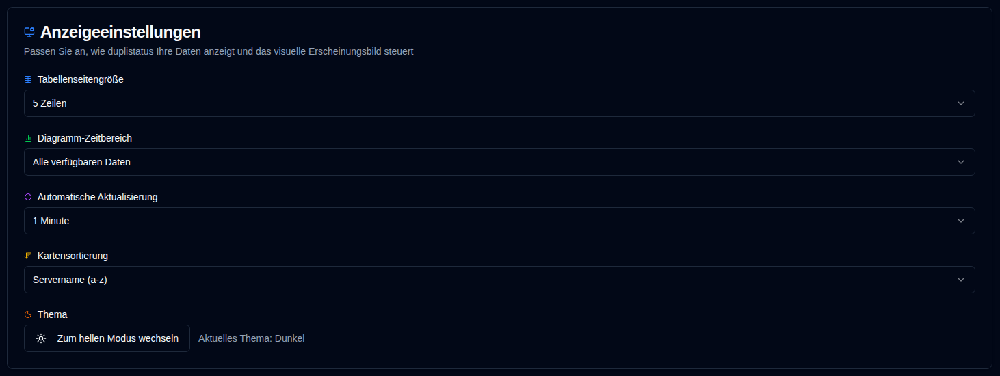

# Anzeige {#display}

Konfigurieren Sie die Benutzeroberfläche und Anzeigeeinstellungen.

 

| Einstellung                   | Beschreibung                                         | Standardwert      |
|:--------------------------|:----------------------------------------------------|:-------------------|
| **Tabellengröße**            | Anzahl der Zeilen pro Seite auf der Serverdetailseite. | 5 Zeilen             |
| **Diagramm-Zeitbereich**      | Zeitintervall in den Diagrammen.                  | Alle verfügbaren Daten |
| **Automatische Aktualisierung** | Wie oft Seiten automatisch aktualisiert werden.              | 1 Minute           |
| **Kartensortierung**      | Wie Karten im Dashboard sortiert werden.              | Servername (a-z)  |
| **Wochenbeginn**         | Konfigurieren Sie, wann die Woche beginnt.                     | Nach Locale    |
| **Thema**                 | Wählen Sie das helle oder dunkle Thema.                     | Dunkel               |

 

:::tip
**Schnellzugriff**: Sie können schnell auf diese Seite zugreifen, indem Sie mit der rechten Maustaste auf die Schaltfläche „Aktualisieren" in der Anwendungssymbolleiste klicken.
:::
