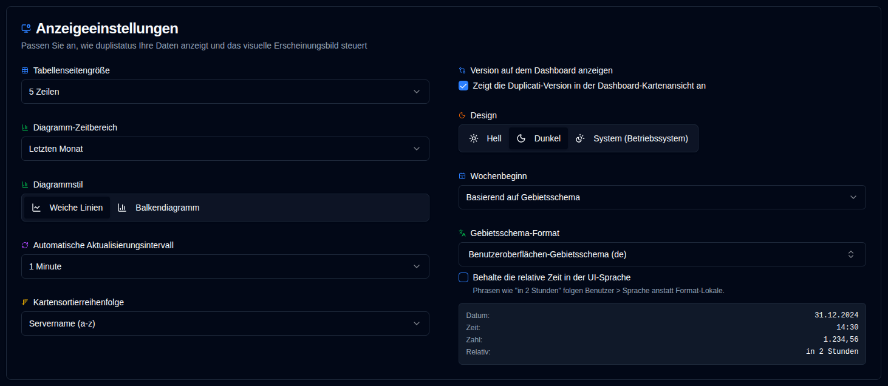

# Anzeige {/* #display */}

Benutzeroberfläche und Anzeigeeinstellungen konfigurieren.

 

| Einstellung               | Beschreibung                                        | Standardwert       |
|:--------------------------|:----------------------------------------------------|:-------------------|
| **Tabellengröße**         | Anzahl der Zeilen pro Seite auf der Serverdetails-Seite. | 5 Zeilen           |
| **Version auf dem Dashboard anzeigen** | Zeigt oder blendet die Duplicati-Version auf den Dashboard-Karten aus. Die Dashboard-Tabelle zeigt immer die Spalte Version an. Auch verfügbar unter [Duplicati-Versionen](duplicati-versions.md). | An |
| **Design**                | Wählen Sie Hell, Dunkel oder passend zur Darstellung Ihres Betriebssystems (bevorzugt Hell-/Dunkelmodus). | Folgt dem Betriebssystem, wenn nicht festgelegt |
| **Diagramm-Zeitbereich**  | Im Diagramm angezeigtes Zeitintervall. Verfügbare Optionen: **1W** (letzte 7 Tage), **2W** (letzte 14 Tage), **1M** (letzte 30 Tage), **3M** (letzte 90 Tage). Sie können den Zeitbereich auch direkt über die Diagramm-Header umschalten. | 1 Monat            |
| **Diagrammstil**          | Auswahl zwischen glatten Liniendiagrammen oder Balkendiagramm-Darstellung. Beide Modi verwenden zeitliche Aggregation für optimale Anzeige. Sie können auch direkt über die Diagramm-Header wechseln. | Weiche Linien      |
| **Gebietsschema-Format**  | Wählen Sie ein unabhängiges Format-Gebietsschema, das von Ihrer UI-Sprache abweicht (416 Gebietsschemas unterstützt). Dies beeinflusst die Anzeige von Datum, Uhrzeit und Zahlen. Relative Zeitangaben (z. B. „in 2 Stunden“) folgen dem Gebietsschema-Format, es sei denn, **Behalte die relative Zeit in der UI-Sprache** ist aktiviert. Eine Live-Vorschau enthält Datum, Uhrzeit, Zahl und eine relative Zeitangabe als Beispiel. Beispiel: UI-Sprache = Deutsch, Format-Gebietsschema = Englisch (UK) → Deutsche Oberfläche mit britischen Datumsformaten. | Basierend auf der UI-Sprache |
| **Behalte die relative Zeit in der UI-Sprache** | Wenn aktiviert, folgen Ausdrücke wie „in 2 Stunden“ der **Benutzer → Sprache** statt dem Format-Gebietsschema. Datum, Uhrzeit und Zahlen verwenden weiterhin das Format-Gebietsschema. Standardmäßig aus. | Aus |
| **Automatische Aktualisierungsintervall** | Wie oft Seiten automatisch aktualisiert werden.     | 1 Minute           |
| **Kartensortierreihenfolge** | Wie Karten im Dashboard sortiert werden.           | Servername (a-z)   |
| **Wochenbeginn**          | Konfigurieren Sie, wann die Woche beginnt.          | Basierend auf Gebietsschema |

 

:::tip
**Schnellzugriff**: Sie können diese Seite schnell erreichen, indem Sie mit der rechten Maustaste auf den Schaltknopf für automatische Aktualisierung in der Anwendungssymbolleiste klicken.
:::
