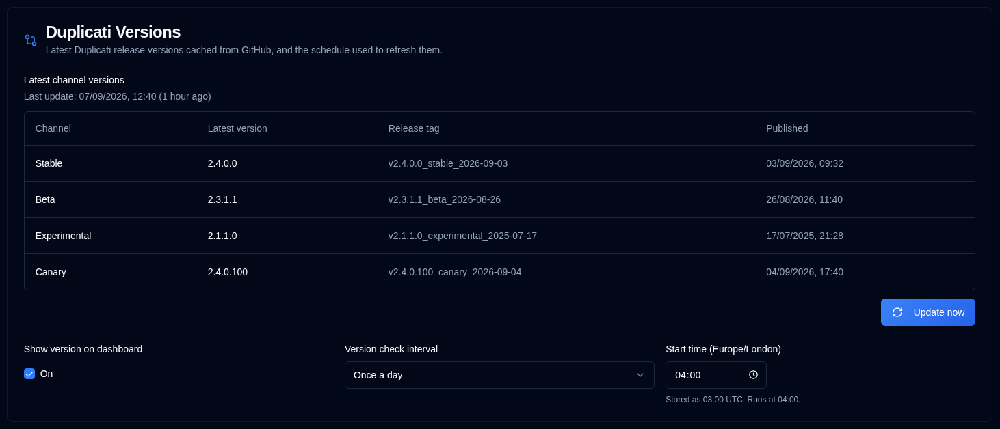

# Duplicati-Versionen {/* #duplicati-versions */}

Diese Seite zeigt die neuesten Duplicati-Release-Versionen, die im **duplistatus**-Cache gespeichert sind, und ermöglicht Administratoren, die Häufigkeit der Aktualisierungen von GitHub zu konfigurieren.

Der Cache wird von der [Dashboard](../dashboard.md#duplicati-server-version)- und der [Server](server-settings.md)-Seite verwendet, um die Version jedes Servers zu färben und anzuzeigen, ob sie aktuell oder veraltet ist.

## Aktuelle Kanalversionen {/* #latest-channel-versions */}

Die Tabelle listet die neueste gecachte Version für jeden Duplicati-Kanal auf:

| Kanal          | Beschreibung                                      |
|:---------------|:-------------------------------------------------|
| **Stabil**     | Neueste stabile Version                            |
| **Beta**       | Neueste Beta-Version                              |
| **Experimentell** | Neueste experimentelle Version                    |
| **Canary**     | Neueste Canary-Version                            |

Die letzte erfolgreiche GitHub-Aktualisierungszeit wird über der Tabelle angezeigt. Wenn ein Kanal noch nicht gefunden wurde oder der Cache noch nie aktualisiert wurde, zeigt die Seite an, dass die Version nicht verfügbar ist.

Administratoren können auf **Jetzt aktualisieren** klicken, um die neuesten Releases sofort abzurufen. Dies erfordert nicht, dass der Cron-Dienst läuft. Wenn GitHub nicht erreicht werden kann, behält **duplistatus** den vorherigen Cache bei.

## Versionsprüfungsplan {/* #version-check-schedule */}

**Version auf dem Dashboard anzeigen** schaltet das Versionsabzeichen im [Dashboard](../dashboard.md#duplicati-server-version) Kartenansicht ein oder aus. Die Dashboard-Tabelle zeigt immer die **Version**-Spalte an. Sie ist standardmäßig aktiviert und ist auch in den [Anzeigeeinstellungen](display-settings.md) verfügbar. Dies ist eine Benutzereinstellung.

Administratoren können wählen, wie oft **duplistatus** GitHub auf neue Duplicati-Releases prüft:

| Intervall          | Ausführung                                                         |
|:-------------------|:-------------------------------------------------------------|
| **Einmal täglich**     | Einmal zur konfigurierten Startzeit                            |
| **Alle 12 Stunden** | Zur Startzeit und 12 Stunden später                         |
| **Alle 6 Stunden**  | Zur Startzeit und alle 6 Stunden danach               |

Die Startzeit wird in Ihrer Browser-Zeitzone gewählt, indem das gleiche kompakte Zeitsteuerelement wie bei der Täglichen Zusammenfassung verwendet wird. Wählen Sie eine beliebige `HH:mm`-Zeit. **duplistatus** speichert diesen Wert in UTC und der Cron-Dienst führt die Prüfung in UTC aus.

Beispiele:

- Täglich mit einer Startzeit von 06:00 wird um 06:00 ausgeführt.
- Täglich mit einer Startzeit von 06:30 wird um 06:30 ausgeführt.
- Alle 12 Stunden mit einer Startzeit von 08:15 wird um 08:15 und 20:15 ausgeführt.
- Alle 6 Stunden mit einer Startzeit von 02:45 wird um 02:45, 08:45, 14:45 und 20:45 ausgeführt.

Beim Start aktualisiert **duplistatus** auch den Cache, wenn er älter ist als das ausgewählte Intervall (24 Stunden, 12 Stunden oder 6 Stunden), einschließlich einer neuen leeren Datenbank. Transiente GitHub-Fehler wie HTTP 504 werden wiederholt. Fehlgeschlagene Aktualisierungen behalten die letzten zwischengespeicherten Versionen.

Reguläre Benutzer können die zwischengespeicherten Versionen und den Zeitplan anzeigen und können **Version auf dem Dashboard anzeigen** ein- oder ausschalten. Nur Administratoren können das Intervall, die Startzeit oder eine erzwungene Aktualisierung ändern.

:::note
Die Änderung des Zeitplans schreibt einen `duplicati_version_check_updated`-Eintrag in das [Audit-Protokoll](audit-logs-viewer.md). Erfolgreiche und fehlgeschlagene GitHub-Aktualisierungen werden als `duplicati_version_refresh` mit einem Trigger von `startup`, `cron` oder `manual` aufgezeichnet.
:::
