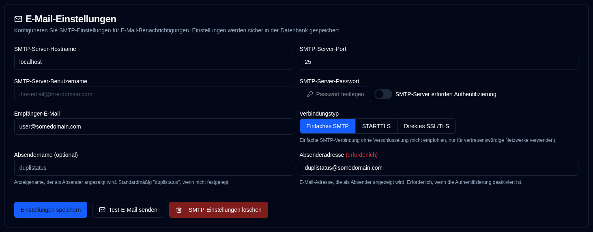

# E-Mail {#email}

**duplistatus** unterstützt den Versand von E-Mail-Benachrichtigungen über SMTP als Alternative oder Ergänzung zu NTFY-Benachrichtigungen. Die E-Mail-Konfiguration wird jetzt über die Weboberfläche verwaltet, wobei die Daten verschlüsselt in der Datenbank gespeichert werden, um die Sicherheit zu erhöhen.

| Einstellung                 | Beschreibung                                                      |
|:------------------------|:-----------------------------------------------------------------|
| **SMTP-Server-Host**    | Der SMTP-Server Ihres E-Mail-Anbieters (z. B. `smtp.gmail.com`).      |
| **SMTP-Server-Port**    | Portnummer (normalerweise `25` für einfaches SMTP, `587` für STARTTLS oder `465` für direktes SSL/TLS). |
| **Verbindungstyp**     | Wählen Sie zwischen einfachem SMTP, STARTTLS oder direktem SSL/TLS. Standardmäßig wird direktes SSL/TLS für neue Konfigurationen verwendet. |
| **SMTP-Authentifizierung** | Umschalter zum Aktivieren oder Deaktivieren der SMTP-Authentifizierung. Wenn deaktiviert, sind Benutzername und Passwort nicht erforderlich. |
| **SMTP-Benutzername**       | Ihre E-Mail-Adresse oder Ihr Benutzername (erforderlich, wenn die Authentifizierung aktiviert ist). |
| **SMTP-Passwort**       | Ihr E-Mail-Passwort oder anwendungsspezifisches Passwort (erforderlich, wenn die Authentifizierung aktiviert ist). |
| **Absendername**         | Anzeigename, der in E-Mail-Benachrichtigungen als Absender angezeigt wird (optional, Standardwert ist „duplistatus"). |
| **Absenderadresse**        | E-Mail-Adresse, die als Absender angezeigt wird. Erforderlich für einfache SMTP-Verbindungen oder wenn die Authentifizierung deaktiviert ist. Standardmäßig wird der SMTP-Benutzername verwendet, wenn die Authentifizierung aktiviert ist. Beachten Sie, dass einige E-Mail-Anbieter die `Absenderadresse` mit dem `SMTP-Server-Benutzername` überschreiben. |
| **Empfänger-E-Mail**     | Die E-Mail-Adresse zum Empfangen von Benachrichtigungen. Muss ein gültiges E-Mail-Adressformat haben. |

Ein <IIcon2 icon="lucide:mail" color="green"/> grünes Symbol neben `Email` in der Seitenleiste bedeutet, dass Ihre Einstellungen gültig sind. Wenn das Symbol <IIcon2 icon="lucide:mail" color="yellow"/> gelb ist, sind Ihre Einstellungen nicht gültig oder nicht konfiguriert.

Das Symbol wird grün angezeigt, wenn alle erforderlichen Felder gesetzt sind: SMTP-Server-Host, SMTP-Server-Port, Empfänger-E-Mail und entweder (SMTP-Benutzername + Passwort, wenn Authentifizierung erforderlich ist) oder (Absenderadresse, wenn Authentifizierung nicht erforderlich ist).

Wenn die Konfiguration nicht vollständig konfiguriert ist, wird ein gelbes Warnfeld angezeigt, das Sie darüber informiert, dass keine E-Mails versendet werden, bis die E-Mail-Einstellungen korrekt ausgefüllt sind. Die E-Mail-Kontrollkästchen auf der Registerkarte [`Backup Benachrichtigungen`](backup-notifications-settings.md) werden ebenfalls ausgegraut und zeigen Bezeichnungen „(Deaktiviert)" an.

 

## Verfügbare Aktionen {#available-actions}

| Button                                                           | Beschreibung                                              |
|:-----------------------------------------------------------------|:---------------------------------------------------------|
| <IconButton label="Einstellungen speichern" />                             | Speichert die Änderungen an den NTFY-Einstellungen.              |
| <IconButton icon="lucide:mail" label="Test-E-Mail senden"/>         | Sendet eine Test-E-Mail-Nachricht unter Verwendung der SMTP-Konfiguration. Die Test-E-Mail zeigt SMTP-Server-Hostname, Port, Verbindungstyp, Authentifizierungsstatus, Benutzername (falls zutreffend), Empfänger-E-Mail, Absenderadresse, Absendername und Test-Zeitstempel an. |
| <IconButton icon="lucide:trash-2" label="SMTP-Einstellungen löschen"/> | Löscht / Leert die SMTP-Konfiguration.                   |

 

:::info[Wichtig]
  Sie müssen die <IconButton icon="lucide:mail" label="Test-E-Mail senden"/> Schaltfläche verwenden, um sicherzustellen, dass Ihre E-Mail-Konfiguration funktioniert, bevor Sie sich auf sie für Benachrichtigungen verlassen.

 Auch wenn Sie ein grünes <IIcon2 icon="lucide:mail" color="green"/> Symbol sehen und alles konfiguriert zu sein scheint, werden E-Mails möglicherweise nicht versendet.
 
 `duplistatus` prüft nur, ob Ihre SMTP-Einstellungen ausgefüllt sind, nicht ob E-Mails tatsächlich zugestellt werden können.
:::

 

## Häufige SMTP-Anbieter {#common-smtp-providers}

**Gmail:**

- Host: `smtp.gmail.com`
- Port: `587` (STARTTLS) oder `465` (Direktes SSL/TLS)
- Verbindungstyp: STARTTLS für Port 587, Direktes SSL/TLS für Port 465
- Benutzername: Ihre Gmail-Adresse
- Passwort: Verwenden Sie ein App-Passwort (nicht Ihr reguläres Passwort). Generieren Sie eines unter https://myaccount.google.com/apppasswords
- Authentifizierung: Erforderlich

**Outlook/Hotmail:**

- Host: `smtp-mail.outlook.com`
- Port: `587`
- Verbindungstyp: STARTTLS
- Benutzername: Ihre Outlook-E-Mail-Adresse
- Passwort: Ihr Kontokennwort
- Authentifizierung: Erforderlich

**Yahoo Mail:**

- Host: `smtp.mail.yahoo.com`
- Port: `587`
- Verbindungstyp: STARTTLS
- Benutzername: Ihre Yahoo-E-Mail-Adresse
- Passwort: Verwenden Sie ein App-Passwort
- Authentifizierung: Erforderlich

### Sicherheit – Best Practices {#security-best-practices}

- Erwägen Sie die Verwendung eines dedizierten E-Mail-Kontos für Benachrichtigungen
 - Testen Sie Ihre Konfiguration mit der Schaltfläche „Test-E-Mail senden"
 - Einstellungen werden verschlüsselt und sicher in der Datenbank gespeichert
 - **Verwenden Sie verschlüsselte Verbindungen** – STARTTLS und Direktes SSL/TLS werden für den Produktiveinsatz empfohlen
 - Einfache SMTP-Verbindungen (Port 25) sind für vertrauenswürdige lokale Netzwerke verfügbar, werden aber für den Produktiveinsatz über nicht vertrauenswürdige Netzwerke nicht empfohlen
