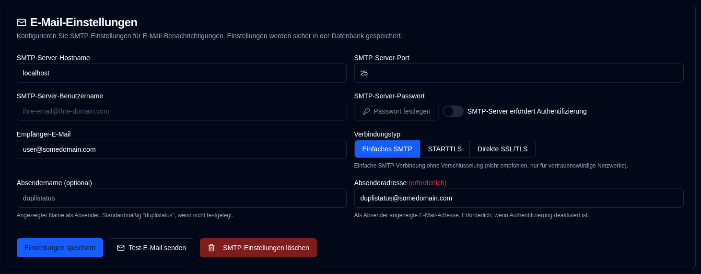

# E-Mail {#email}

**duplistatus** unterstützt den Versand von E-Mail-Benachrichtigungen via SMTP als Alternative oder Ergänzung zu NTFY-Benachrichtigungen. Die E-Mail-Konfiguration wird jetzt über die Weboberfläche verwaltet, wobei die verschlüsselte Speicherung in der Datenbank für erhöhte Sicherheit sorgt.

| Einstellung                 | Beschreibung                                                      |
|:------------------------|:-----------------------------------------------------------------|
| **SMTP-Server-Host**    | Der SMTP-Server Ihres E-Mail-Anbieters (z. B. `smtp.gmail.com`).      |
| **SMTP-Server-Port**    | Portnummer (typischerweise `25` für einfaches SMTP, `587` für STARTTLS oder `465` für direkte SSL/TLS). |
| **Verbindungstyp**     | Wählen Sie zwischen einfachem SMTP, STARTTLS oder direkter SSL/TLS. Standardmäßig ist direkte SSL/TLS für neue Konfigurationen eingestellt. |
| **SMTP-Authentifizierung** | Schalten Sie die SMTP-Authentifizierung ein oder aus. Wenn deaktiviert, sind Benutzername und Passwort nicht erforderlich. |
| **SMTP-Benutzername**       | Ihre E-Mail-Adresse oder Ihr Benutzername (erforderlich, wenn die Authentifizierung aktiviert ist). |
| **SMTP-Passwort**       | Ihr E-Mail-Passwort oder ein app-spezifisches Passwort (erforderlich, wenn die Authentifizierung aktiviert ist). |
| **Absendername**         | Anzeigename, der als Absender in E-Mail-Benachrichtigungen angezeigt wird (optional, Standard ist "duplistatus"). |
| **Absenderadresse**        | E-Mail-Adresse, die als Absender angezeigt wird. Erforderlich bei einfachen SMTP-Verbindungen oder wenn die Authentifizierung deaktiviert ist. Standardmäßig wird der SMTP-Benutzername verwendet, wenn die Authentifizierung aktiviert ist. Beachten Sie, dass einige E-Mail-Anbieter die `From Address` mit der `SMTP Server Username` überschreiben. |
| **Empfänger-E-Mail**     | Die E-Mail-Adresse, die Benachrichtigungen empfängt. Muss im gültigen E-Mail-Adressformat vorliegen. |

Ein <IIcon2 icon="lucide:mail" color="green"/> grünes Symbol neben **E-Mail** in der Seitenleiste bedeutet, dass Ihre Einstellungen gültig sind. Wenn das Symbol <IIcon2 icon="lucide:mail" color="yellow"/> gelb ist, sind Ihre Einstellungen nicht gültig oder nicht konfiguriert.

Das Symbol wird grün angezeigt, wenn alle erforderlichen Felder gesetzt sind: SMTP Server Host, SMTP-Server-Port, Empfänger-E-Mail und entweder (SMTP-Benutzername + Passwort, wenn Authentifizierung erforderlich ist) oder (Absenderadresse, wenn Authentifizierung nicht erforderlich ist).

Wenn die Konfiguration nicht vollständig konfiguriert ist, wird ein gelbes Warnfeld angezeigt, das Sie darüber informiert, dass keine E-Mails versendet werden, bis die E-Mail-Einstellungen korrekt ausgefüllt sind. Die E-Mail-Kontrollkästchen auf der Registerkarte [Backup-Benachrichtigungen](backup-notifications-settings.md) werden ebenfalls ausgegraut und zeigen „(Deaktiviert)"-Beschriftungen an.

 

## Verfügbare Aktionen {#available-actions}

| Button                                                           | Beschreibung                                              |
|:-----------------------------------------------------------------|:---------------------------------------------------------|
| <IconButton label="Einstellungen speichern" />                             | Speichern Sie die Änderungen an den NTFY-Einstellungen.              |
| <IconButton icon="lucide:mail" label="Test-E-Mail senden"/>         | Sendet eine Test-E-Mail mithilfe der SMTP-Konfiguration. Die Test-E-Mail zeigt SMTP-Server-Hostname, Port, Verbindungstyp, Authentifizierungsstatus, Benutzernamen (falls zutreffend), Empfänger-E-Mail, Absenderadresse, Absendername und Test-Zeitstempel an. |
| <IconButton icon="lucide:trash-2" label="SMTP-Einstellungen löschen"/> | Löschen / Leeren der SMTP-Konfiguration.                   |

 

:::info[IMPORTANT]
  Sie müssen die Schaltfläche <IconButton icon="lucide:mail" label="Test-E-Mail senden"/> verwenden, um sicherzustellen, dass Ihr E-Mail-Setup funktioniert, bevor Sie sich darauf für Benachrichtigungen verlassen.

 Auch wenn Sie ein grünes <IIcon2 icon="lucide:mail" color="green"/> Symbol sehen und alles konfiguriert aussieht, werden E-Mails möglicherweise nicht versendet.
 
 **duplistatus** prüft nur, ob Ihre SMTP-Einstellungen ausgefüllt sind, nicht ob E-Mails tatsächlich zugestellt werden können.
:::

 

## Häufige SMTP-Anbieter {#common-smtp-providers}

**Gmail:**

- Host: `smtp.gmail.com`
- Port: `587` (STARTTLS) oder `465` (Direkte SSL/TLS)
- Verbindungstyp: STARTTLS für Port 587, Direkte SSL/TLS für Port 465
- Benutzername: Ihre Gmail-Adresse
- Passwort: Verwenden Sie ein App-Passwort (nicht Ihr reguläres Passwort). Erstellen Sie eines unter https://myaccount.google.com/apppasswords
- Authentifizierung: Erforderlich

**Outlook/Hotmail:**

- Host: `smtp-mail.outlook.com`
- Port: `587`
- Verbindungstyp: STARTTLS
- Benutzername: Ihre Outlook-E-Mail-Adresse
- Passwort: Ihr Kontopasswort
- Authentifizierung: Erforderlich

**Yahoo Mail:**

- Host: `smtp.mail.yahoo.com`
- Port: `587`
- Verbindungstyp: STARTTLS
- Benutzername: Ihre Yahoo-E-Mail-Adresse
- Passwort: Verwenden Sie ein App-Passwort
- Authentifizierung: Erforderlich

### Sicherheit – Best Practices {#security-best-practices}

- Verwenden Sie ein dediziertes E-Mail-Konto für Benachrichtigungen
 - Testen Sie Ihre Konfiguration mithilfe der Schaltfläche "Test-E-Mail senden"
 - Einstellungen werden verschlüsselt und sicher in der Datenbank gespeichert
 - **Verschlüsselte Verbindungen verwenden** - STARTTLS und Direkte SSL/TLS werden für den Produktiveinsatz empfohlen
 - Einfache SMTP-Verbindungen (Port 25) sind für vertrauenswürdige lokale Netzwerke verfügbar, aber nicht für den Einsatz über nicht vertrauenswürdige Netzwerke im Produktivbetrieb empfohlen
