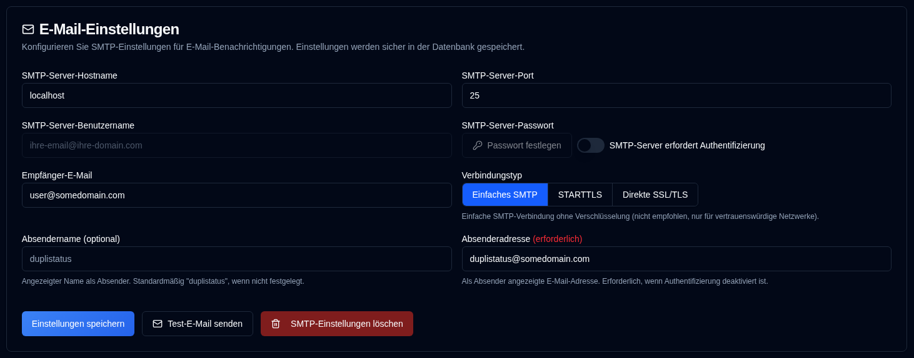

# E-Mail {/* #email */}

**duplistatus** unterstützt das Senden von E-Mail-Benachrichtigungen über SMTP als Alternative oder Ergänzung zu NTFY-Benachrichtigungen. Die E-Mail-Konfiguration wird nun über die Weboberfläche mit verschlüsselter Speicherung in der Datenbank verwaltet, um die Sicherheit zu erhöhen.

| Einstellung              | Beschreibung                                                      |
|:------------------------|:-----------------------------------------------------------------|
| **SMTP-Server-Host**    | Der SMTP-Server Ihres E-Mail-Anbieters (z. B. `smtp.gmail.com`).      |
| **SMTP-Server-Port**    | Portnummer (typischerweise `25` für einfaches SMTP, `587` für STARTTLS oder `465` für direkte SSL/TLS). |
| **Verbindungstyp**     | Wählen Sie zwischen einfachem SMTP, STARTTLS oder direkter SSL/TLS. Standardmäßig wird für neue Konfigurationen direkte SSL/TLS verwendet. |
| **SMTP-Authentifizierung** | Schalten Sie die SMTP-Authentifizierung ein oder aus. Wenn sie deaktiviert ist, sind die Felder für Benutzername und Passwort nicht erforderlich. |
| **SMTP-Benutzername**       | Ihre E-Mail-Adresse oder Ihr Benutzername (erforderlich, wenn die Authentifizierung aktiviert ist). |
| **SMTP-Passwort**       | Ihr E-Mail-Passwort oder ein app-spezifisches Passwort (erforderlich, wenn die Authentifizierung aktiviert ist). |
| **Absendername**         | Anzeigename, der als Absender in den E-Mail-Benachrichtigungen angezeigt wird (optional, standardmäßig "duplistatus"). |
| **Absenderadresse**        | E-Mail-Adresse, die als Absender angezeigt wird. Erforderlich für einfache SMTP-Verbindungen oder wenn die Authentifizierung deaktiviert ist. Standardmäßig wird der SMTP-Benutzername verwendet, wenn die Authentifizierung aktiviert ist. Beachten Sie, dass einige E-Mail-Anbieter die `From Address` durch die `SMTP Server Username` ersetzen. |
| **Empfänger-E-Mail**     | Die E-Mail-Adresse, die die Benachrichtigungen erhalten soll. Muss ein gültiges E-Mail-Format haben. |

Ein <IIcon2 icon="lucide:mail" color="green"/> grünes Symbol neben **E-Mail** in der Seitenleiste bedeutet, dass Ihre Einstellungen gültig sind. Wenn das Symbol <IIcon2 icon="lucide:mail" color="yellow"/> gelb ist, sind Ihre Einstellungen ungültig oder nicht konfiguriert.

Das Symbol zeigt grün an, wenn alle erforderlichen Felder gesetzt sind: SMTP-Server-Host, SMTP-Server-Port, Empfänger-E-Mail und entweder (SMTP-Benutzername + Passwort, wenn die Authentifizierung erforderlich ist) oder (Absenderadresse, wenn die Authentifizierung nicht erforderlich ist).

Wenn die Konfiguration nicht vollständig konfiguriert ist, wird eine gelbe Warnbox angezeigt, die Sie informiert, dass keine E-Mails gesendet werden, bis die E-Mail-Einstellungen korrekt ausgefüllt sind. Die E-Mail-Kontrollkästchen im Tab [Backup-Benachrichtigungen](backup-notifications-settings.md) werden ebenfalls deaktiviert und zeigen "(deaktiviert)" an.

 

## Verfügbare Aktionen {/* #available-actions */}

| Schaltfläche                                                           | Beschreibung                                              |
|:-----------------------------------------------------------------|:---------------------------------------------------------|
| <IconButton label="Einstellungen speichern" />                             | Speichern Sie die Änderungen an den NTFY-Einstellungen.              |
| <IconButton icon="lucide:mail" label="Test-E-Mail senden"/>         | Sendet eine Test-E-Mail-Nachricht mit der SMTP-Konfiguration. Die Test-E-Mail zeigt den SMTP-Server-Hostnamen, den Port, den Verbindungstyp, den Authentifizierungsstatus, den Benutzernamen (falls zutreffend), die Empfänger-E-Mail, die Absenderadresse, den Absendernamen und den Zeitstempel des Tests an. |
| <IconButton icon="lucide:trash-2" label="SMTP-Einstellungen löschen"/> | Löschen / Löschen der SMTP-Konfiguration. Deaktiviert, wenn [Tägliche Zusammenfassung](daily-summary-settings.md) aktiviert ist, da dieser Modus E-Mail erfordert. |

 

:::info[WICHTIG]
  Sie müssen die <IconButton icon="lucide:mail" label="Test-E-Mail senden"/>-Schaltfläche verwenden, um sicherzustellen, dass Ihre E-Mail-Einrichtung funktioniert, bevor Sie sie für Benachrichtigungen verwenden.

 Selbst wenn Sie ein grünes <IIcon2 icon="lucide:mail" color="green"/>-Symbol sehen und alles als konfiguriert aussieht, werden möglicherweise keine E-Mails gesendet.
 
 **duplistatus** überprüft nur, ob Ihre SMTP-Einstellungen ausgefüllt sind, nicht ob E-Mails tatsächlich zugestellt werden können.
:::

 

## Häufige SMTP-Anbieter {/* #common-smtp-providers */}

**Gmail:**

- Host: `smtp.gmail.com`
- Port: `587` (STARTTLS) oder `465` (Direkte SSL/TLS)
- Verbindungstyp: STARTTLS für Port 587, Direkte SSL/TLS für Port 465
- Benutzername: Ihre Gmail-Adresse
- Passwort: Verwenden Sie ein App-Passwort (nicht Ihr normales Passwort). Generieren Sie eines unter https://myaccount.google.com/apppasswords
- Authentifizierung: Erforderlich

**Outlook/Hotmail:**

- Host: `smtp-mail.outlook.com`
- Port: `587`
- Verbindungstyp: STARTTLS
- Benutzername: Ihre Outlook-E-Mail-Adresse
- Passwort: Ihr Kontopasswort
- Authentifizierung: Erforderlich

**Yahoo Mail:**

- Host: `smtp.mail.yahoo.com`
- Port: `587`
- Verbindungstyp: STARTTLS
- Benutzername: Ihre Yahoo-E-Mail-Adresse
- Passwort: Verwenden Sie ein App-Passwort
- Authentifizierung: Erforderlich

### Sicherheitsrichtlinien {/* #security-best-practices */}

- Überlegen Sie, ein dediziertes E-Mail-Konto für Benachrichtigungen zu verwenden
- Testen Sie Ihre Konfiguration mit der Schaltfläche "Test-E-Mail senden"
- Einstellungen werden verschlüsselt und sicher in der Datenbank gespeichert
- **Verwenden Sie verschlüsselte Verbindungen** - STARTTLS und Direkte SSL/TLS sind für den Produktionsbetrieb empfohlen
- Einfache SMTP-Verbindungen (Port 25) sind für vertrauenswürdige lokale Netzwerke verfügbar, werden aber nicht für den Produktionsbetrieb über unsichere Netzwerke empfohlen
