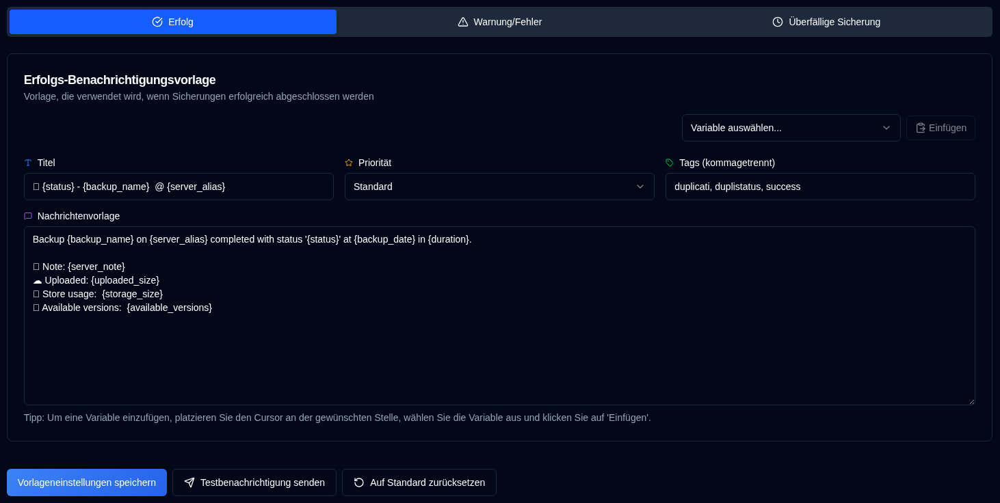

# Vorlagen {#templates}

**duplistatus** verwendet drei Vorlagen für Benachrichtigungsnachrichten. Diese Vorlagen werden sowohl für NTFY- als auch für E-Mail-Benachrichtigungen verwendet.

Die Seite enthält einen **Vorlagensprache**-Selektor, der das Gebietsschema für Standard-Vorlagen festlegt. Das Ändern der Sprache aktualisiert das Gebietsschema für neue Standards, ändert aber **nicht** den Text vorhandener Vorlagen. Um eine neue Sprache auf Ihre Vorlagen anzuwenden, bearbeiten Sie diese entweder manuell oder verwenden Sie **Diese Vorlage auf Standard zurücksetzen** (für die aktuelle Registerkarte) oder **Alle auf Standard zurücksetzen** (für alle drei Vorlagen).

| Template           | Beschreibung                                                    |
| :----------------- | :-------------------------------------------------------------- |
| **Erfolg**         | Wird verwendet, wenn Sicherungen erfolgreich abgeschlossen werden. |
| **Warnung/Fehler** | Wird verwendet, wenn Sicherungen mit Warnungen oder Fehlern abgeschlossen werden. |
| **Überfällige Sicherung** | Wird verwendet, wenn Sicherungen überfällig sind.               |

 

## Vorlagen-Sprache {#template-language}

Ein **Vorlagensprache**-Wähler oben auf der Seite ermöglicht es Ihnen, die Sprache für Standard-Vorlagen (Englisch, Deutsch, Französisch, Spanisch, Portugiesisch) auszuwählen. Das Ändern der Sprache aktualisiert das Gebietsschema für Standards, aber vorhandene angepasste Vorlagen behalten ihren aktuellen Text bei, bis Sie diese aktualisieren oder eine der Schaltflächen zum Zurücksetzen verwenden.

 

## Verfügbare Aktionen {#available-actions}

| Schaltfläche | Beschreibung |
|:--------------------------------------------------------------------|:----------------------------------------------------------------------------------------------------|
| <IconButton label="Vorlageneinstellungen speichern" /> | Speichert die Einstellungen beim Ändern der Vorlage. Die Schaltfläche speichert die angezeigte Vorlage (Erfolg, Warnung/Fehler oder überfällige Sicherung). |
| <IconButton icon="lucide:send" label="Testbenachrichtigung senden"/> | Überprüft die Vorlage nach der Aktualisierung. Die Variablen werden für den Test durch ihre Namen ersetzt. Bei E-Mail-Benachrichtigungen wird der Vorlagentitel zur E-Mail-Betreffzeile. |
| <IconButton icon="lucide:rotate-ccw" label="Diese Vorlage auf Standard zurücksetzen"/> | Stellt die Standardvorlage für die **ausgewählte Vorlage** (aktueller Tab) wieder her. Denken Sie daran, nach dem Zurücksetzen zu speichern. |
| <IconButton icon="lucide:rotate-ccw" label="Alle auf Standard zurücksetzen"/> | Stellt alle drei Vorlagen (Erfolg, Warnung/Fehler, überfällige Sicherung) auf die Standardwerte für die ausgewählte Vorlagensprache zurück. Denken Sie daran, nach dem Zurücksetzen zu speichern. |

 

## Variablen {#variables}

Alle Vorlagen unterstützen Variablen, die durch tatsächliche Werte ersetzt werden. Die folgende Tabelle zeigt die verfügbaren Variablen:

| Variable               | Beschreibung                                     | Verfügbar in     |
|:-----------------------|:------------------------------------------------|:-----------------|
| `{server_name}`        | Name des Servers.                             | Alle Vorlagen    |
| `{server_alias}`       | Alias des Servers.                            | Alle Vorlagen    |
| `{server_note}`        | Hinweis für den Server.                            | Alle Vorlagen    |
| `{server_url}`         | Duplicati-Server-URL zur Webkonfiguration   | Alle Vorlagen    |
| `{backup_name}`        | Name der Sicherung.                             | Alle Vorlagen    |
| `{status}`             | Sicherungsstatus (Erfolg, Warnung, Fehler, Kritisch). | Erfolg, Warnung |
| `{backup_date}`        | Datum und Uhrzeit der Sicherung.                    | Erfolg, Warnung |
| `{duration}`           | Dauer der Sicherung.                         | Erfolg, Warnung |
| `{uploaded_size}`      | Menge der hochgeladenen Daten.                        | Erfolg, Warnung |
| `{storage_size}`       | Speicherplatznutzungsinformationen.                      | Erfolg, Warnung |
| `{available_versions}` | Anzahl der verfügbaren Sicherungsversionen.            | Erfolg, Warnung |
| `{file_count}`         | Anzahl der verarbeiteten Dateien.                      | Erfolg, Warnung |
| `{file_size}`          | Gesamtgröße der gesicherten Dateien.                  | Erfolg, Warnung |
| `{messages_count}`     | Anzahl der Nachrichten.                             | Erfolg, Warnung |
| `{warnings_count}`     | Anzahl der Warnungen.                             | Erfolg, Warnung |
| `{errors_count}`       | Anzahl der Fehler.                               | Erfolg, Warnung |
| `{log_text}`           | Protokollmeldungen (Warnungen und Fehler)              | Erfolg, Warnung |
| `{last_backup_date}`   | Datum der letzten Sicherung.                        | Überfällig          |
| `{last_elapsed}`       | Seit der letzten Sicherung verstrichene Zeit.             | Überfällig          |
| `{expected_date}`      | Erwartetes Sicherungsdatum.                           | Überfällig          |
| `{expected_elapsed}`   | Seit dem erwarteten Datum verstrichene Zeit.           | Überfällig          |
| `{backup_interval}`    | Intervallzeichenfolge (z. B. „1D", „2W", „1M").       | Überfällig          |
| `{overdue_tolerance}`  | Überfälligkeitstoleranzeinstellung.                      | Überfällig          |
