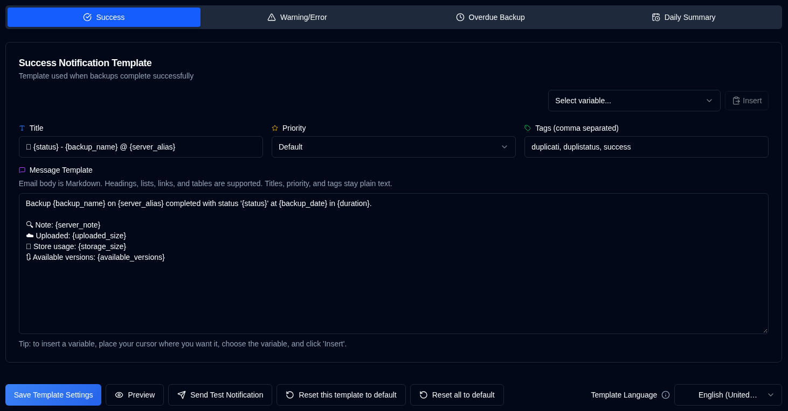

# Vorlagen {#templates}

**duplistatus** verwendet vier Vorlagen für Benachrichtigungsnachrichten. E-Mail-Körper sind Markdown (Überschriften, Listen, Links und Tabellen). NTFY für Erfolg, Warnung/Fehler und Überfällig wird aus demselben Inhalt abgeleitet. Die Tägliche Zusammenfassung ist nur für E-Mails verfügbar.

Die Seite enthält einen **Vorlagensprache**-Auswahldialog, der die Sprache für die Standardvorlagen festlegt. Das Ändern der Sprache aktualisiert die Sprache für neue Standardeinstellungen, aber es ändert **nicht** den Text der vorhandenen Vorlagen. Um eine neue Sprache auf Ihre Vorlagen anzuwenden, bearbeiten Sie diese manuell oder verwenden Sie **Diese Vorlage auf Standardwerte zurücksetzen** (für die aktuelle Registerkarte) oder **Alle auf Standard zurücksetzen** (für alle Vorlagen).

| Vorlage              | Beschreibung                                         |
| :----------------- | :-------------------------------------------------- |
| **Erfolg**        | Wird verwendet, wenn Sicherungen erfolgreich abgeschlossen wurden.            |
| **Warnung/Fehler**  | Wird verwendet, wenn Sicherungen mit Warnungen oder Fehlern abgeschlossen wurden. |
| **Verspätete Sicherung** | Wird verwendet, wenn Sicherungen überfällig sind.                      |
| **Tägliche Zusammenfassung**  | Markdown-E-Mail-Vorlage für die optionale tägliche Zusammenfassung. |

 

## Vorlagen-Sprache {#template-language}

Ein **Vorlagensprache**-Auswahlfeld oben auf der Seite ermöglicht es Ihnen, die Sprache für Standardvorlagen auszuwählen (Englisch, Deutsch, Französisch, Spanisch, Portugiesisch, Hindi (Lateinisch) und vereinfachtes Chinesisch). Das Ändern der Sprache aktualisiert das Gebietsschema für die Standardwerte, jedoch behalten vorhandene angepasste Vorlagen ihren aktuellen Text bei, bis Sie diese aktualisieren oder eine der Schaltflächen zum Zurücksetzen verwenden.

 

## Verfügbare Aktionen {#available-actions}

| Schaltfläche                                                              | Beschreibung                                                                                         |
|:--------------------------------------------------------------------|:----------------------------------------------------------------------------------------------------|
| <IconButton label="Vorlagen-Einstellungen speichern" />                      | Speichert die Einstellungen beim Ändern der Vorlage. Die Schaltfläche speichert die angezeigte Vorlage (Erfolg, Warnung/Fehler, Überfällige Sicherung oder Tägliche Zusammenfassung). |
| <IconButton icon="lucide:send" label="Testbenachrichtigung senden"/>     | Prüft die Vorlage nach dem Aktualisieren. Die Variablen werden für den Test durch ihre Namen ersetzt. Für E-Mail-Benachrichtigungen wird der Titel der Vorlage zum Betreff der E-Mail. Nicht verfügbar auf der Registerkarte Tägliche Zusammenfassung. |
| <IconButton icon="lucide:rotate-ccw" label="Diese Vorlage auf Standard zurücksetzen"/> | Stellt die Standardvorlage für die **ausgewählte Vorlage** (der aktuelle Tab) wieder her. Denken Sie daran, nach dem Zurücksetzen zu speichern. |
| <IconButton icon="lucide:rotate-ccw" label="Alle auf Standard zurücksetzen"/> | Stellt alle Vorlagen (Erfolg, Warnung/Fehler, Überfällige Sicherung und Tägliche Zusammenfassung) auf die Standardeinstellungen für die ausgewählte Vorlagensprache zurück. Denken Sie daran, nach dem Zurücksetzen zu speichern. |

 

## Variablen {#variables}

E-Mail-Körper sind Markdown. Überschriften, Listen, Links und Tabellen werden unterstützt. Platzhalterwerte werden als escapierter Text eingefügt und können keine Markdown- oder HTML-Syntax einführen. Bisher eingebettetes rohes HTML in angepassten Vorlagen wird jetzt escapiert.

Alle Erfolg-, Warnung/Fehler- und Überfälligen-Vorlagen unterstützen Variablen, die durch tatsächliche Werte ersetzt werden. Die folgende Tabelle zeigt die verfügbaren Variablen:

| Variable               | Beschreibung                                     | Verfügbar in     |
|:-----------------------|:------------------------------------------------|:-----------------|
| `{server_name}`        | Name des Servers.                             | Erfolg, Warnung, Überfällig |
| `{server_alias}`       | Alias des Servers.                            | Erfolg, Warnung, Überfällig |
| `{server_note}`        | Notiz für den Server.                            | Erfolg, Warnung, Überfällig |
| `{server_url}`         | URL der Duplicati-Server-Webkonfiguration   | Erfolg, Warnung, Überfällig |
| `{backup_name}`        | Name des Backups.                             | Erfolg, Warnung, Überfällig |
| `{status}`             | Status der Sicherung (Erfolg, Warnung, Fehler, Schwerwiegend). | Erfolg, Warnung |
| `{backup_date}`        | Datum und Uhrzeit der Sicherung.                    | Erfolg, Warnung |
| `{duration}`           | Dauer der Sicherung.                         | Erfolg, Warnung |
| `{uploaded_size}`      | Menge der hochgeladenen Daten.                        | Erfolg, Warnung |
| `{storage_size}`       | Informationen zur Speichernutzung.                      | Erfolg, Warnung |
| `{available_versions}` | Anzahl der verfügbaren Sicherungsversionen.            | Erfolg, Warnung |
| `{file_count}`         | Anzahl der verarbeiteten Dateien.                      | Erfolg, Warnung |
| `{file_size}`          | Gesamtgröße der gesicherten Dateien.                  | Erfolg, Warnung |
| `{messages_count}`     | Anzahl der Nachrichten.                             | Erfolg, Warnung |
| `{warnings_count}`     | Anzahl der Warnungen.                             | Erfolg, Warnung |
| `{errors_count}`       | Anzahl der Fehler.                               | Erfolg, Warnung |
| `{log_text}`           | Protokollnachrichten (Warnungen und Fehler)              | Erfolg, Warnung |
| `{last_backup_date}`   | Datum der letzten Sicherung.                        | Überfällig          |
| `{last_elapsed}`       | Seit der letzten Sicherung verstrichene Zeit.             | Überfällig          |
| `{expected_date}`      | Erwartetes Sicherungsdatum.                           | Überfällig          |
| `{expected_elapsed}`   | Seit dem erwarteten Datum verstrichene Zeit.           | Überfällig          |
| `{backup_interval}`    | Intervallangabe (z. B. „1D“, „2W“, „1M“).       | Überfällig          |
| `{overdue_tolerance}`  | Überfällig-Toleranz-Einstellung.                      | Überfällig          |

Tägliche Zusammenfassungsvorlagen verwenden eine andere Gruppe von Variablen für den aktuellen Status-Snapshot:

| Variable | Beschreibung |
|:---------|:------------|
| `{summary_date}` | Lokales Kalenderdatum des Snapshots |
| `{generated_at}` | Datum und Uhrzeit, zu der der Snapshot generiert wurde |
| `{time_zone}` | Gespeicherte IANA-Zeitzone |
| `{server_count}` / `{job_count}` | Server und bekannte Jobs |
| `{success_count}` / `{warning_count}` / `{error_count}` / `{fatal_count}` / `{unknown_count}` / `{no_report_count}` | gegenseitig ausschließende Status-Buckets |
| `{overdue_count}` | Überfällige Jobs (orthogonal zum Status) |
| `{problem_table}` / `{all_jobs_table}` | Generierte Tabellen mit aufmerksamkeitsbedürftigen und allen Jobs. Spalten: Server, Sicherung, Überfällig, Letzter Status, Letztes Ergebnis, Dauer, Warnungen, Fehler, Hochgeladen. |
| `{duplistatus_link}` | Link zum duplistatus-Dashboard (weggelassen, wenn keine öffentliche URL konfiguriert ist). Bevorzugen Sie dies gegenüber manuell erstellten Markdown-Links. |
| `{duplistatus_url}` | Dieselbe URL im Klartext (leer, wenn keine öffentliche URL konfiguriert ist). |
| `{latest_uploaded_size}` / `{latest_source_size}` / `{latest_storage_size}` / `{latest_file_count}` / `{total_warnings}` / `{total_errors}` | Gesamtzahl der neuesten Ergebnisse |

Verwenden Sie **Vorschau**, um die E-Mail HTML- und Klartext-Versionen ohne Senden zu rendern. Die Vorschau für Erfolg, Warnung/Fehler und Überfällig enthält auch NTFY. Die Vorschau öffnet sich in einem Dialogfeld. Die E-Mail HTML folgt dem aktuellen hellen oder dunklen Design.
