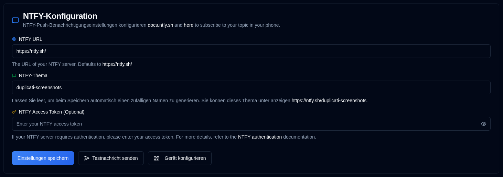

# NTFY {#ntfy}

[NTFY](https://github.com/binwiederhier/ntfy) ist ein einfacher Benachrichtigungsdienst, der Push-Benachrichtigungen an Ihr Telefon oder Ihren Desktop senden kann. In diesem Abschnitt können Sie Ihre Benachrichtigungsserver-Verbindung und Authentifizierung einrichten.

| Einstellung           | Beschreibung                                                                                                                                   |
|:----------------------|:----------------------------------------------------------------------------------------------------------------------------------------------|
| **NTFY-URL**          | Die URL Ihres NTFY-Servers (Standard ist der öffentliche Server `https://ntfy.sh/`).                                                                      |
| **NTFY-Thema**        | Ein eindeutiger Bezeichner für Ihre Benachrichtigungen. Das System generiert automatisch ein zufälliges Thema, wenn das Feld leer gelassen wird, oder Sie können Ihr eigenes angeben. |
| **NTFY-Zugriffstoken** | Ein optionales Zugriffstoken für authentifizierte NTFY-Server. Lassen Sie dieses Feld leer, wenn Ihr Server keine Authentifizierung erfordert.               |

 

Ein <IIcon2 icon="lucide:message-square" color="green"/> grünes Symbol neben `NTFY` in der Seitenleiste bedeutet, dass Ihre Einstellungen gültig sind. Wenn das Symbol <IIcon2 icon="lucide:message-square" color="yellow"/> gelb ist, sind Ihre Einstellungen nicht gültig.
Wenn die Konfiguration nicht gültig ist, werden die NTFY-Kontrollkästchen auf der Registerkarte [`Sicherungs-Benachrichtigungen`](backup-notifications-settings.md) ebenfalls ausgegraut.

## Verfügbare Aktionen {#available-actions}

| Schaltfläche                                                                | Beschreibung                                                                                                  |
|:----------------------------------------------------------------------|:-------------------------------------------------------------------------------------------------------------|
| <IconButton label="Einstellungen speichern" />                                  | Speichern Sie alle Änderungen an den NTFY-Einstellungen.                                                                  |
| <IconButton icon="lucide:send-horizontal" label="Testnachricht senden"/> | Senden Sie eine Testnachricht an Ihren NTFY-Server, um Ihre Konfiguration zu überprüfen.                                         |
| <IconButton icon="lucide:qr-code" label="Gerät konfigurieren"/>          | Zeigt einen QR-Code an, mit dem Sie Ihr Mobilgerät oder Ihren Desktop schnell für NTFY-Benachrichtigungen konfigurieren können. |

## Gerätekonfiguration {#device-configuration}

Sie sollten die NTFY-Anwendung auf Ihrem Gerät installieren, bevor Sie es konfigurieren ([siehe hier](https://ntfy.sh/)). Wenn Sie auf die Schaltfläche <IconButton icon="lucide:qr-code" label="Gerät konfigurieren"/> klicken oder mit der rechten Maustaste auf das Symbol <SvgButton svgFilename="ntfy.svg" /> in der Anwendungssymbolleiste klicken, wird ein QR-Code angezeigt. Durch das Scannen dieses QR-Codes wird Ihr Gerät automatisch mit dem korrekten NTFY-Thema für Benachrichtigungen konfiguriert.

 

 

:::caution
Wenn Sie den öffentlichen Server `ntfy.sh` ohne Zugriffstoken verwenden, kann jeder mit Ihrem Themennamen Ihre
Benachrichtigungen anzeigen.
 
Um einen gewissen Datenschutz zu bieten, wird ein zufälliges 12-stelliges Thema generiert, das über
3 Sextillionen (3.000.000.000.000.000.000.000) mögliche Kombinationen bietet, was es schwierig macht, es zu erraten.

Für verbesserte Sicherheit sollten Sie [Zugriffstoken-Authentifizierung](https://docs.ntfy.sh/config/#access-tokens) und [Zugriffskontrolllisten](https://docs.ntfy.sh/config/#access-control-list-acl) verwenden, um Ihre Themen zu schützen, oder [NTFY selbst hosten](https://docs.ntfy.sh/install/#docker) für vollständige Kontrolle.

⚠️ **Sie sind verantwortlich für die Sicherung Ihrer NTFY-Themen. Bitte nutzen Sie diesen Dienst nach eigenem Ermessen.**
:::

 
 

:::note
Alle Produktnamen, Logos und Marken sind Eigentum ihrer jeweiligen Eigentümer. Symbole und Namen werden ausschließlich zu Identifikationszwecken verwendet und implizieren keine Billigung.
:::
