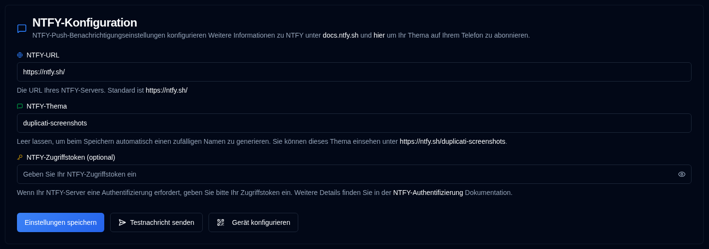

# NTFY {/* #ntfy */}

[NTFY](https://github.com/binwiederhier/ntfy) ist ein einfacher Benachrichtigungsdienst, der Push-Benachrichtigungen an Ihr Telefon oder Desktop senden kann. Dieser Abschnitt ermöglicht es Ihnen, Ihre Verbindung zum Benachrichtigungsserver und die Authentifizierung einzurichten.

| Einstellung           | Beschreibung                                                                                                                                                        |
|:----------------------|:--------------------------------------------------------------------------------------------------------------------------------------------------------------------|
| **NTFY-URL**          | Die URL Ihres NTFY-Servers (Standard ist der öffentliche `https://ntfy.sh/`).                                                                                        |
| **NTFY-Thema**        | Ein eindeutiger Bezeichner für Ihre Benachrichtigungen. Das System generiert automatisch ein zufälliges Thema, wenn es leer gelassen wird, oder Sie können selbst eines angeben. |
| **NTFY-Zugriffstoken** | Ein optionales Zugriffstoken für authentifizierte NTFY-Server. Lassen Sie dieses Feld leer, wenn Ihr Server keine Authentifizierung erfordert.                           |

 

Ein <IIcon2 icon="lucide:message-square" color="green"/> grünes Symbol neben **NTFY** in der Seitenleiste bedeutet, dass Ihre Einstellungen gültig sind. Wenn das Symbol <IIcon2 icon="lucide:message-square" color="yellow"/> gelb ist, sind Ihre Einstellungen ungültig.
Wenn die Konfiguration nicht gültig ist, werden die NTFY-Kontrollkästchen im [`Backup Notifications`](backup-notifications-settings.md)-Tab ebenfalls ausgegraut.

## Verfügbare Aktionen {/* #available-actions */}

| Taste                                                                 | Beschreibung                                                                                                 |
|:----------------------------------------------------------------------|:-------------------------------------------------------------------------------------------------------------|
| <IconButton label="Einstellungen speichern" />                                  | Alle Änderungen an den NTFY-Einstellungen speichern.                                                         |
| <IconButton icon="lucide:send-horizontal" label="Testnachricht senden"/> | Eine Testnachricht an Ihren NTFY-Server senden, um Ihre Konfiguration zu überprüfen.                          |
| <IconButton icon="lucide:qr-code" label="Gerät konfigurieren"/>          | Einen QR-Code anzeigen, mit dem Sie Ihr mobiles Gerät oder Desktop schnell für NTFY-Benachrichtigungen konfigurieren können. |

Wenn eine spätere ntfy-Zustellung fehlschlägt, sehen Administratoren ein rotes Sirenensymbol in der Symbolleiste. Siehe [Zustellungsfehler](../overview.md#delivery-failures).

## Gerätekonfiguration {/* #device-configuration */}

Sie sollten die NTFY-Anwendung auf Ihrem Gerät installieren, bevor Sie sie konfigurieren ([siehe hier](https://ntfy.sh/)). Durch Klicken auf die <IconButton icon="lucide:qr-code" label="Gerät konfigurieren"/>-Taste oder Rechtsklick auf das <SvgButton svgFilename="ntfy.svg" />-Symbol in der Anwendungsleiste wird ein QR-Code angezeigt. Durch Scannen dieses QR-Codes wird Ihr Gerät automatisch mit dem richtigen NTFY-Thema für Benachrichtigungen konfiguriert.

 

 

:::caution
Wenn Sie den öffentlichen **ntfy.sh**-Server ohne Zugriffstoken verwenden, kann jeder mit Ihrem Themennamen Ihre
Benachrichtigungen sehen. 
 
Um einen gewissen Grad an Privatsphäre zu gewährleisten, wird ein zufälliges 12-stelliges Thema generiert, das über
3 Sextillionen (3.000.000.000.000.000.000.000) mögliche Kombinationen bietet, wodurch es schwer zu erraten ist.

Für verbesserte Sicherheit sollten Sie [Zugriffstoken-Authentifizierung](https://docs.ntfy.sh/config/#access-tokens) und [Zugriffssteuerungslisten](https://docs.ntfy.sh/config/#access-control-list-acl) verwenden, um Ihre Themen zu schützen, oder [NTFY selbst hosten](https://docs.ntfy.sh/install/#docker), um vollständige Kontrolle zu haben.

⚠️ **Sie sind dafür verantwortlich, Ihre NTFY-Themen zu sichern. Bitte nutzen Sie diesen Dienst nach eigenem Ermessen.**
:::

 
 

:::note
 Alle Produktnamen, Logos und Marken sind Eigentum ihrer jeweiligen Inhaber. Symbole und Namen werden nur zu Identifikationszwecken verwendet und implizieren keine Billigung.
:::
