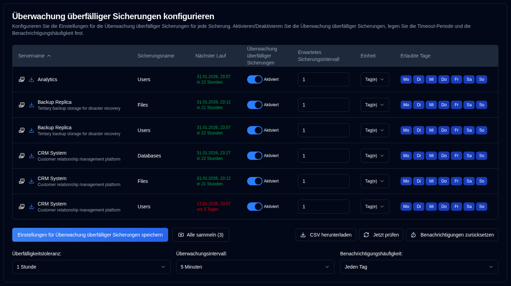

# Überfällige Benachrichtigungen {#overdue-notifications}

## Konfigurieren Sie die Einstellungen für überfällige Sicherungen pro Sicherung {#configure-per-backup-overdue-settings}

-  **Servername**: Der Name des Servers, der auf überfällige Sicherungen überwacht werden soll. 
   - Klicken Sie auf <SvgIcon svgFilename="duplicati_logo.svg" height="18"/>, um die Weboberfläche des Duplicati-Servers zu öffnen
   - Klicken Sie auf <IIcon2 icon="lucide:download" height="18"/>, um Backup-Protokolle von diesem Server zu sammeln.
- **Sicherungsname**: Der Name der Sicherung, die auf überfällige Sicherungen überwacht werden soll.
- **Nächster Lauf**: Die nächste geplante Sicherungszeit, angezeigt in Grün, wenn sie in der Zukunft geplant ist, oder in Rot, wenn sie überfällig ist. Wenn Sie den Mauszeiger über den Wert „Nächster Lauf" bewegen, wird eine QuickInfo angezeigt, die den letzten Sicherungs-Zeitstempel aus der Datenbank mit vollständigem Datum/Uhrzeit und relativer Zeit anzeigt.
- **Überwachung überfälliger Sicherungen**: Aktivieren oder deaktivieren Sie die Überwachung überfälliger Sicherungen für diese Sicherung.
- **Erwartetes Sicherungsintervall**: Das erwartete Sicherungsintervall.
- **Einheit**: Die Einheit des erwarteten Intervalls.
- **Erlaubte Tage**: Die erlaubten Wochentage für die Sicherung.

Wenn die Symbole neben der Servername ausgegraut sind, ist der Server nicht in den [`Einstellungen → Server Settings`](server-settings.md) konfiguriert.

:::note
Wenn Sie Backup-Protokolle von einem Duplicati-Server sammeln, aktualisiert **duplistatus** automatisch die Überwachung überfälliger Sicherungen und Konfigurationen.
:::

:::tip
Um optimale Ergebnisse zu erzielen, sammeln Sie Backup-Protokolle, nachdem Sie die Konfiguration der Sicherungsauftragsintervalle auf Ihrem Duplicati-Server geändert haben. Dies stellt sicher, dass **duplistatus** mit Ihrer aktuellen Konfiguration synchronisiert bleibt.
:::

## Globale Konfigurationen {#global-configurations}

Diese Einstellungen gelten für alle Sicherungen:

| Einstellung                      | Beschreibung                                                                                                                                                                                                                                                                                           |
|:--------------------------------|:------------------------------------------------------------------------------------------------------------------------------------------------------------------------------------------------------------------------------------------------------------------------------------------------------|
| **Überfälligkeitstoleranz**           | Die Kulanzfrist (zusätzlich gewährte Zeit), die zur erwarteten Sicherungszeit hinzugefügt wird, bevor die Sicherung als überfällig markiert wird. Der Standard ist `1 Stunde`.                                                                                                                                                                           |
| **Überwachungsintervall** | Wie oft das System auf überfällige Sicherungen prüft. Der Standard ist `5 Minuten`.                                                                                                                                                                                                                          |
| **Benachrichtigungshäufigkeit**      | Wie oft Benachrichtigungen zu überfälligen Sicherungen gesendet werden:   `Einmalig`: Senden Sie **nur eine** Benachrichtigung, wann die Sicherung überfällig wird.   `Täglich`: Senden Sie **tägliche** Benachrichtigungen während die Sicherung überfällig ist (Standard).   `Wöchentlich`: Senden Sie **wöchentliche** Benachrichtigungen während die Sicherung überfällig ist.   `Monatlich`: Senden Sie **monatliche** Benachrichtigungen während die Sicherung überfällig ist. |

## Verfügbare Aktionen {#available-actions}

| Button                                                              | Beschreibung                                                                                         |
|:--------------------------------------------------------------------|:----------------------------------------------------------------------------------------------------|
| <IconButton label="Einstellungen für Überwachung überfälliger Sicherungen speichern" />             | Speichert die Einstellungen, löscht Timer für alle deaktivierten Sicherungen und führt eine Prüfung überfälliger Sicherungen durch.              |
| <IconButton icon="lucide:import" label="Alle sammeln (#)"/>          | Sammelt Backup-Protokolle von allen konfigurierten Servern, in Klammern die Anzahl der Server zum Sammeln von. |
| <IconButton icon="lucide:download" label="CSV herunterladen"/>            | Lädt eine CSV-Datei herunter, die alle Einstellungen für Überwachung überfälliger Sicherungen und den „Letzte Sicherung Zeitstempel (DB)" aus der Datenbank enthält. |
| <IconButton icon="lucide:refresh-cw" label="Jetzt prüfen"/>            | Führt die Prüfung überfälliger Sicherungen sofort aus. Dies ist nützlich nach Änderungen an Konfigurationen. Es löst auch eine Neuberechnung des „Nächsten Laufs" aus. |
| <IconButton icon="lucide:timer-reset" label="Benachrichtigungen zurücksetzen"/> | Setzt die zuletzt gesendete Benachrichtigung für überfällige Sicherungen für alle Sicherungen zurück.                                          |
