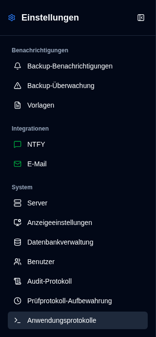
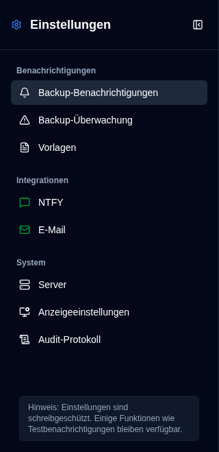

# Übersicht {#overview}

Die Einstellungsseite bietet eine einheitliche Schnittstelle zur Konfiguration aller Aspekte von **duplistatus**. Sie können darauf zugreifen, indem Sie auf die <IconButton icon="lucide:settings" /> **Einstellungen**-Schaltfläche in der [Anwendungsleiste](../overview.md#application-toolbar) klicken. Hinweis: Normale Benutzer sehen ein vereinfachtes Menü mit weniger Optionen im Vergleich zu Administratoren.

## Administrator-Ansicht {#administrator-view}

Administratoren sehen alle verfügbaren Einstellungen.

<table>
  <tr>
    <td>
      
    </td>
    <td>
      <ul>
        <li>
          <strong>Benachrichtigungen</strong>
          <ul>
            <li><a href="backup-notifications-settings.md">Backup-Benachrichtigungen</a>: Pro-Backup-Benachrichtigungseinstellungen konfigurieren</li>
            <li><a href="backup-monitoring-settings.md">Backup-Überwachung</a>: Überfällige Backup-Erkennung und Warnungen konfigurieren</li>
            <li><a href="notification-templates.md">Vorlagen</a>: Benachrichtigungsvorlagen anpassen</li>
          </ul>
        </li> 
        <li>
          <strong>Integrationen</strong>
          <ul>
            <li><a href="ntfy-settings.md">NTFY</a>: NTFY-Push-Benachrichtigungsdienst konfigurieren</li>
            <li><a href="email-settings.md">E-Mail</a>: SMTP-E-Mail-Benachrichtigungen konfigurieren</li>
          </ul>
        </li> 
        <li>
          <strong id="system">System</strong>
          <ul>
            <li><a href="server-settings.md">Server</a>: Duplicati-Serverkonfigurationen verwalten</li>
            <li><a href="display-settings.md">Anzeigeeinstellungen</a>: Design, Diagramm-Zeitbereich, Diagrammstil, Gebietsschema-Format, automatisches Aktualisierungsintervall, Kartensortierreihenfolge und Wochenbeginn konfigurieren</li>
            <li><a href="database-maintenance.md">Datenbankverwaltung</a>: Datenbankbereinigung durchführen (nur Admin)</li>
            <li><a href="user-management-settings.md">Benutzer</a>: Benutzerkonten verwalten (nur Admin)</li>
            <li><a href="audit-logs-viewer.md">Audit-Protokoll</a>: Systemaudit-Protokolle anzeigen</li>
            <li><a href="audit-logs-retention.md">Prüfprotokoll-Aufbewahrung</a>: Audit-Protokoll-Aufbewahrung konfigurieren (nur Admin)</li>
            <li><a href="application-logs-settings.md">Anwendungsprotokolle</a>: Anwendungsprotokolle anzeigen und exportieren (nur Admin)</li>
          </ul>
        </li>
      </ul>
    </td>
  </tr>
</table>

## Nicht-Administrator-Ansicht {#non-administrator-view}

Normale Benutzer sehen einen begrenzten Satz von Einstellungen.

<table>
  <tr>
    <td>
      
    </td>
    <td>
      <ul>
        <li>
          <strong>Benachrichtigungen</strong>
          <ul>
            <li><a href="backup-notifications-settings.md">Backup-Benachrichtigungen</a>: Pro-Backup-Benachrichtigungseinstellungen anzeigen (schreibgeschützt)</li>
            <li><a href="backup-monitoring-settings.md">Backup-Überwachung</a>: Überfällige Backup-Einstellungen anzeigen (schreibgeschützt)</li>
            <li><a href="notification-templates.md">Vorlagen</a>: Benachrichtigungsvorlagen anzeigen (schreibgeschützt)</li>
          </ul>
        </li> 
        <li>
          <strong>Integrationen</strong>
          <ul>
            <li><a href="ntfy-settings.md">NTFY</a>: NTFY-Einstellungen anzeigen (schreibgeschützt)</li>
            <li><a href="email-settings.md">E-Mail</a>: E-Mail-Einstellungen anzeigen (schreibgeschützt)</li>
          </ul>
        </li> 
        <li>
          <strong id="system">System</strong>
          <ul>
            <li><a href="server-settings.md">Server</a>: Serverkonfigurationen anzeigen (schreibgeschützt)</li>
            <li><a href="display-settings.md">Anzeige</a>: Design, Diagramm-Zeitbereich, Diagrammstil, Gebietsschema-Format, automatisches Aktualisierungsintervall, Kartensortierreihenfolge und Wochenbeginn konfigurieren</li>
            <li><a href="audit-logs-viewer.md">Audit-Protokoll</a>: Systemaudit-Protokolle anzeigen (schreibgeschützt)</li>
          </ul>
        </li>
      </ul>
    </td>
  </tr>
</table>

## Statussymbole {#status-icons}

In der Seitenleiste werden Statussymbole neben den **NTFY**- und **E-Mail**-Integrationseinstellungen angezeigt:
- <IIcon2 icon="lucide:message-square" color="green"/> <IIcon2 icon="lucide:mail" color="green"/> **Grünes Symbol**: Ihre Einstellungen sind gültig und korrekt konfiguriert
- <IIcon2 icon="lucide:message-square" color="yellow"/> <IIcon2 icon="lucide:mail" color="yellow"/> **Gelbes Symbol**: Ihre Einstellungen sind nicht gültig oder nicht konfiguriert

Wenn die Konfiguration ungültig ist, werden die entsprechenden Kontrollkästchen auf der Registerkarte [Backup-Benachrichtigungen](backup-notifications-settings.md) ausgegraut und deaktiviert. Weitere Details finden Sie auf den Seiten [NTFY-Einstellungen](ntfy-settings.md) und [E-Mail-Einstellungen](email-settings.md).

 

:::important
Ein grünes Symbol bedeutet nicht zwangsläufig, dass Benachrichtigungen korrekt funktionieren. Verwenden Sie immer die verfügbaren Testfunktionen, um zu bestätigen, dass Ihre Benachrichtigungen funktionieren, bevor Sie sich darauf verlassen.
:::

 
