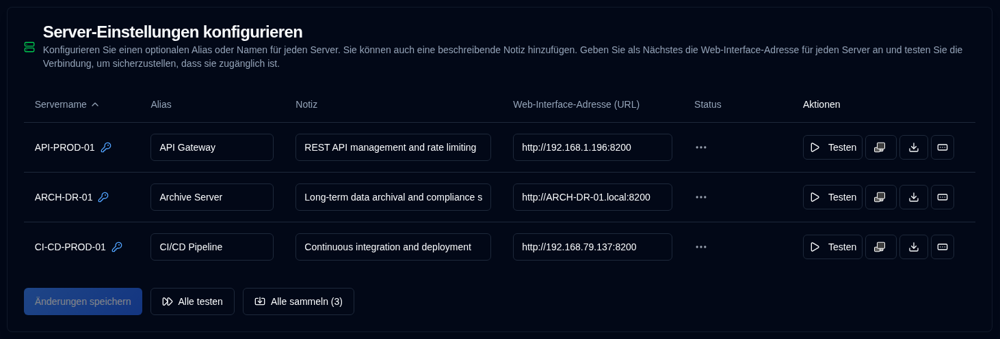

# Server {#server}

Sie können hier einen alternativen Namen (Alias) für Ihre Server, einen Hinweis zur Beschreibung seiner Funktion und die Webadressen Ihrer Duplicati-Server konfigurieren.

| Einstellung                     | Beschreibung                                                                                                                                                                                  |
|:--------------------------------|:---------------------------------------------------------------------------------------------------------------------------------------------------------------------------------------------|
| **Servername**                  | Servername, der im Duplicati-Server konfiguriert ist. Ein <IIcon2 icon="lucide:key-round" color="#42A5F5"/> wird angezeigt, wenn ein Passwort für den Server festgelegt ist.                |
| **Alias**                       | Ein Spitzname oder benutzerfreundlicher Name Ihres Servers. Wann Sie den Mauszeiger über einen Alias bewegen, wird dessen Name angezeigt; in einigen Fällen wird zur Verdeutlichung der Alias und der Name in Klammern angezeigt. |
| **Hinweis**                     | Freitext zur Beschreibung der Serverfunktionalität, des Installationsortes oder anderer Informationen. Wann konfiguriert, wird er neben dem Namen oder Alias des Servers angezeigt.           |
| **Web-Interface-Adresse (URL)** | Konfigurieren Sie die URL für den Zugriff auf die Benutzeroberfläche des Duplicati-Servers. Sowohl `HTTP`- als auch `HTTPS`-URLs werden unterstützt.                                       |
| **Status**                      | Zeigt die Ergebnisse von Test- oder Backup-Protokoll-Sammlungsprotokollen an                                                                                                                 |
| **Aktionen**                    | Sie können den Server testen, die Duplicati-Schnittstelle öffnen, Protokolle sammeln und ein Passwort festlegen. Weitere Details finden Sie unten.                                          |

 

:::note
Wenn die Web-Interface-Adresse (URL) nicht konfiguriert ist, wird die <SvgIcon svgFilename="duplicati_logo.svg" /> Schaltfläche auf allen Seiten deaktiviert und der Server wird nicht in der [`Duplicati-Konfiguration`](../duplicati-configuration.md) <SvgButton svgFilename="duplicati_logo.svg" href="../duplicati-configuration"/> Liste angezeigt.
:::

 

## Verfügbare Aktionen für jeden Server {#available-actions-for-each-server}

| Button                                                                                                      | Beschreibung                                                             |
|:------------------------------------------------------------------------------------------------------------|:------------------------------------------------------------------------|
| <IconButton icon="lucide:play" label="Test"/>                                                               | Testen Sie die Verbindung zum Duplicati-Server.                            |
| <SvgButton svgFilename="duplicati_logo.svg" />                                                              | Öffnen Sie die Weboberfläche des Duplicati-Servers in einem neuen Browser-Tab.         |
| <IconButton icon="lucide:download" />                                                                       | Backup-Protokolle vom Duplicati-Server sammeln.                          |
| <IconButton icon="lucide:rectangle-ellipsis" /> &nbsp; or <IIcon2 icon="lucide:key-round" color="#42A5F5"/> | Ändern oder legen Sie ein Passwort für den Duplicati-Server fest, um Sicherungen zu sammeln. |

 

:::info[WICHTIG]

Um Ihre Sicherheit zu schützen, können Sie nur die folgenden Aktionen ausführen:
- Ein Passwort für den Server festlegen
- Das Passwort vollständig entfernen (löschen)
 
Das Passwort wird verschlüsselt in der Datenbank gespeichert und wird nie in der Benutzeroberfläche angezeigt.
:::

 

## Verfügbare Aktionen für alle Server {#available-actions-for-all-servers}

| Button                                                     | Beschreibung                                                    |
|:-----------------------------------------------------------|:---------------------------------------------------------------|
| <IconButton label="Änderungen speichern" />                | Speichern Sie die an den Servereinstellungen vorgenommenen Änderungen. |
| <IconButton icon="lucide:fast-forward" label="Alle testen"/>  | Testen Sie die Verbindung zu allen Duplicati-Servern.          |
| <IconButton icon="lucide:import" label="Alle sammeln (#)"/> | Sammeln Sie Backup-Protokolle von allen Duplicati-Servern.    |

 
