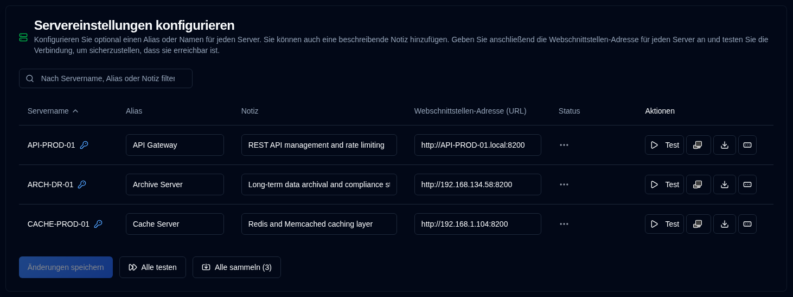

# Server {#server}

Sie können hier einen alternativen Namen (Alias) für Ihre Server, einen Hinweis zur Beschreibung seiner Funktion und die Webadressen Ihrer Duplicati-Server konfigurieren.

| Einstellung                         | Beschreibung                                                                                                                                                                                  |
|:--------------------------------|:---------------------------------------------------------------------------------------------------------------------------------------------|
| **Servername**                 | Servername, der im Duplicati-Server konfiguriert ist. Ein <IIcon2 icon="lucide:key-round" color="#42A5F5"/> wird angezeigt, wenn ein Passwort für den Server festgelegt ist.                                         |
| **Alias**                       | Ein Spitzname oder menschenlesbarer Name Ihres Servers. Beim Überfahren eines Alias wird dessen Name angezeigt; in einigen Fällen wird zur Klarheit sowohl der Alias als auch der Name in Klammern angezeigt. |
| **Hinweis**                        | Freier Text zur Beschreibung der Serverfunktionalität, des Installationsorts oder anderer Informationen. Wenn konfiguriert, wird er neben dem Namen oder Alias des Servers angezeigt.                 |
| **Web-Interface-Adresse (URL)** | Konfigurieren Sie die URL für den Zugriff auf die Duplicati-Server-Benutzeroberfläche. Sowohl `HTTP` als auch `HTTPS` URLs werden unterstützt.                                                                                           |
| **Status**                      | Zeigt die Ergebnisse des Verbindungstests oder der gesammelten Backup-Logs an                                                                                                                                              |
| **Aktionen**                     | Sie können die Verbindung testen, die Duplicati-Benutzeroberfläche öffnen, Logs sammeln und ein Passwort festlegen. Weitere Details finden Sie unten.                                                                                         |

 

:::note
Wenn die Web-Interface-Adresse (URL) nicht konfiguriert ist, wird die Schaltfläche <SvgIcon svgFilename="duplicati_logo.svg" /> auf allen Seiten deaktiviert und der Server wird nicht in der Liste [Duplicati-Konfiguration](../duplicati-configuration.md) <SvgButton svgFilename="duplicati_logo.svg" href="../duplicati-configuration"/> angezeigt.
:::

 

## Verfügbare Aktionen für jeden Server {#available-actions-for-each-server}

| Schaltfläche                                                                                                      | Beschreibung                                                             |
|:------------------------------------------------------------------------------------------------------------|:------------------------------------------------------------------------|
| <IconButton icon="lucide:play" label="Test"/>                                                               | Testet die Verbindung zum Duplicati-Server.                            |
| <SvgButton svgFilename="duplicati_logo.svg" />                                                              | Öffnet die Web-Benutzeroberfläche des Duplicati-Servers in einem neuen Browser-Tab.         |
| <IconButton icon="lucide:download" />                                                                       | Sammelt Backup-Logs vom Duplicati-Server.                          |
| <IconButton icon="lucide:rectangle-ellipsis" /> &nbsp; oder <IIcon2 icon="lucide:key-round" color="#42A5F5"/> | Ändert oder legt ein Passwort für den Duplicati-Server zum Sammeln von Backups fest. |

 

:::info[WICHTIG]

Um Ihre Sicherheit zu schützen, können Sie nur die folgenden Aktionen ausführen:
- Ein Passwort für den Server festlegen
- Das Passwort vollständig entfernen (löschen)
 
Das Passwort wird verschlüsselt in der Datenbank gespeichert und wird nie in der Benutzeroberfläche angezeigt.
:::

 

## Verfügbare Aktionen für alle Server {#available-actions-for-all-servers}

| Schaltfläche                                                     | Beschreibung                                     |
|:-----------------------------------------------------------|:------------------------------------------------|
| <IconButton label="Änderungen speichern" />                        | Speichert die Änderungen an den Servereinstellungen.   |
| <IconButton icon="lucide:fast-forward" label="Alle testen"/>  | Testet die Verbindung zu allen Duplicati-Servern.   |
| <IconButton icon="lucide:import" label="Alle sammeln (#)"/> | Sammelt Backup-Logs von allen Duplicati-Servern. |

 
