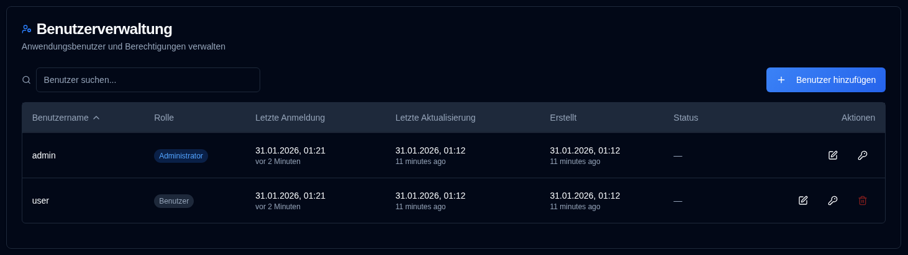

# Benutzer {#users}

Verwalten Sie Benutzerkonten, Berechtigungen und Zugriffskontrolle für **duplistatus**. Dieser Abschnitt ermöglicht Administratoren das Erstellen, Ändern und Löschen von Benutzerkonten.

>[!TIP] 
>Das Standard-Konto `admin` kann gelöscht werden. Erstellen Sie dazu zunächst einen neuen Administratorbenutzer, melden Sie sich mit diesem Konto an, 
> und löschen Sie dann das Konto `admin`.
>
> Das Standard-Passwort für das Konto `admin` ist `Duplistatus09`. Sie müssen es beim ersten Anmelden ändern.

## Benutzerverwaltung {#accessing-user-management}

Sie können auf den Bereich Benutzerverwaltung auf zwei Arten zugreifen:

1. **Aus dem Benutzermenü**: Klicken Sie auf <IconButton icon="lucide:user" label="Benutzername" />   in der [Anwendungssymbolleiste](../overview.md#application-toolbar) und wählen Sie "Admin-Benutzer" aus.

2. **Aus Einstellungen**: Klicken Sie auf <IconButton icon="lucide:settings"/> und `Users` in der Seitenleiste der Einstellungen

## Erstellen eines neuen Benutzers {#creating-a-new-user}

1. Klicken Sie auf die Schaltfläche <IconButton icon="lucide:plus" label="Benutzer hinzufügen"/>
2. Geben Sie die Benutzerdetails ein:
   - **Benutzername**: Muss 3–50 Zeichen lang, eindeutig und Groß-/Kleinschreibung-insensitiv sein
   - **Admin**: Prüfen, um Administratorrechte zu gewähren
   - **Passwortänderung erforderlich**: Prüfen, um eine Passwortänderung beim ersten Anmelden zu erzwingen
   - **Passwort**: 
     - Option 1: Prüfen Sie „Passwort automatisch generieren", um ein sicheres temporäres Passwort zu erstellen
     - Option 2: Deaktivieren Sie diese Option und geben Sie ein benutzerdefiniertes Passwort ein
3. Klicken Sie auf <IconButton icon="lucide:user-plus" label="Benutzer erstellen" />.

## Benutzer bearbeiten {#editing-a-user}

1. Klicken Sie auf das <IconButton icon="lucide:edit" /> Bearbeitungssymbol neben dem Benutzer
2. Ändern Sie eines der folgenden Elemente:
   - **Benutzername**: Ändern Sie den Benutzernamen (muss eindeutig sein)
   - **Admin**: Administratorrechte umschalten
   - **Passwortänderung erforderlich**: Anforderung zur Passwortänderung umschalten
3. Klicken Sie auf <IconButton icon="lucide:check" label="Änderungen speichern" />.

## Passwort eines Benutzers zurücksetzen {#resetting-a-user-password}

1. Klicken Sie auf das <IconButton icon="lucide:key-round" /> Schlüsselsymbol neben dem Benutzer
2. Bestätigen Sie das Passwort zurücksetzen
3. Ein neues temporäres Passwort wird generiert und angezeigt
4. Kopieren Sie das Passwort und geben Sie es dem Benutzer sicher weiter

## Benutzer löschen {#deleting-a-user}

1. Klicken Sie auf das <IconButton icon="lucide:trash-2" /> Löschsymbol neben dem Benutzer
2. Bestätigen Sie das Löschen im Dialogfeld. **Das Löschen von Benutzern ist dauerhaft und kann nicht rückgängig gemacht werden.**

## Kontosperrung {#account-lockout}

Konten werden nach mehreren fehlgeschlagenen Anmeldeversuchen automatisch gesperrt:
- **Sperrungsschwelle**: 5 fehlgeschlagene Versuche
- **Sperrdauer**: 15 Minuten
- Gesperrte Konten können sich nicht anmelden, bis die Sperrfrist abläuft

## Wiederherstellung des Admin-Zugriffs {#recovering-admin-access}

Wenn Sie Ihr Admin-Passwort verloren haben oder aus Ihrem Konto gesperrt wurden, können Sie den Zugriff mithilfe des Admin-Wiederherstellungsskripts wiederherstellen. Weitere Informationen finden Sie im Leitfaden [Admin Account Recovery](../admin-recovery.md) mit detaillierten Anweisungen zur Wiederherstellung von Administrator-Zugriff in Docker-Umgebungen.
