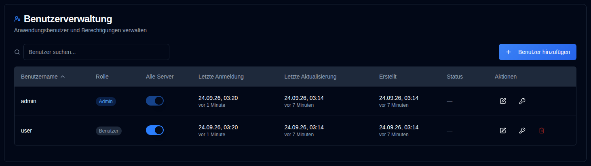

# Benutzer {/* #users */}

Verwalten Sie Benutzerkonten, Berechtigungen und Zugriffskontrolle für **duplistatus**. Dieser Abschnitt ermöglicht es Administratoren, Benutzerkonten zu erstellen, zu ändern und zu löschen.

>[!TIP] 
>Das Standardkonto `admin` kann gelöscht werden. Erstellen Sie hierzu zunächst einen neuen Administrator-Benutzer, melden Sie sich mit diesem Konto an 
> und löschen Sie anschließend das Konto `admin`.
>
> Das Standardpasswort für das Konto `admin` ist `Duplistatus09`. Sie müssen es bei der ersten Anmeldung ändern.

## Zugriff auf die Benutzerverwaltung {/* #accessing-user-management */}

Sie können auf den Bereich Benutzerverwaltung auf zwei Arten zugreifen:

1. **Über das Benutzermenü**: Klicken Sie auf <IconButton icon="lucide:user" label="Benutzername" /> in der [Anwendungs-Symbolleiste](../overview.md#application-toolbar) und wählen Sie "Admin-Benutzer" aus.

2. **Über Einstellungen**: Klicken Sie auf <IconButton icon="lucide:settings"/> und **Benutzer** in der Seitenleiste der Einstellungen

## Einen neuen Benutzer erstellen {/* #creating-a-new-user */}

1. Klicken Sie auf die Schaltfläche <IconButton icon="lucide:plus" label="Benutzer hinzufügen"/>
2. Geben Sie die Benutzerdetails ein:
   - **Benutzername**: Muss 3-50 Zeichen lang sein, eindeutig und unabhängig von Groß-/Kleinschreibung
   - **Admin**: Aktivieren, um Administratorrechte zu gewähren
   - **Passwortänderung erforderlich**: Aktivieren, um Passwortänderung bei erster Anmeldung zu erzwingen
   - **Passwort**: 
     - Option 1: Aktivieren Sie "Passwort automatisch generieren", um ein sicheres temporäres Passwort zu erstellen
     - Option 2: Deaktivieren und ein benutzerdefiniertes Passwort eingeben
3. Klicken Sie auf <IconButton icon="lucide:user-plus" label="Benutzer erstellen" />.

## Einen Benutzer bearbeiten {/* #editing-a-user */}

1. Klicken Sie auf das Bearbeitungssymbol <IconButton icon="lucide:edit" /> neben dem Benutzer
2. Ändern Sie eine der folgenden Angaben:
   - **Benutzername**: Benutzername ändern (muss eindeutig sein)
   - **Admin**: Administratorrechte umschalten
   - **Passwortänderung erforderlich**: Passwortänderungserfordernis umschalten
3. Klicken Sie auf <IconButton icon="lucide:check" label="Änderungen speichern" />.

## Ein Benutzerpasswort zurücksetzen {/* #resetting-a-user-password */}

1. Klicken Sie auf das Schlüsselsymbol <IconButton icon="lucide:key-round" /> neben dem Benutzer
2. Bestätigen Sie das Zurücksetzen des Passworts
3. Ein neues temporäres Passwort wird generiert und angezeigt
4. Kopieren Sie das Passwort und geben Sie es dem Benutzer sicher weiter

## Einen Benutzer löschen {/* #deleting-a-user */}

1. Klicken Sie auf das Löschen-Symbol <IconButton icon="lucide:trash-2" /> neben dem Benutzer
2. Bestätigen Sie das Löschen im Dialogfeld. **Das Löschen eines Benutzers ist dauerhaft und kann nicht rückgängig gemacht werden.**

## Kontosperrung {/* #account-lockout */}

Konten werden nach mehreren fehlgeschlagenen Anmeldeversuchen automatisch gesperrt:
- **Sperrschwellenwert**: 5 fehlgeschlagene Versuche
- **Sperrdauer**: 15 Minuten
- Gesperrte Konten können sich nicht anmelden, bis der Sperrzeitraum abgelaufen ist

## Wiederherstellung des Admin-Zugriffs {/* #recovering-admin-access */}

Wenn Sie Ihr Administrator-Passwort verloren haben oder aus Ihrem Konto ausgesperrt wurden, können Sie den Zugriff mithilfe des Admin-Wiederherstellungsskripts wiederherstellen. Weitere Informationen zur Wiederherstellung des Administratorzugriffs in Docker-Umgebungen finden Sie im Leitfaden [Admin-Kontowiederherstellung](../admin-recovery.md).

Wenn der Browser **Zugriff verweigert** (HTTP 403) anzeigt, bevor das Anmeldeformular erscheint, stellen Sie den Zugriff stattdessen mit [Von IP-Zulassungsliste ausgesperrt](../troubleshooting.md#locked-out-by-ip-allowlist) wieder her.
