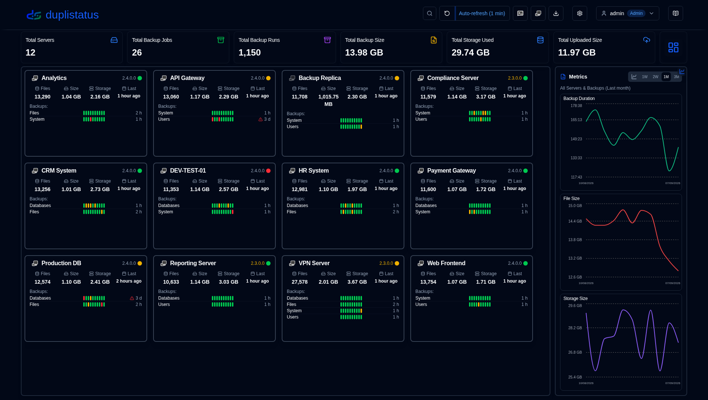

# Bienvenido a duplistatus {#welcome-to-duplistatus}

**duplistatus** - Supervisar múltiples [servidores de Duplicati](https://github.com/duplicati/duplicati) desde un único Panel de control

## Características {#features}

- **Configuración rápida**: Implementación sencilla en contenedores, con imágenes disponibles en Docker Hub y GitHub.
- **Panel unificado**: Visualiza el estado de las copias de seguridad, el historial, la versión de Duplicati y los detalles de todos los servidores en un solo lugar.
- **Monitoreo de copias de seguridad**: Comprobación automatizada y alertas para copias de seguridad programadas vencidas.
- **Visualización de datos y registros**: Gráficos interactivos y recopilación automática de registros de los servidores Duplicati.
- **Notificaciones y Alertas**: Soporte integrado de NTFY y SMTP para correo electrónico de alertas de copia de seguridad, incluyendo notificaciones de copia de seguridad vencida.
- **Control de Acceso de Usuario y Seguridad**: Sistema de autenticación seguro con control de acceso basado en roles (roles de Administrador/Usuario), políticas de contraseña configurables, protección de bloqueo de cuenta y gestión de usuarios completa.
- **Claves de API**: Claves opcionales con alcance para subidas de Duplicati y widgets de Homepage, más límites configurables de tamaño y velocidad de subida.
- **Listas de Permitidos de IP**: Listas CIDR separadas para la interfaz de administración y las APIs externas (`/api/upload`, `/api/summary`, `/api/lastbackup*`).
- **Registro de Auditoría**: Registro completo de todos los cambios del sistema y acciones de usuario con filtrado avanzado, capacidades de exportación y períodos de retención configurables.
- **Visor de Registros de Aplicación**: Interfaz solo para administradores para ver, buscar y exportar registros de la aplicación directamente desde la interfaz web con capacidades de monitoreo en tiempo real.
- **Soporte Multilingüe**: Interfaz y documentación disponibles en inglés, francés, alemán, español, portugués brasileño, hindi (romano) y chino simplificado.

## Instalación {#installation}

La aplicación puede implementarse usando Docker, Portainer Stacks o Podman. Consulte los detalles en la [Guía de Instalación](installation/installation.md).

- Si está actualizando desde una versión anterior, su base de datos será [migrada automáticamente](migration/version_upgrade.md) al nuevo esquema durante el proceso de actualización.

- Al usar Podman (como contenedor independiente o dentro de un pod), y si requiere configuraciones DNS personalizadas (como para Tailscale MagicDNS, redes corporativas u otras configuraciones DNS personalizadas), puede especificar manualmente servidores DNS y dominios de búsqueda. Consulte la guía de instalación para más detalles.

## Configuración de servidores Duplicati (Requerido) {#duplicati-servers-configuration-required}

Una vez que su servidor **duplistatus** esté en marcha, debe configurar sus servidores **Duplicati** para enviar logs de backups a **duplistatus**, según lo descrito en la [sección de Configuración de Duplicati](installation/duplicati-server-configuration.md) de la Guía de Instalación. Sin esta configuración, el panel no recibirá datos de backups de sus servidores.

## Guía de usuario {#user-guide}

Consulte la [Guía de usuario](user-guide/overview.md) para instrucciones detalladas sobre cómo configurar y usar **duplistatus**, incluyendo configuración inicial, configuración de características y solución de problemas.

## Capturas de pantalla {#screenshots}

### Panel de control {#dashboard}

### Historial de backups {#backup-history}

### Detalles del backup {#backup-details}

### Backups vencidos {#overdue-backups}

### Notificaciones vencidas en su teléfono {#overdue-notifications-on-your-phone}

## Referencia de API {#api-reference}

Consulte la [Documentación de puntos de conexión de la API](api-reference/overview.md) para detalles sobre endpoints disponibles, formatos de solicitud/respuesta y ejemplos.

## Desarrollo {#desarrollo}

Para obtener instrucciones sobre cómo descargar, modificar o ejecutar el código, consulte [Configuración de Desarrollo](development/setup.md).

Este proyecto fue construido principalmente con ayuda de IA. Para aprender cómo, consulte [Cómo construí esta aplicación usando herramientas de IA](development/how-i-build-with-ai).

## Créditos {#creditos}

- En primer lugar, gracias a Kenneth Skovhede por crear Duplicati—esta increíble herramienta de respaldo. Agradecimiento también a todos los contribuyentes.

💙 Si encuentra [Duplicati](https://www.duplicati.com) útil, por favor considere apoyar al desarrollador. Más detalles están disponibles en su sitio web o página de GitHub.

- Ícono SVG de Duplicati de https://dashboardicons.com/icons/duplicati
- Ícono SVG de ntfy de https://dashboardicons.com/icons/ntfy
- Ícono SVG de GitHub de https://github.com/logos

:::note
Todos los nombres de productos, logotipos y marcas registradas son propiedad de sus respectivos propietarios. Los iconos y nombres se utilizan únicamente con fines de identificación y no implican respaldo.
:::

## Licencia {#licencia}

El proyecto está bajo la [Apache License 2.0](LICENSE.md).

**Copyright © 2026 Waldemar Scudeller Jr.**
