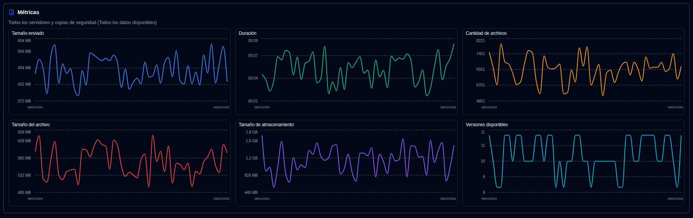

# Métricas de Backup {#backup-metrics}

Se muestra un gráfico de métricas de backup a lo largo del tiempo tanto en el Panel de control (vista de tabla) como en la página de detalles del servidor.

- **Panel de control**, el gráfico muestra el número total de backups registrados en la base de datos **duplistatus**. Si utiliza el diseño de Tarjetas, puede seleccionar un servidor para ver sus métricas consolidadas (cuando el panel lateral muestra métricas).
- **Página de Detalles del Servidor**, el gráfico muestra métricas para el servidor seleccionado (para todos sus backups) o para un backup específico individual.

- **Tamaño cargado**: Cantidad total de datos enviados/transmitidos durante los backups desde el servidor Duplicati al destino (almacenamiento local, FTP, proveedor en la nube, ...) por día.
- **Duración**: La duración total de todos los backups recibidos por día en HH:MM.
- **Cantidad de archivos**: La suma del contador de cantidad de archivos recibido para todos los backups por día.
- **Tamaño de archivos**: La suma del tamaño de archivos reportado por el servidor Duplicati para todos los backups recibidos por día.
- **Tamaño de almacenamiento**: La suma del tamaño de almacenamiento usado en el destino de backup reportado por el servidor Duplicati por día.
- **Versiones disponibles**: La suma de todas las versiones disponibles para todos los backups por día.

:::note
Puede utilizar el control [Configuración de pantalla](settings/display-settings.md) para configurar el rango de tiempo del gráfico.
:::
