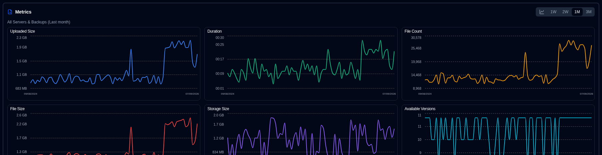

# Métricas de Copia de Seguridad {/* #backup-metrics */}

Un gráfico de métricas de copia de seguridad a lo largo del tiempo se muestra tanto en el panel (vista de tabla) como en la página de detalles del servidor.

- **Panel**, el gráfico muestra el número total de copias de seguridad registradas en la base de datos **duplistatus**. Si utiliza el diseño de Tarjetas, puede seleccionar un servidor para ver sus métricas consolidadas (cuando el panel lateral esté mostrando métricas).
- Página de **Detalles del Servidor**, el gráfico muestra métricas para el servidor seleccionado (para todas sus copias de seguridad) o para una única copia de seguridad específica.

## Controles de Gráfico en Línea {/* #inline-chart-controls */}

Controles de acceso rápido están disponibles directamente en los encabezados del panel del gráfico para configuración fácil sin necesidad de navegar a Configuración de Visualización:

### Selector de Rango de Tiempo {/* #time-range-selector */}

Botones tipo píldora aparecen en el encabezado del gráfico para selección rápida de rango de tiempo: **1S | 2S | 1M | 3M**

- **1S**: Últimos 7 días (ventana móvil)
- **2S**: Últimos 14 días (ventana móvil)
- **1M**: Últimos 30 días (ventana móvil, predeterminado)
- **3M**: Últimos 90 días (ventana móvil)

Los cambios realizados aquí se sincronizan con su Configuración de Visualización, por lo que su preferencia se recuerda tras actualizaciones de página.

### Alternador de Estilo de Gráfico {/* #chart-style-toggle */}

Un botón de alternancia en el encabezado del gráfico le permite cambiar entre:

- **Líneas Suaves**: Muestra puntos de datos conectados con curvas suaves
- **Gráfico de Barras**: Muestra datos como barras discretas para cada periodo de tiempo

Ambos modos utilizan agregación por intervalos de tiempo para visualización óptima. Los periodos vacíos en modo de barras no muestran ninguna barra. Su preferencia persiste tras actualizaciones de página y se sincroniza con Configuración de Visualización.

## Consolidación de Datos del Gráfico {/* #chart-data-consolidation */}

Cuando ocurren múltiples copias de seguridad en el mismo día, **duplistatus** consolida los datos antes de mostrarlos en los gráficos:

- **SUMA**: Se usa para métricas acumulativas (Duración, Número de Archivos, Tamaño de Archivo, Tamaño Subido)
- **ÚLTIMO**: Se usa para Tamaño de Almacenamiento (el valor más reciente del día)
- **MÁX**: Se usa para Versiones Disponibles (la cuenta más alta del día)

Esta consolidación ocurre antes de aplicar la agrupación por intervalos de tiempo, asegurando métricas agregadas precisas. Por ejemplo, dos copias de seguridad el 5/12/26 producirán un único punto de datos consolidado en el gráfico.

## Definiciones de Métricas {/* #metric-definitions */}

- **Tamaño Subido**: Cantidad total de datos subidos/transmitidos durante las copias de seguridad desde el servidor Duplicati al destino (almacenamiento local, FTP, proveedor de nube, ...) por día.
- **Duración**: La duración total de todas las copias de seguridad recibidas por día en HH:MM.
- **Número de Archivos**: La suma del contador de número de archivos recibido para todas las copias de seguridad por día.
- **Tamaño de Archivo**: La suma del tamaño de archivo reportado por el servidor Duplicati para todas las copias de seguridad recibidas por día.
- **Tamaño de Almacenamiento**: La suma del tamaño de almacenamiento usado en el destino de la copia de seguridad reportado por el servidor duplicati por día.
- **Versiones disponibles**: La suma de todas las versiones disponibles para todas las copias de seguridad por día.

:::note
Puede usar el control [Configuración de visualización](settings/display-settings.md) para configurar el rango de tiempo del gráfico.
:::
