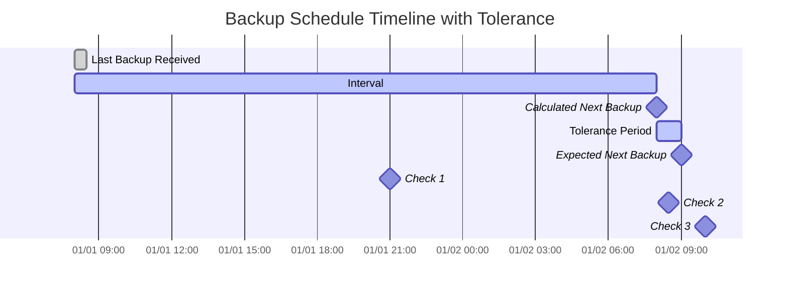

import { ZoomMermaid } from '@site/src/components/ZoomMermaid';

# Monitoreo de Backups {#backup-monitoring}

La función de monitoreo de backups le permite rastrear y alertar sobre backups que están retrasados. Las notificaciones pueden ser a través de NTFY o Correo electrónico.

En la interfaz de usuario, los backups retrasados se muestran con un icono de advertencia. Al pasar el cursor sobre el icono se muestran los detalles del backup retrasado, incluida la última hora del backup, la hora del backup esperado, el período de tolerancia y la hora del próximo backup esperado.

## Proceso de Verificación Retrasada {#overdue-check-process}

**Cómo funciona:**

| **Paso** | **Valor**                  | **Descripción**                                   | **Ejemplo**        |
|:--------:|:---------------------------|:--------------------------------------------------|:-------------------|
|    1     | **Última Backup**            | La marca de tiempo del último backup exitoso.      | `2024-01-01 08:00` |
|    2     | **Intervalo esperado**      | La frecuencia de backup configurada.                  | `1 day`            |
|    3     | **Siguiente Backup calculado** | `Última Backup` + `Intervalo esperado`               | `2024-01-02 08:00` |
|    4     | **Tolerancia**              | El período de gracia configurado (tiempo adicional permitido). | `1 hour`           |
|    5     | **Siguiente Backup esperado**   | `Siguiente Backup calculado` + `Tolerancia`            | `2024-01-02 09:00` |

Una copia de seguridad se considera **retrasada** si la hora actual es posterior a la hora de `Siguiente Backup Esperado`.

<ZoomMermaid>

</ZoomMermaid>

**Ejemplos basados en la cronología anterior:**

- A las `2024-01-01 21:00` (🔹Verificación 1), el backup está **a tiempo**.
- A las `2024-01-02 08:30` (🔹Verificación 2), el backup está **a tiempo**, ya que aún se encuentra dentro del período de tolerancia.
- A las `2024-01-02 10:00` (🔹Verificación 3), el backup está **retrasado**, ya que esto es después de la hora de `Expected Next Backup`.

## Comprobaciones Periódicas {#periodic-checks}

**duplistatus** realiza comprobaciones periódicas de backups retrasados en intervalos configurables. El intervalo por defecto es 20 minutos, pero puede configurarlo en [Configuración → Monitoreo de Backups](settings/backup-monitoring-settings.md).

## Configuración Automática {#automatic-configuration}

Cuando recopila logs de backup de un servidor Duplicati, **duplistatus** automáticamente:

- Extrae la programación de backups de la Configuración de Duplicati
- Actualiza los intervalos de monitoreo de backups para que coincidan exactamente
- Sincroniza los días de la semana permitidos y las horas programadas
- Preserva sus preferencias de notificación

:::tip
Para obtener los mejores resultados, recopile logs de backup después de cambiar los intervalos de trabajos de backup en su servidor Duplicati. Esto garantiza que **duplistatus** se mantenga sincronizado con su configuración actual.
:::

Revise la sección [Configuración de Monitoreo de Backups](settings/backup-monitoring-settings.md) para opciones de configuración detalladas.
