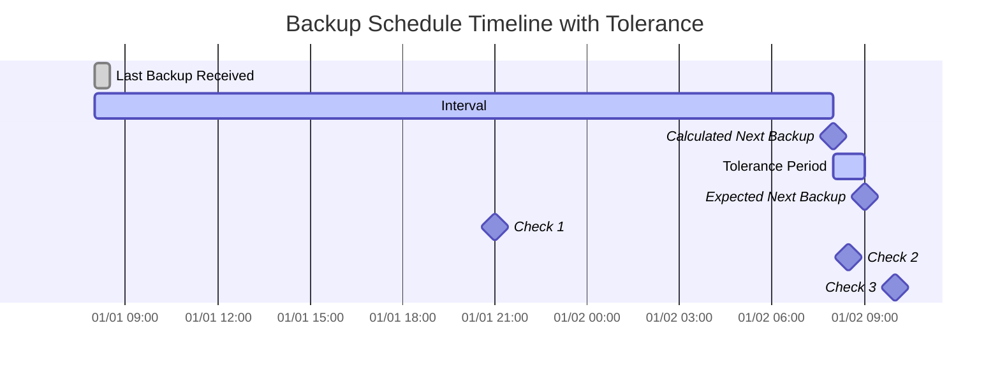

import { ZoomMermaid } from '@site/src/components/ZoomMermaid';

# Monitoreo de copias de seguridad {/* #backup-monitoring */}

La función de monitoreo de copias de seguridad le permite hacer un seguimiento y recibir alertas sobre las copias de seguridad que están vencidas. Las notificaciones pueden realizarse mediante NTFY o correo electrónico.

En la interfaz de usuario, las copias de seguridad vencidas se muestran con un icono de advertencia . Al pasar el cursor sobre el icono se muestran los detalles de la copia de seguridad vencida, incluyendo la hora de la última copia de seguridad, la hora prevista para la copia de seguridad, el período de tolerancia y la hora prevista para la próxima copia de seguridad.

## Proceso de comprobación de vencimientos {/* #overdue-check-process */}

**Cómo funciona:**

| **Paso** | **Valor**                  | **Descripción**                                   | **Ejemplo**        |
|:--------:|:---------------------------|:--------------------------------------------------|:-------------------|
|    1     | **Última Copia de Seguridad**            | La marca de tiempo de la última copia de seguridad correcta.      | `2024-01-01 08:00` |
|    2     | **Intervalo esperado**      | La frecuencia configurada de la copia de seguridad.                  | `1 day`            |
|    3     | **Próxima copia de seguridad calculada** | `Last Backup` + `Expected Interval`               | `2024-01-02 08:00` |
|    4     | **Tolerancia**              | El período de gracia configurado (tiempo adicional permitido). | `1 hour`           |
|    5     | **Próxima copia de seguridad prevista**   | `Calculated Next Backup` + `Tolerance`            | `2024-01-02 09:00` |

Una copia de seguridad se considera **vencida** si la hora actual es posterior a la hora de `Expected Next Backup`.

<ZoomMermaid>

```mermaid
gantt
    title Backup Schedule Timeline with Tolerance
    dateFormat  YYYY-MM-DD HH:mm
    axisFormat %m/%d %H:%M

    Last Backup Received    :done, last-backup, 2024-01-01 08:00, 0.5h

    Interval                :active, interval, 2024-01-01 08:00, 24h
    Calculated Next Backup                :milestone, expected, 2024-01-02 08:00, 0h
    Tolerance Period        :active, tolerance period, 2024-01-02 08:00, 1h

    Expected Next Backup               :milestone, adjusted, 2024-01-02 09:00, 0h

    Check 1 : milestone, deadline, 2024-01-01 21:00, 0h
    Check 2 : milestone, deadline, 2024-01-02 08:30, 0h
    Check 3 : milestone, deadline, 2024-01-02 10:00, 0h

```

</ZoomMermaid>

**Ejemplos basados en la línea de tiempo anterior:**

- A las `2024-01-01 21:00` (🔹Comprobar 1), la copia de seguridad está **en hora**.
- A las `2024-01-02 08:30` (🔹Comprobar 2), la copia de seguridad está **en hora**, ya que aún está dentro del período de tolerancia.
- A las `2024-01-02 10:00` (🔹Comprobar 3), la copia de seguridad está **vencida**, ya que es posterior a la hora de `Expected Next Backup`.

## Comprobaciones periódicas {/* #periodic-checks */}

**duplistatus** realiza comprobaciones periódicas de copias de seguridad vencidas a intervalos configurables. El intervalo predeterminado es de 20 minutos, pero puede configurarlo en [Configuración → Monitoreo de copias de seguridad](settings/backup-monitoring-settings.md).

## Configuración automática {/* #automatic-configuration */}

Cuando recopila registros de copias de seguridad desde un servidor Duplicati, **duplistatus** hace automáticamente lo siguiente:

- Extrae la programación de la copia de seguridad de la configuración de Duplicati
- Actualiza los intervalos de monitoreo de copias de seguridad para que coincidan exactamente
- Sincroniza los días permitidos y las horas programadas
- Mantiene sus preferencias de notificación

:::tip
Para obtener los mejores resultados, recopile los registros de copias de seguridad después de cambiar los intervalos de trabajo de copia de seguridad en su servidor Duplicati. Esto garantiza que **duplistatus** permanezca sincronizado con su configuración actual.
:::

Revise la sección [Configuración de monitoreo de copias de seguridad](settings/backup-monitoring-settings.md) para ver opciones detalladas de configuración.
