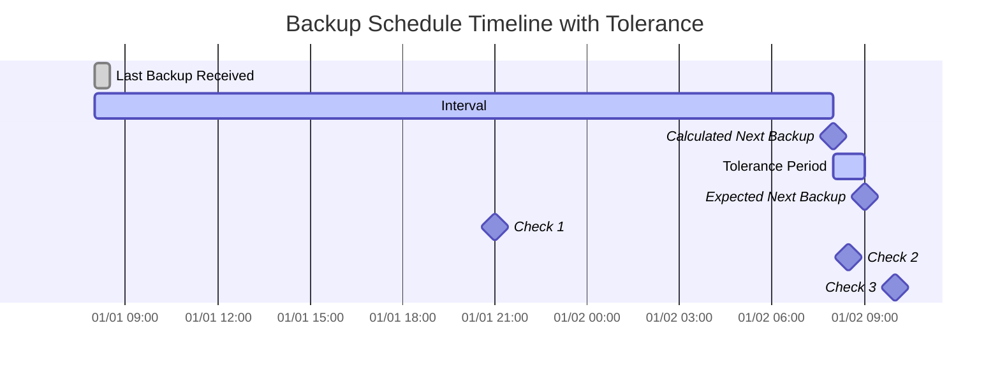

import { ZoomMermaid } from '@site/src/components/ZoomMermaid';

# Monitoreo de Copias de Seguridad {/* #backup-monitoring */}

La función de monitoreo de copias de seguridad le permite rastrear y alertar sobre las copias de seguridad que están vencidas. Las notificaciones pueden ser a través de NTFY o Correo electrónico.

En la interfaz de usuario, las copias de seguridad vencidas se muestran con un icono de advertencia. Al pasar el cursor sobre el icono, se muestran los detalles de la copia de seguridad vencida, incluyendo la hora de la última copia de seguridad, la hora esperada de la copia de seguridad, el período de tolerancia y la hora esperada de la próxima copia de seguridad.

## Proceso de Comprobación de Vencimiento {/* #overdue-check-process */}

**Cómo funciona:**

| **Paso** | **Valor**                  | **Descripción**                                   | **Ejemplo**        |
|:--------:|:---------------------------|:--------------------------------------------------|:-------------------|
|    1     | **Última Copia de Seguridad**            | La marca de tiempo de la última copia de seguridad exitosa.      | `2024-01-01 08:00` |
|    2     | **Intervalo esperado**      | La frecuencia de copia de seguridad configurada.                  | `1 day`            |
|    3     | **Próxima copia de seguridad calculada** | `Last Backup` + `Expected Interval`               | `2024-01-02 08:00` |
|    4     | **Tolerancia**              | El período de gracia configurado (tiempo adicional permitido). | `1 hour`           |
|    5     | **Próxima copia de seguridad esperada**   | `Calculated Next Backup` + `Tolerance`            | `2024-01-02 09:00` |

Una copia de seguridad se considera **vencida** si la hora actual es posterior a la hora de `Expected Next Backup`.

<ZoomMermaid>

```mermaid
gantt
    title Backup Schedule Timeline with Tolerance
    dateFormat  YYYY-MM-DD HH:mm
    axisFormat %m/%d %H:%M

    Last Backup Received    :done, last-backup, 2024-01-01 08:00, 0.5h

    Interval                :active, interval, 2024-01-01 08:00, 24h
    Calculated Next Backup                :milestone, expected, 2024-01-02 08:00, 0h
    Tolerance Period        :active, tolerance period, 2024-01-02 08:00, 1h

    Expected Next Backup               :milestone, adjusted, 2024-01-02 09:00, 0h

    Check 1 : milestone, deadline, 2024-01-01 21:00, 0h
    Check 2 : milestone, deadline, 2024-01-02 08:30, 0h
    Check 3 : milestone, deadline, 2024-01-02 10:00, 0h

```

</ZoomMermaid>

**Ejemplos basados en la línea de tiempo anterior:**

- A las `2024-01-01 21:00` (🔹Comprobación 1), la copia de seguridad está **a tiempo**.
- A las `2024-01-02 08:30` (🔹Comprobación 2), la copia de seguridad está **a tiempo**, ya que aún está dentro del período de tolerancia.
- A las `2024-01-02 10:00` (🔹Comprobación 3), la copia de seguridad está **vencida**, ya que esto es después de la hora de `Expected Next Backup`.

## Comprobaciones Periódicas {/* #periodic-checks */}

**duplistatus** realiza comprobaciones periódicas de copias de seguridad vencidas en intervalos configurables. El intervalo predeterminado es de 20 minutos, pero puede configurarlo en [Configuración → Monitoreo de Copias de Seguridad](settings/backup-monitoring-settings.md).

## Configuración Automática {/* #automatic-configuration */}

Cuando recopila registros de copia de seguridad de un servidor Duplicati, **duplistatus** automáticamente:

- Extrae el horario de copia de seguridad de la configuración de Duplicati
- Actualiza los intervalos de monitoreo de copia de seguridad para que coincidan exactamente
- Sincroniza los días permitidos de la semana y los horarios programados
- Conserva sus preferencias de notificación

:::tip
Para obtener los mejores resultados, recopile los registros de copia de seguridad después de cambiar los intervalos de trabajo de copia de seguridad en su servidor Duplicati. Esto asegura que **duplistatus** esté sincronizado con su configuración actual.
:::

Revise la sección [Configuración de monitoreo de copias de seguridad](settings/backup-monitoring-settings.md) para obtener opciones de configuración detalladas.
