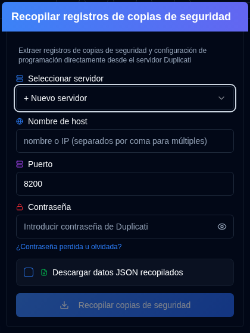
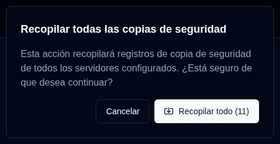

# Recopilar logs de backup {#collect-backup-logs}

**duplistatus** puede recuperar logs de backup directamente desde servidores Duplicati para rellenar la base de datos o restaurar datos de logs faltantes. La aplicación omite automáticamente cualquier log duplicado que ya exista en la base de datos.

## Pasos para recopilar logs de backup {#steps-to-collect-backup-logs}

### Recopilación Manual {#manual-collection}

1.  Haga clic en el icono <IconButton icon="lucide:download" /> **Recopilar Registros de Copia de Seguridad** en la [Barra de Herramientas de la Aplicación](overview.md#application-toolbar).

2.  Seleccionar servidor

Si tiene direcciones de servidores configuradas en [Configuración → Configuración de servidores](settings/server-settings.md), seleccione una de la lista desplegable para una recopilación instantánea. Si no tiene ningún servidor configurado, puede ingresar los detalles del servidor Duplicati manualmente.

3.  Ingrese los detalles del servidor Duplicati:
    - **Nombre de host**: El nombre de host o dirección IP del servidor Duplicati. Puede ingresar varios nombres de host separados por comas, por ejemplo `192.168.1.23,someserver.local,192.168.1.89`
    - **Puerto**: El número de puerto utilizado por el servidor Duplicati (por defecto: `8200`).
    - **Contraseña**: Ingrese la contraseña de autenticación si es requerida.
    - **Descargar datos JSON recopilados**: Active esta opción para descargar los datos recopilados por duplistatus.
4.  Haga clic en **Recopilar backups**.

***Notas:***
- Si introduce varios nombres de host, la recopilación se realizará utilizando el mismo puerto y contraseña para todos los servidores.
- **duplistatus** detectará automáticamente el mejor protocolo de conexión (HTTPS o HTTP). Primero intenta HTTPS (con validación SSL adecuada), luego HTTPS con certificados autofirmados y finalmente HTTP como alternativa.

:::tip
Los botones <IconButton icon="lucide:download" /> están disponibles en [Configuración → Monitoreo de backups](settings/backup-monitoring-settings.md) y [Configuración → Configuración de servidores](settings/server-settings.md) para la recopilación de un único servidor.
:::

 

### Recopilación en Lote {#bulk-collection}

_Haga clic con el botón derecho_ en el botón <IconButton icon="lucide:download" /> **Recopilar logs de backup** en la barra de herramientas de la aplicación para recopilar desde todos los servidores configurados.

:::tip
También puede utilizar el botón <IconButton icon="lucide:import" label="Recopilar todo"/> en las páginas [Configuración → Monitoreo de backups](settings/backup-monitoring-settings.md) y [Configuración → Configuración de servidores](settings/server-settings.md) para recopilar desde todos los servidores configurados.
:::

## Cómo funciona el proceso de recopilación {#how-the-collection-process-works}

- **duplistatus** detecta automáticamente el mejor protocolo de conexión y se conecta al servidor Duplicati especificado.
- Recupera el historial de copias de seguridad, la información de registros y la configuración de copias de seguridad (para monitoreo de copias de seguridad).
- Se omiten cualquier registro ya presente en la base de datos de **duplistatus**.
- Los nuevos datos se procesan y almacenan en la base de datos local.
- La URL utilizada (con el protocolo detectado) se almacenará o actualizará en la base de datos local.
- Si se selecciona la opción de descarga, se descargarán los datos JSON recopilados. El nombre del archivo tendrá el siguiente formato: `[serverName]_collected_[Timestamp].json`. La marca de tiempo utiliza el formato de fecha ISO 8601 (AAAA-MM-DDTHH:MM:SS).
- El panel se actualiza para reflejar la nueva información.

:::note ¿Ve servidores duplicados después de recopilar?
Si el mismo servidor aparece más de una vez después de recopilar los registros de copia de seguridad (o después de una reinstalación/actualización de Duplicati), generalmente se debe a un cambio en `machine_id` o a un error de la API de Duplicati que mezcla el id de `identity` y `machine_id`. La solución es alinear los ids en el servidor de Duplicati (editar `identity.txt`/`machineid.txt` o establecer **Duplicati → Configuración → Opciones avanzadas → Machine-id**), reiniciar Duplicati y, a continuación, combinar las entradas en **duplistatus** mediante [Configuración → Mantenimiento de base de datos → Combinar servidores duplicados](settings/database-maintenance.md#merge-duplicate-servers). Consulte [Servidores duplicados en el Panel de control](troubleshooting.md#duplicate-servers-on-the-dashboard) para ver los pasos completos.
:::

## Solución de problemas de recopilación {#troubleshooting-collection-issues}

La recopilación del registro de backup requiere que el servidor Duplicati sea accesible desde la instalación de **duplistatus**. Si encuentra problemas, verifique lo siguiente:

- Confirmar que el nombre de host (o dirección IP) y número de puerto son correctos. Puede probar esto accediendo a la interfaz de usuario del servidor Duplicati en su navegador (p. ej., `http://hostname:port`).
- Verificar que **duplistatus** pueda conectarse al servidor Duplicati. Un problema común es la resolución de nombres DNS (el sistema no puede encontrar el servidor por su nombre de host). Consulte más en [sección de solución de problemas](troubleshooting.md#collect-backup-logs-not-working).
- Asegurar que la contraseña que proporcionó es correcta.
