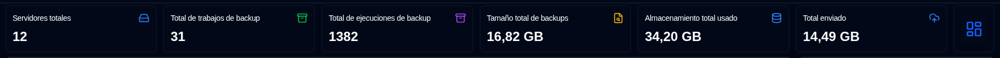
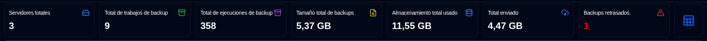
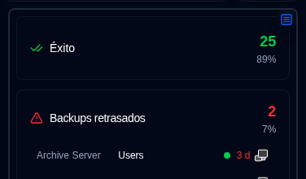
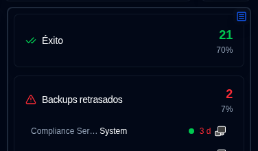
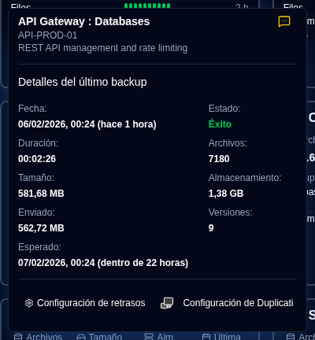
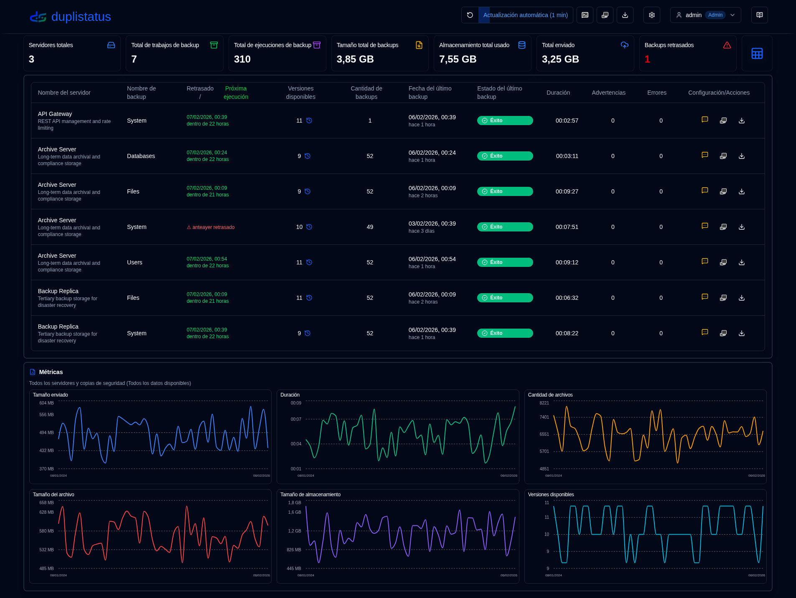
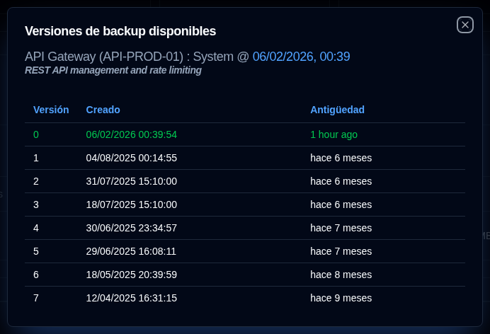

# Panel de control {#dashboard}

:::tip
**Acceso rápido a Configuración de pantalla**: Haga clic con el botón derecho en el botón de actualización automática en la barra de herramientas de la aplicación para abrir rápidamente la página [Configuración de pantalla](settings/display-settings.md).
:::

## Resumen del Panel de Control {#dashboard-summary}

Esta sección muestra estadísticas agregadas para todas las copias de seguridad.

- **Servidores totales**: El número de servidores siendo monitoreados.
- **Total de trabajos de backup**: El número total de trabajos de backup (tipos) configurados para todos los servidores.
- **Total de ejecuciones de backup**: El número total de logs de backup de ejecuciones recibidas o recopiladas para todos los servidores.
- **Tamaño total de backups**: El tamaño combinado de todos los datos de origen, basado en los últimos logs de backup recibidos.
- **Almacenamiento utilizado**: El espacio total de almacenamiento utilizado por los backups en el destino de backup (por ejemplo, almacenamiento en la nube, servidor FTP, unidad local), basado en los últimos logs de backup.
- **Tamaño cargado**: La cantidad total de datos enviados desde el servidor Duplicati al destino (por ejemplo, almacenamiento local, FTP, proveedor de nube).
- **Backups retrasados** (tabla): El número de backups que están retrasados. Consulte [Configuración de Notificaciones de backup](settings/backup-notifications-settings.md)
- **Alternancia de diseño**: Cambia entre el diseño de Tarjetas (por defecto) y el diseño de Tabla.

## Diseño de Tarjetas {#cards-layout}

El diseño de tarjetas muestra el estado del registro de backup más reciente recibido para cada backup.

- **Nombre del servidor**: Nombre del servidor Duplicati (o el alias)
  - Al pasar el cursor sobre el **Nombre del servidor** se mostrará el nombre del servidor y la nota
- **Estado general**: El estado del servidor. Los backups retrasados se mostrarán con un estado de `Advertencia`
- **Información de resumen**: El número consolidado de archivos, tamaño y almacenamiento utilizado para todas las copias de seguridad de este servidor. También muestra el tiempo transcurrido del backup más reciente recibido (pase el cursor para mostrar la marca de tiempo)
- **Lista de backups**: Una tabla con todos los backups configurados para este servidor, con 3 columnas:
  - **Nombre de backup**: Nombre del backup en el servidor Duplicati
  - **Historial de estado**: Estado de los últimos 10 backups recibidos.
  - **Último backup recibido**: El tiempo transcurrido desde la hora actual del último registro recibido. Mostrará un icono de advertencia si el backup está retrasado.
    - El tiempo se muestra en formato abreviado: `m` para minutos, `h` para horas, `d` para días, `w` para semanas, `mo` para meses, `y` para años.

:::note
Puede utilizar la [Configuración de pantalla](settings/display-settings.md) para configurar el orden de clasificación de las tarjetas. Las opciones disponibles son `Server name (a-z)`, `Status (error > warning > success)` y `Last backup received (new > old)`.
:::

Puede alternar el botón en la esquina superior derecha del panel lateral para cambiar la vista del panel:

- Estado: Mostrar estadísticas de los trabajos de backup por estado, con una lista de backups retrasados y trabajos de backup con estado de advertencias/errores.

- Métricas: Mostrar gráficos con duración, tamaño de archivos y tamaño de almacenamiento a lo largo del tiempo para el servidor agregado o seleccionado.

### Detalles del backup {#backup-details}

Al pasar el cursor sobre un backup en la lista, se muestran los detalles del último registro de backup recibido y cualquier información de retrasos.

- **Nombre del servidor : Backup**: El nombre o alias del servidor Duplicati y backup, también mostrará el nombre del servidor y la nota.
  - El alias y la nota se pueden configurar en `Configuración → Configuración del servidor`.
- **Notificaciones**: Un icono que muestra la configuración de [notificación configurada](#notifications-icons) para nuevos logs de backup.
- **Fecha**: La marca de tiempo del backup y el tiempo transcurrido desde la última actualización de pantalla.
- **Estado**: El estado del último backup recibido (Éxito, Advertencia, Error, Fatal).
- **Duración, Cantidad de archivos, Tamaño de archivos, Tamaño de almacenamiento, Tamaño cargado**: Valores reportados por el servidor Duplicati.
- **Versiones disponibles**: El número de versiones de backup almacenadas en el destino de backup en el momento del backup.

Si este backup está retrasado, la información sobre herramientas también muestra:

- **Backup esperado**: La hora en que se esperaba el backup, incluyendo el período de gracia configurado (tiempo adicional permitido antes de marcar como retrasado).

Puede hacer clic en los botones en la parte inferior para abrir `Configuración → Notificaciones de Backup` para configurar los ajustes retrasados o abrir la interfaz web del Servidor Duplicati.

## Diseño de tabla {#table-layout}

El diseño de la tabla enumera los logs de backup más recientes recibidos para todos los servidores y backups.

- **Nombre del servidor**: El nombre del servidor Duplicati (o alias)
  - Bajo el nombre se encuentra la nota del servidor
- **Nombre de backup**: El nombre del backup en el servidor Duplicati.
- **Versiones disponibles**: El número de versiones de backup almacenadas en el destino del backup. Si el icono está atenuado, la información detallada no se recibió en el log. Consulte las [instrucciones de Configuración de Duplicati](../installation/duplicati-server-configuration.md) para más detalles.
- **Cantidad de backups**: El número de backups reportados por el servidor Duplicati.
- **Fecha del último backup**: La marca de tiempo del último log de backup recibido y el tiempo transcurrido desde la última actualización de pantalla.
- **Estado del último backup**: El estado del último backup recibido (Éxito, Advertencia, Error, Fatal).
- **Duración**: La duración del backup en HH:MM:SS.
- **Advertencias/Errores**: El número de advertencias/errores reportados en el log del backup.
- **Configuración**:
  - **Notificación**: Un icono que muestra la configuración de notificación configurada para nuevos logs de backup.
  - **Configuración de Duplicati**: Un botón para abrir la interfaz web del servidor Duplicati

### Iconos de Notificaciones {#notifications-icons}

| Icon                                                                                                                                    | Opción de Notificación | Descripción                                                                                         |
| --------------------------------------------------------------------------------------------------------------------------------------- | ------------------- | --------------------------------------------------------------------------------------------------- |
| <IconButton icon="lucide:message-square-off" style={{border: 'none', padding: 0, color: '#9ca3af', background: 'transparent'}} />     | Desactivado                 | No se enviarán notificaciones cuando se reciba un nuevo log de backup                                     |
| <IconButton icon="lucide:message-square-more" style={{border: 'none', padding: 0, color: '#60a5fa', background: 'transparent'}} />     | Todos                 | Se enviarán notificaciones para cada nuevo log de backup, independientemente de su estado.                      |
| <IconButton icon="lucide:message-square-more" style={{border: 'none', padding: 0, color: '#fbbf24', background: 'transparent'}} />    | Advertencias            | Se enviarán notificaciones solo para logs de backup con un estado de Advertencia, Desconocido, Error o Fatal. |
| <IconButton icon="lucide:message-square-more" style={{border: 'none', padding: 0, color: '#f87171', background: 'transparent'}} />    | Errores              | Se enviarán notificaciones solo para logs de backup con un estado de Error o Fatal.                    |

:::note
Esta configuración de notificación solo se aplica cuando **duplistatus** recibe un nuevo registro de backup de un Servidor Duplicati. Las notificaciones de retraso se configuran por separado y se enviarán independientemente de esta configuración.
:::

### Detalles de retrasos {#overdue-details}

Pasar el cursor sobre el icono de advertencia de backup retrasado muestra detalles sobre el backup retrasado.

- **Verificado**: Cuándo se realizó la última verificación de retraso. Configure la frecuencia en [Notificaciones de backup Configuración](settings/backup-notifications-settings.md).
- **Último backup**: Cuándo se recibió el último registro de backup.
- **Backup esperado**: La hora en que se esperaba el backup, incluido el período de gracia configurado (tiempo adicional permitido antes de marcar como retrasado).
- **Última notificación**: Cuándo se envió la última notificación de retraso.

### Versiones de backup disponibles {#available-backup-versions}

Al hacer clic en el icono de reloj azul, se abre una lista de versiones de backup disponibles en el momento del backup, según lo reportado por el servidor de Duplicati.

- **Detalles del backup**: Muestra el nombre del servidor y alias, nota del servidor, nombre de backup y cuándo se ejecutó el backup.
- **Detalles de versión**: Muestra el número de versión, fecha de creación y antigüedad.

:::note
Si el icono está atenuado, significa que no se recibió información detallada en los logs de mensajes.
Consulte las [instrucciones de Configuración de Duplicati](../installation/duplicati-server-configuration.md) para obtener más detalles.
:::
