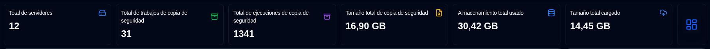
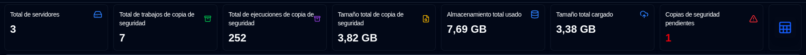
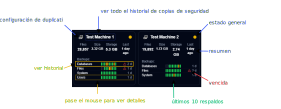
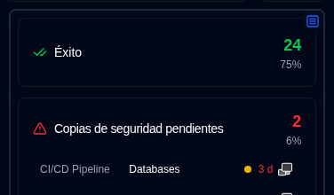
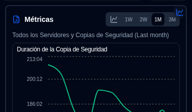
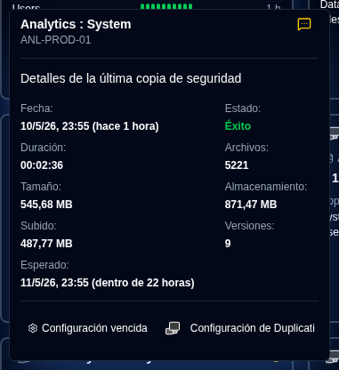
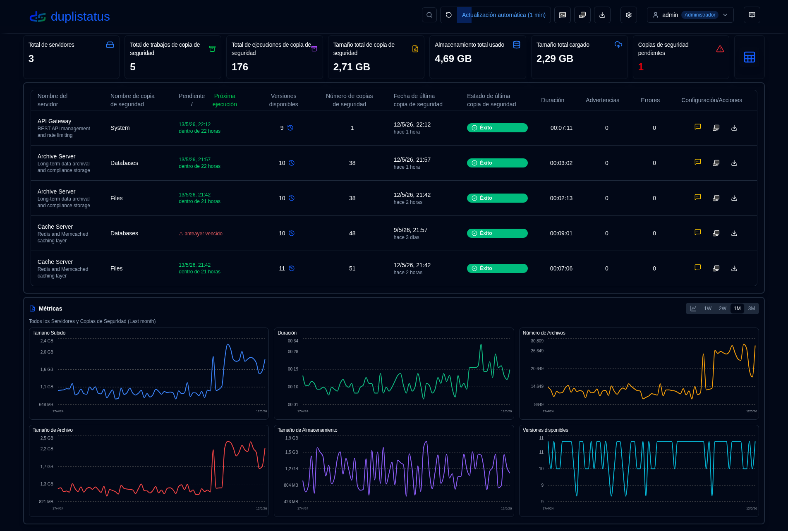
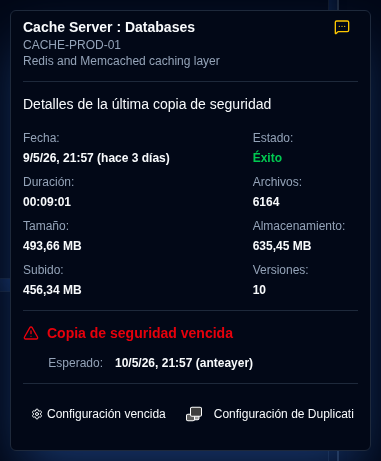
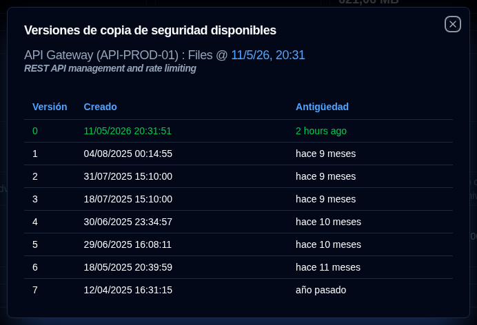

# Panel de control {#dashboard}

## Panel de control {#dashboard-summary}

Esta sección muestra estadísticas agregadas para todas las copias de seguridad.

- **Total Servidores**: El número de servidores que se están supervisando.                                                                                                             
- **Total Trabajos de Respaldo**: El número total de trabajos de respaldo (tipos) configurados para todos los servidores.                                                                                
- **Total Ejecuciones de Respaldo**: El número total de registros de respaldo de ejecuciones recibidos o recopilados para todos los servidores.                                                                   
- **Tamaño Total de Respaldo**: El tamaño combinado de todos los datos de origen, basado en los últimos registros de respaldo recibidos.                                                                    
- **Almacenamiento Total Usado**: El espacio total de almacenamiento utilizado por las copias de seguridad en el destino de respaldo (por ejemplo, almacenamiento en la nube, servidor FTP, unidad local), basado en los últimos registros de respaldo recibidos. 
- **Tamaño Total Subido**: La cantidad total de datos subidos desde el servidor Duplicati al destino (por ejemplo, almacenamiento local, FTP, proveedor en la nube).                       
- **Respaldos Atrasados** (tabla): El número de respaldos que están retrasados. Consulte [Configuración de notificaciones de copia de seguridad](settings/backup-notifications-settings.md)                          
- **Alternar diseño**: Cambia entre el diseño de Tarjetas (por defecto) y el diseño de Tabla.

## Filtrado de servidores {#server-filtering}

Puede filtrar los servidores y backups mostrados en el panel de control utilizando el campo de búsqueda en la barra de herramientas de la aplicación. Haga clic en el icono de filtro <IconButton icon="lucide:search" /> para mostrar el campo de búsqueda.

**Coincidencias de filtro:**
- ID del servidor
- URL del servidor
- Nombres de trabajos de copia de seguridad

**Alcance:**
- Filtra tanto la vista de tarjetas como la vista de tabla en el panel
- El estado de la sesión se mantiene a través del Proveedor de Filtro de Servidores del Panel
- Se borra cuando actualiza o sale del panel

Esto facilita la localización rápida de servidores o copias de seguridad específicos entre muchos sistemas monitoreados.

## Diseño de Tarjetas {#cards-layout}

El diseño de tarjetas muestra el estado del registro de backup más reciente recibido para cada backup.

- **Nombre del servidor**: Nombre del servidor Duplicati (o el alias)
  - Al pasar el cursor sobre el **Nombre del servidor** se mostrará el nombre del servidor y la nota
- **Estado general**: El estado del servidor. Los respaldos retrasados se mostrarán con un estado de **Advertencia**
- **Información de resumen**: El número consolidado de archivos, tamaño y almacenamiento usado para todos los respaldos de este servidor. También muestra el tiempo transcurrido de la copia de seguridad más reciente recibida (pase el cursor para ver la marca de tiempo)
- **Lista de respaldos**: Una tabla con todos los respaldos configurados para este servidor, con 3 columnas:
  - **Nombre del respaldo**: Nombre del respaldo en el servidor Duplicati
  - **Historial de estado**: Estado de los últimos 10 respaldos recibidos.
  - **Último respaldo recibido**: El tiempo transcurrido desde la hora actual desde que se recibió el último registro. Mostrará un icono de advertencia si el respaldo está retrasado.
    - El tiempo se muestra en formato abreviado: `m` para minutos, `h` para horas, `d` para días, `w` para semanas, `mo` para meses, `y` para años.

El orden de clasificación de las tarjetas y otras configuraciones se pueden establecer en la [Configuración de pantalla](settings/display-settings.md).

La vista de panel ofrece dos pantallas informativas, accesibles haciendo clic en el botón de la esquina superior derecha del panel lateral:

- Estado: Mostrar estadísticas de los trabajos de backup por estado, con una lista de backups retrasados y trabajos de backup con estado de advertencias/errores.

- Métricas: Mostrar gráficos con Duración, Tamaño de archivos y Tamaño de almacenamiento a lo largo del tiempo para el Servidor agregado o seleccionado.

### Detalles del backup {#backup-details}

Al pasar el cursor sobre un backup en la lista se muestran los detalles del último registro de backup recibido y cualquier información retrasada.

- **Nombre del servidor : Respaldo**: El nombre o alias del servidor Duplicati y del respaldo; también mostrará el nombre del servidor y la nota.
  - El alias y la nota se pueden configurar en [Configuración → Configuración del servidor](settings/server-settings.md).
- **Notificaciones**: Un icono que muestra la [configuración de notificación](#notifications-icons) establecida para nuevos registros de respaldo.
- **Fecha**: La marca de tiempo del respaldo y el tiempo transcurrido desde la última actualización de pantalla.
- **Estado**: El estado del último respaldo recibido (Éxito, Advertencia, Error, Fatal).
- **Duración, Cantidad de archivos, Tamaño del archivo, Tamaño de almacenamiento, Tamaño subido**: Valores informados por el servidor Duplicati.
- **Versiones disponibles**: El número de versiones de respaldo almacenadas en el destino de respaldo en el momento del respaldo.

Si este backup está retrasado, la información sobre herramientas también muestra:

- **Backup esperado**: La hora en que se esperaba el backup, incluido el período de gracia configurado (tiempo adicional permitido antes de marcar como retrasado).

También puede hacer clic en los botones en la parte inferior para abrir [Configuración → Notificaciones de backup](settings/backup-notifications-settings.md) para configurar los ajustes de monitoreo o abrir la interfaz web del servidor Duplicati.

## Diseño de Tabla {#table-layout}

La disposición de la tabla enumera los logs de backup más recientes recibidos para todos los servidores y backups.

- **Nombre del servidor**: El nombre del servidor Duplicati (o alias)
  - Debajo del nombre se encuentra la nota del servidor
- **Nombre del respaldo**: El nombre del respaldo en el servidor Duplicati.
- **Versiones disponibles**: El número de versiones de respaldo almacenadas en el destino de respaldo. Si el icono está en gris, no se recibió información detallada en el registro. Consulte las [instrucciones de configuración de Duplicati](../installation/duplicati-server-configuration.md) para obtener más detalles.
- **Cantidad de respaldos**: El número de respaldos informados por el servidor Duplicati.
- **Fecha del último respaldo**: La marca de tiempo del último registro de respaldo recibido y el tiempo transcurrido desde la última actualización de pantalla.
- **Estado del último respaldo**: El estado del último respaldo recibido (Éxito, Advertencia, Error, Fatal).
- **Duración**: La duración del respaldo en formato HH:MM:SS.
- **Advertencias/Errores**: El número de advertencias/errores informados en el registro de respaldo.
- **Configuración**:
  - **Notificaciones**: Un icono que muestra la configuración de notificación establecida para nuevos registros de respaldo.
  - **Configuración de Duplicati**: Un botón para abrir la interfaz web del servidor Duplicati

Puede utilizar la [Configuración de pantalla](settings/display-settings.md) para configurar el tamaño de la tabla y otras configuraciones.

### Iconos de Notificaciones {#notifications-icons}

| Icono                                                                                                                              | Opción de notificación | Descripción                                                                                         |
|------------------------------------------------------------------------------------------------------------------------------------|------------------------|-----------------------------------------------------------------------------------------------------|
| <IconButton icon="lucide:message-square-off" style={{border: 'none', padding: 0, color: '#9ca3af', background: 'transparent'}} />  | Apagado                 | No se enviarán notificaciones cuando se reciba un nuevo registro de respaldo                                     |
| <IconButton icon="lucide:message-square-more" style={{border: 'none', padding: 0, color: '#60a5fa', background: 'transparent'}} /> | Todo                 | Se enviarán notificaciones para cada nuevo registro de respaldo, independientemente de su estado.                      |
| <IconButton icon="lucide:message-square-more" style={{border: 'none', padding: 0, color: '#fbbf24', background: 'transparent'}} /> | Advertencias            | Se enviarán notificaciones solo para registros de respaldo con un estado de Advertencia, Desconocido, Error o Fatal. |
| <IconButton icon="lucide:message-square-more" style={{border: 'none', padding: 0, color: '#f87171', background: 'transparent'}} /> | Errores              | Se enviarán notificaciones solo para registros de respaldo con un estado de Error o Fatal.                    |

:::note
Esta configuración de notificación solo se aplica cuando **duplistatus** recibe un nuevo registro de backup de un servidor Duplicati. Las notificaciones de backup retrasado se configuran por separado y se enviarán independientemente de esta configuración.
:::

### Detalles de retrasos {#overdue-details}

Al pasar el cursor sobre el icono de advertencia de backup retrasado se muestran los detalles acerca del backup retrasado.

- **Verificado**: Cuándo se realizó la última verificación retrasada. Configure la frecuencia en [Configuración de Notificaciones de backup](settings/backup-notifications-settings.md).
- **Último backup**: Cuándo se recibió el último registro de backup.
- **Backup esperado**: La hora en que se esperaba el backup, incluido el período de gracia configurado (tiempo adicional permitido antes de marcar como retrasado).
- **Última notificación**: Cuándo se envió la última notificación de retrasado.

### Versiones de backup disponibles {#available-backup-versions}

Al hacer clic en el icono de reloj azul se abre una lista de versiones de backup disponibles en el momento del backup, según lo reportado por el Servidor Duplicati.

- **Detalles del backup**: Muestra el nombre del servidor y alias, nota del servidor, nombre de backup, y cuándo se ejecutó el backup.
- **Detalles de versión**: Muestra el número de versión, fecha de creación, y antigüedad.

:::note
Si el icono está atenuado, significa que no se recibió información detallada en los logs de mensajes.
Consulte las [instrucciones de Configuración de Duplicati](../installation/duplicati-server-configuration.md) para obtener más detalles.
:::
