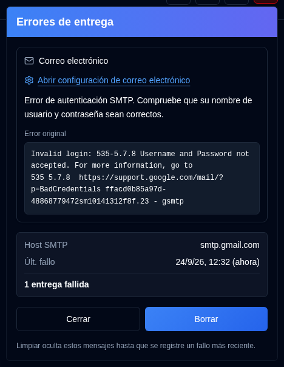

# Errores de entrega {/* #delivery-failures */}

Un botón <IconButton icon="lucide:siren" tone="alert" /> con un suave tinte rojo aparece en la [Barra de herramientas de la aplicación](overview.md#application-toolbar) para los administradores cuando la entrega de correo electrónico o NTFY está fallando. Permanece oculto cuando ambos canales funcionan correctamente, y no se muestra en la página de inicio de sesión. Los usuarios normales no lo ven.

Abra el botón para ver una tarjeta por cada canal con errores (Correo electrónico, NTFY), no una fila por cada entrada de auditoría. Cada tarjeta muestra:

- El error, y un **Error original** en monoespaciado cuando se registró la respuesta SMTP
- El host SMTP o el tema de NTFY
- La hora del últ. fallo
- Cuántas entregas han fallado desde el últ. éxito, o desde la última vez que borró ese canal

**Abrir configuración de correo electrónico** va a [Configuración → Correo electrónico](settings/email-settings.md). **Abrir configuración de NTFY** va a [Configuración → NTFY](settings/ntfy-settings.md).

**Cerrar** solo descarta el panel. **Borrar** oculta los canales enumerados hasta que se registre un error más reciente, incluso cuando el texto del error es el mismo. Una entrega exitosa posterior mantiene el botón oculto. Eso incluye `email_sent`, `notification_sent` y un envío exitoso del [Resumen Diario](settings/daily-summary-settings.md) para ese canal.

La lista se carga con la página y se actualiza aproximadamente una vez por minuto mientras la pestaña del navegador está visible.
