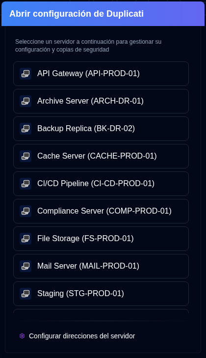

# Configuración de Duplicati {#duplicati-configuration}

El botón <SvgButton svgFilename="duplicati_logo.svg" /> en la [Barra de herramientas de la aplicación](overview#application-toolbar) abre la interfaz web del Servidor Duplicati en una nueva pestaña.

Puede seleccionar un servidor de la lista desplegable. Si ya ha seleccionado un servidor (haciendo clic en su tarjeta) o está viendo sus detalles, el botón abrirá la Configuración de Duplicati de ese servidor específico directamente.

- La lista de servidores mostrará el `nombre del servidor` o `alias del servidor (nombre del servidor)`.
- Las direcciones de servidores se configuran en [`Configuración → Servidor`](settings/server-settings.md).
- La aplicación guarda automáticamente la URL de un servidor cuando utiliza la función <IconButton icon="lucide:download" height="16" href="collect-backup-logs" /> [`Recopilar Logs de Backup`](collect-backup-logs.md).
- Los servidores no aparecerán en la lista de servidores si su dirección no ha sido configurada.

## Accediendo a la interfaz antigua de Duplicati {#accessing-the-old-duplicati-ui}

Si experimenta problemas al iniciar sesión con la nueva interfaz web de Duplicati (`/ngclient/`), puede hacer clic derecho en el botón <SvgButton svgFilename="duplicati_logo.svg" /> o en cualquier elemento de servidor en el popover de selección de servidores para abrir la interfaz antigua de Duplicati (`/ngax/`) en una pestaña nueva.

  

:::note
Todos los nombres de productos, marcas registradas y marcas comerciales registradas son propiedad de sus respectivos propietarios. Los iconos y nombres se utilizan únicamente con fines de identificación y no implican respaldo.
:::
