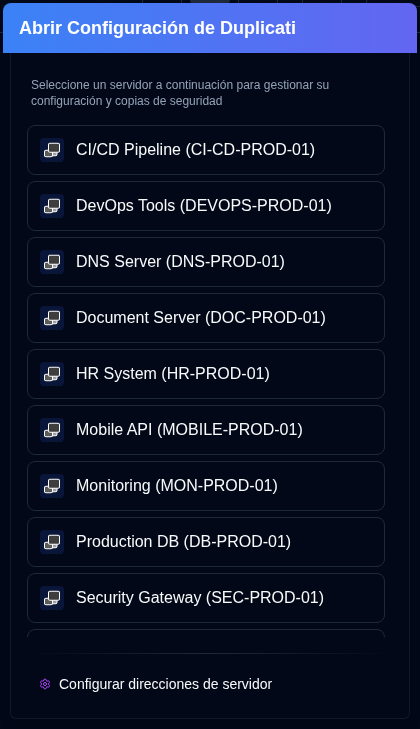

# Configuración de Duplicati {/* #duplicati-configuration */}

El botón <SvgButton svgFilename="duplicati_logo.svg" /> en la [Barra de herramientas de la aplicación](overview.md#application-toolbar) abre la interfaz web del servidor Duplicati en una nueva pestaña.

Puede seleccionar un servidor de la lista desplegable. Si ya ha seleccionado un servidor (haciendo clic en su tarjeta) o está viendo sus detalles, el botón abrirá directamente la configuración de Duplicati de ese servidor específico.

- La lista de servidores mostrará `server name` o `server alias (server name)`.
- Las direcciones de los servidores se configuran en [Configuración → Servidor](settings/server-settings.md).
- La aplicación guarda automáticamente la URL de un servidor cuando utiliza la función <IconButton icon="lucide:download" height="16" href="collect-backup-logs" /> [Recopilar registros de copias de seguridad](collect-backup-logs.md).
- Los servidores no aparecerán en la lista de servidores si su dirección no ha sido configurada.

## Accediendo a la antigua interfaz de usuario de Duplicati {/* #accessing-the-old-duplicati-ui */}

Si experimenta problemas de inicio de sesión con la nueva interfaz web de Duplicati (`/ngclient/`), puede hacer clic derecho en el botón <SvgButton svgFilename="duplicati_logo.svg" /> o en cualquier elemento de servidor en el menú emergente de selección de servidor para abrir la antigua interfaz de usuario de Duplicati (`/ngax/`) en una nueva pestaña.

  

:::note
 Todos los nombres de productos, logotipos y marcas comerciales son propiedad de sus respectivos dueños. Los iconos y nombres se utilizan únicamente con fines de identificación y no implican respaldo.
:::
