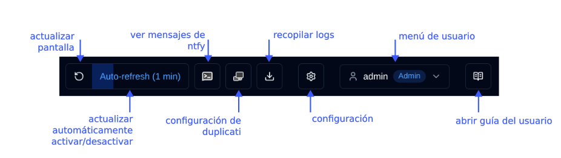
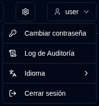

# Resumen {#overview}

Bienvenido a la guía del usuario de duplistatus. Este documento completo proporciona instrucciones detalladas para utilizar duplistatus a fin de monitorear y gestionar sus operaciones de backup de Duplicati en múltiples servidores.

## ¿Qué es duplistatus? {#what-is-duplistatus}

duplistatus es un potente panel de control diseñado específicamente para sistemas de backup Duplicati. Proporciona:

- Monitoreo centralizado de múltiples servidores Duplicati desde una única interfaz
- Seguimiento en tiempo real del estado de todas las operaciones de backup
- Detección automatizada de backup retrasado con alertas configurables
- Métricas integrales y visualización del rendimiento de backup
- Sistema de notificación flexible a través de NTFY y correo electrónico
- Soporte multilenguaje (inglés, francés, alemán, español y portugués brasileño).

## Instalación {#installation}

Para requisitos previos e instrucciones detalladas de instalación, consulte la [Guía de instalación](../installation/installation.md).

## Acceso al Panel de control {#accessing-the-dashboard}

Después de la instalación exitosa, acceda a la interfaz web de duplistatus siguiendo estos pasos:

1. Abra su navegador web preferido
2. Navegue a `http://su-dirección-ip-del-servidor:9666`
   - Reemplace `su-dirección-ip-del-servidor` con la dirección IP o nombre de host real de su servidor duplistatus
   - El puerto predeterminado es `9666`
3. Se le presentará una página de inicio de sesión. Puede seleccionar el idioma de la interfaz en la esquina superior derecha de la página de inicio de sesión, o cuando haya iniciado sesión, a través del menú de usuario (haga clic en su nombre de usuario → Idioma).
   Use estas credenciales para el primer uso (o después de una actualización de versiones pre-0.9.x):
    - nombre de usuario: `admin`
    - contraseña: `Duplistatus09` 
4. Después de iniciar sesión, el panel de control principal se mostrará automáticamente (sin datos en el primer uso)

## Resumen de la Interfaz de Usuario {#user-interface-overview}

duplistatus proporciona un panel de control intuitivo para monitorear operaciones de backup de Duplicati en toda su infraestructura.

La interfaz de usuario está organizada en varias secciones clave para proporcionar una experiencia de monitoreo clara y completa:

1. [Barra de herramientas de la aplicación](#application-toolbar): Acceso rápido a funciones y configuraciones esenciales
2. [Resumen del panel de control](dashboard.md#dashboard-summary): Estadísticas generales de todos los servidores monitoreados
3. Resumen de servidores: [Diseño de tarjetas](dashboard.md#cards-layout) o [diseño de tabla](dashboard.md#table-layout) que muestra el estado más reciente de todas las copias de seguridad
4. [Detalles de retrasos](dashboard.md#overdue-details): Advertencias visuales para backups retrasados con información detallada al pasar el cursor
5. [Versiones de backup disponibles](dashboard.md#available-backup-versions): Haga clic en el icono azul para ver las versiones de backup disponibles en el destino
6. [Métricas de backup](backup-metrics.md): Gráficos interactivos que muestran el rendimiento del backup a lo largo del tiempo
7. [Detalles del servidor](server-details.md): Lista completa de backups registrados para servidores específicos, incluidas estadísticas detalladas
8. [Detalles del backup](server-details.md#backup-details): Información detallada de backups individuales, incluidos logs de ejecución, advertencias y errores

## Barra de herramientas de la aplicación {#application-toolbar}

La barra de herramientas de la aplicación proporciona acceso conveniente a funciones y configuración clave, organizada para un flujo de trabajo eficiente.

| Botón | Descripción |
|--------------------------------------------------------------------------------------------------------------------------------------------------|------------------------------------------------------------------------------------------------------------------------------------------------------------------------------|
| <IconButton icon="lucide:rotate-ccw" /> &nbsp; Actualizar pantalla | Ejecutar una actualización manual inmediata de todos los datos |
| <IconButton label="Auto-refresh" /> | Activar o desactivar la funcionalidad de actualización automática. Configurar en [Configuración de pantalla](settings/display-settings.md)   _Clic derecho_ para abrir la página de Configuración de pantalla |
| <SvgButton svgFilename="ntfy.svg" /> &nbsp; Abrir NTFY | Acceder al sitio web ntfy.sh para su tema de notificación configurado.   _Clic derecho_ para mostrar un código QR para configurar su dispositivo para recibir notificaciones de duplistatus. |
| <SvgButton svgFilename="duplicati_logo.svg" href="duplicati-configuration" /> &nbsp; [Configuración de Duplicati](duplicati-configuration.md) | Abrir la interfaz web del servidor Duplicati seleccionado   _Clic derecho_ para abrir la interfaz de usuario heredada de Duplicati (`/ngax`) en una nueva pestaña |
| <IconButton icon="lucide:download" href="collect-backup-logs" /> &nbsp; [Recopilar logs](collect-backup-logs.md) | Conectarse a servidores Duplicati y recuperar logs de backup   _Clic derecho_ para recopilar logs para todos los servidores configurados |
| <IconButton icon="lucide:settings" href="settings/backup-notifications-settings" /> &nbsp; [Configuración](settings/backup-notifications-settings.md) | Configurar notificaciones, monitoreo, servidor SMTP y plantillas de notificación |
| <IconButton icon="lucide:user" label="nombre de usuario" /> | Mostrar el usuario conectado, tipo de usuario (`Admin`, `Usuario`), hacer clic para menú de usuario (incluye selección de idioma). Más información en [Gestión de usuarios](settings/user-management-settings.md) |
| <IconButton icon="lucide:book-open-text" href="overview" /> &nbsp; Guía de usuario | Abrir la [Guía de usuario](overview.md) a la sección relevante para la página que está viendo actualmente. La descripción emergente muestra "Ayuda para [Nombre de página]" para indicar qué documentación se abrirá. |

### Menú de Usuario {#user-menu}

Al hacer clic en el botón de usuario se abre un menú desplegable con opciones específicas del usuario. Las opciones del menú difieren según haya iniciado sesión como administrador o como usuario normal. Ambos roles pueden cambiar el idioma de la interfaz a través del submenú de **Idioma**. Idiomas compatibles: inglés, francés, alemán, español y portugués brasileño.

<table>
  <tr>
    <th>Admin</th>
    <th>Usuario Regular</th>
  </tr>
  <tr>
    <td style={{verticalAlign: 'top'}}></td>
    <td style={{verticalAlign: 'top'}}></td>
  </tr>
</table>

## Configuración Esencial {#essential-configuration}

1. Configurar sus [servidores Duplicati](../installation/duplicati-server-configuration.md) para enviar mensajes de logs de backup a duplistatus (requerido).
2. Recopilar logs de backup iniciales – utilice la función [Recopilar logs de backup](collect-backup-logs.md) para rellenar la base de datos con datos históricos de backup de todos sus servidores Duplicati. Esto también actualiza automáticamente los intervalos de monitoreo de backups retrasados según la configuración de cada servidor.
3. Configurar ajustes del servidor – configure alias de servidor y notas en [Configuración → Servidor](settings/server-settings.md) para que su panel de control sea más informativo.
4. Configurar ajustes de NTFY – configure notificaciones a través de NTFY en [Configuración → NTFY](settings/ntfy-settings.md).
5. Configurar ajustes de correo electrónico – configure notificaciones por correo electrónico en [Configuración → Correo electrónico](settings/email-settings.md).
6. Configurar notificaciones de backup – configure notificaciones por backup o por servidor en [Configuración → Notificaciones de backup](settings/backup-notifications-settings.md).

 

:::info[IMPORTANTE]
Recuerde configurar los servidores Duplicati para enviar logs de backup a duplistatus, como se describe en la sección [Configuración de Duplicati](../installation/duplicati-server-configuration.md).
:::

 

:::note
Todos los nombres de productos, logotipos y marcas registradas son propiedad de sus respectivos propietarios. Los iconos y nombres se utilizan únicamente con fines de identificación y no implican respaldo.
:::
