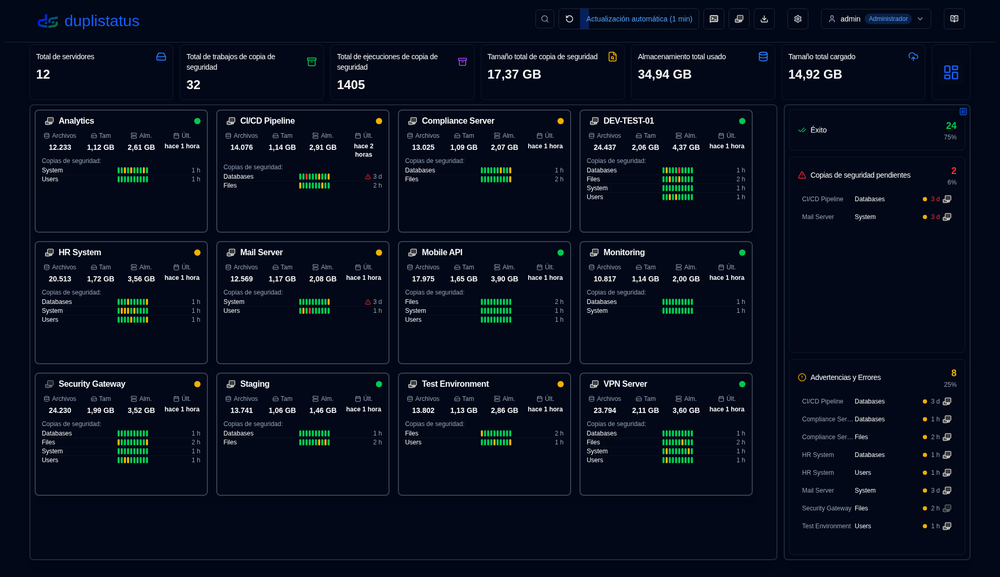
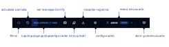
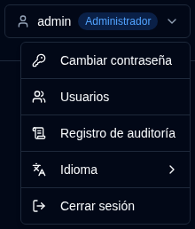
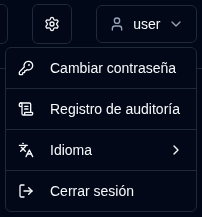

# Resumen {#overview}

Bienvenido a la guía del usuario de duplistatus. Este documento completo proporciona instrucciones detalladas para utilizar duplistatus a fin de monitorear y gestionar sus operaciones de backup de Duplicati en múltiples servidores.

## ¿Qué es duplistatus? {#what-is-duplistatus}

duplistatus es un potente panel de control diseñado específicamente para sistemas de backup Duplicati. Proporciona:

- Monitoreo centralizado de múltiples servidores Duplicati desde una única interfaz
- Seguimiento en tiempo real del estado de todas las operaciones de respaldo
- Detección automatizada de copias de seguridad atrasadas con alertas configurables
- Métricas completas y visualización del rendimiento del respaldo
- Sistema de notificaciones flexible mediante NTFY y correo electrónico
- Soporte multilingüe (inglés, francés, alemán, español y portugués brasileño).

## Instalación {#installation}

Para requisitos previos e instrucciones detalladas de instalación, consulte la [Guía de instalación](../installation/installation.md).

## Acceso al Panel de control {#accessing-the-dashboard}

Después de la instalación exitosa, acceda a la interfaz web de duplistatus siguiendo estos pasos:

1. Abra su navegador web preferido
2. Navegue a `http://your-server-ip:9666`
   - Reemplace `your-server-ip` con la dirección IP o el nombre de host real de su servidor duplistatus
   - El puerto predeterminado es `9666`
3. Se le presentará una página de inicio de sesión.

Utilice estas credenciales para el primer uso (o después de una actualización desde versiones anteriores a 0.9.x):
    - nombre de usuario: `admin`
    - contraseña: `Duplistatus09`

Seleccione el idioma de la interfaz de usuario en la esquina superior derecha <IconButton icon="lucide:languages" label="Idioma" />, o en <IconButton icon="lucide:user" label="nombre de usuario" /> después de iniciar sesión (véase más abajo).

4. Después de iniciar sesión, el panel de control principal se mostrará automáticamente (sin datos en el primer uso)

## Resumen de la Interfaz de Usuario {#user-interface-overview}

duplistatus proporciona un panel de control intuitivo para monitorear operaciones de backup de Duplicati en toda su infraestructura.

La interfaz de usuario está organizada en varias secciones clave para proporcionar una experiencia de monitoreo clara y completa:

1. [Barra de herramientas de la aplicación](#application-toolbar): Acceso rápido a funciones y configuraciones esenciales
2. [Resumen del panel de control](dashboard.md#dashboard-summary): Estadísticas generales para todos los servidores supervisados
3. Resumen de servidores: [Diseño de tarjetas](dashboard.md#cards-layout) o [diseño de tabla](dashboard.md#table-layout) que muestra el estado más reciente de todas las copias de seguridad
4. [Detalles de atraso](dashboard.md#overdue-details): Advertencias visuales para copias de seguridad atrasadas con información detallada al pasar el cursor
5. [Versiones de respaldo disponibles](dashboard.md#available-backup-versions): Haga clic en el icono azul para ver las versiones de respaldo disponibles en el destino
6. [Métricas de respaldo](backup-metrics.md): Gráficos interactivos que muestran el rendimiento del respaldo a lo largo del tiempo
7. [Detalles del servidor](server-details.md): Lista completa de respaldos registrados para servidores específicos, incluyendo estadísticas detalladas
8. [Detalles del respaldo](server-details.md#backup-details): Información detallada sobre respaldos individuales, incluyendo registros de ejecución, advertencias y errores

## Barra de herramientas de la aplicación {#application-toolbar}

La barra de herramientas de la aplicación proporciona acceso conveniente a funciones y configuración clave, organizada para un flujo de trabajo eficiente.

| Botón                                                                                                                                           | Descripción                                                                                                                                                                                |
|--------------------------------------------------------------------------------------------------------------------------------------------------|--------------------------------------------------------------------------------------------------------------------------------------------------------------------------------------------|
| <IconButton icon="lucide:search" /> &nbsp; Filtrar                                                                                            | Filtrar por nombre del servidor, alias o nombre de copia de seguridad                                                                                                                      |
| <IconButton icon="lucide:rotate-ccw" /> &nbsp; Actualizar pantalla                                                                                    | Ejecutar una actualización manual inmediata de todos los datos                                                                                                                             |
| <IconButton label="Actualización automática" />                                                                                                              | Activar o desactivar la función de actualización automática. Configurar en [Configuración de visualización](settings/display-settings.md)   _Clic derecho_ para abrir la página de Configuración de visualización           |
| <SvgButton svgFilename="ntfy.svg" /> &nbsp; Abrir NTFY                                                                                            | Acceder al sitio web ntfy.sh para el tema de notificación configurado.   _Clic derecho_ para mostrar un código QR y configurar su dispositivo para recibir notificaciones de duplistatus. |
| <SvgButton svgFilename="duplicati_logo.svg" href="duplicati-configuration" /> &nbsp; [Configuración de Duplicati](duplicati-configuration.md)       | Abrir la interfaz web del servidor Duplicati seleccionado   _Clic derecho_ para abrir la interfaz heredada de Duplicati (`/ngax`) en una nueva pestaña                                                                                                                           |
| <IconButton icon="lucide:download" href="collect-backup-logs" /> &nbsp; [Recopilar registros](collect-backup-logs.md)                                   | Conectarse a los servidores Duplicati y recuperar los registros de respaldo   _Clic derecho_ para recopilar registros de todos los servidores configurados                                                         |
| <IconButton icon="lucide:settings" href="settings/backup-notifications-settings" /> &nbsp; [Configuración](settings/backup-notifications-settings.md) | Configurar notificaciones, monitoreo, servidor SMTP y plantillas de notificación                                                                                                 |
| <IconButton icon="lucide:user" label="nombre de usuario" />                                                                                               | Muestra el usuario conectado, el tipo de usuario (`Admin`, `User`), haga clic para abrir el menú de usuario (incluye selección de idioma). Consulte más en [Gestión de usuarios](settings/user-management-settings.md)                               |
| <IconButton icon="lucide:book-open-text" href="overview" /> &nbsp; Guía del usuario                                                                    | Abre la [Guía del usuario](overview.md) a la sección relevante de la página que está viendo actualmente. La sugerencia muestra "Ayuda para [Nombre de la página]" para indicar qué documentación se abrirá.                                                                           |

### Menú de Usuario {#user-menu}

Al hacer clic en el botón de usuario se abre un menú desplegable con opciones específicas del usuario. Las opciones del menú difieren según haya iniciado sesión como administrador o como usuario normal. Ambos roles pueden cambiar el idioma de la interfaz a través del submenú de **Idioma**. Idiomas compatibles: inglés, francés, alemán, español y portugués brasileño.

<table>
  <tr>
    <th>Admin</th>
    <th>Usuario Regular</th>
  </tr>
  <tr>
    <td style={{verticalAlign: 'top'}}></td>
    <td style={{verticalAlign: 'top'}}></td>
  </tr>
</table>

## Configuración Esencial {#essential-configuration}

1. Configure sus [servidores Duplicati](../installation/duplicati-server-configuration.md) para enviar mensajes de registro de copia de seguridad a duplistatus (requerido).
2. Recopile los registros iniciales de copia de seguridad: use la función [Recopilar registros de copia de seguridad](collect-backup-logs.md) para llenar la base de datos con datos históricos de copias de seguridad de todos sus servidores Duplicati. Esto también actualiza automáticamente los intervalos de monitoreo de copias de seguridad según la configuración de cada servidor.
3. Configure los ajustes del servidor: configure alias y notas de los servidores en [Configuración → Servidor](settings/server-settings.md) para hacer que su panel sea más informativo.
4. Configure los ajustes de NTFY: configure notificaciones mediante NTFY en [Configuración → NTFY](settings/ntfy-settings.md).
5. Configure la configuración de correo electrónico: configure las notificaciones por correo electrónico en [Configuración → Correo electrónico](settings/email-settings.md).
6. Configure las notificaciones de copia de seguridad: configure notificaciones por copia de seguridad o por servidor en [Configuración → Notificaciones de copia de seguridad](settings/backup-notifications-settings.md).

 

:::info[IMPORTANTE]
Recuerde configurar los servidores Duplicati para enviar logs de backup a duplistatus, como se describe en la sección [Configuración de Duplicati](../installation/duplicati-server-configuration.md).
:::

 

:::note
Todos los nombres de productos, logotipos y marcas registradas son propiedad de sus respectivos propietarios. Los iconos y nombres se utilizan únicamente con fines de identificación y no implican respaldo.
:::
