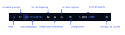
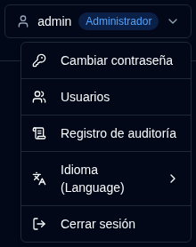
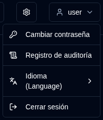

# Vista general {/* #overview */}

Bienvenido a la guía de usuario de duplistatus. Este documento completo proporciona instrucciones detalladas para usar duplistatus y supervisar y gestionar sus operaciones de copia de seguridad de Duplicati en varios servidores.

## ¿Qué es duplistatus? {/* #what-is-duplistatus */}

duplistatus es un potente panel de control de monitoreo diseñado específicamente para sistemas de copia de seguridad Duplicati. Proporciona:

- Monitoreo centralizado de múltiples servidores Duplicati desde una única interfaz
- Seguimiento en tiempo real del estado de todas las operaciones de copia de seguridad
- Detección automatizada de copias de seguridad vencidas con alertas configurables
- Métricas completas y visualización del rendimiento de las copias de seguridad
- Sistema de notificaciones flexible a través de NTFY y correo electrónico
- Funciones opcionales de [configuración de seguridad](../installation/security-configuration.md)
- Soporte para múltiples idiomas (inglés, francés, alemán, español, portugués de Brasil, hindi y chino simplificado).

## Instalación {/* #installation */}

Para conocer los requisitos previos e instrucciones detalladas de instalación, consulte la [Guía de instalación](../installation/installation.md).

## Acceso al panel de control {/* #accessing-the-dashboard */}

Después de la instalación correcta, acceda a la interfaz web de duplistatus siguiendo estos pasos:

1. Abra su navegador web preferido
2. Navegue a `http://your-server-ip:9666`
   - Reemplace `your-server-ip` con la dirección IP o el nombre de host real de su servidor duplistatus
   - El puerto predeterminado es `9666`
3. Se le presentará una página de inicio de sesión.

Utilice estas credenciales para el primer uso (o después de una actualización desde versiones anteriores a 0.9.x):
    - nombre de usuario: `admin`
    - contraseña: `Duplistatus09`

Seleccione el idioma de la interfaz de usuario en la esquina superior derecha <IconButton icon="lucide:languages" label="Idioma" />, o en <IconButton icon="lucide:user" label="nombre de usuario" /> después de iniciar sesión (ver más abajo).

4. Después de iniciar sesión, el panel principal se mostrará automáticamente (sin datos en el primer uso)

## Vista general de la interfaz de usuario {/* #user-interface-overview */}

duplistatus proporciona un panel intuitivo para monitorear las operaciones de copia de seguridad de Duplicati en toda su infraestructura.

La interfaz de usuario está organizada en varias secciones clave para proporcionar una experiencia de monitoreo clara y completa:

1. [Barra de herramientas de aplicación](#application-toolbar): Acceso rápido a funciones y configuraciones esenciales
2. [Resumen del panel](dashboard.md#dashboard-summary): Estadísticas generales para todos los servidores supervisados
3. Vista general de servidores: [Diseño de tarjetas](dashboard.md#cards-layout) o [diseño de tabla](dashboard.md#table-layout) que muestra el estado más reciente de todas las copias de seguridad, incluida la [versión del servidor Duplicati](dashboard.md#duplicati-server-version) del último registro de copia de seguridad recibido
4. [Detalles de vencimiento](dashboard.md#overdue-details): Advertencias visuales para copias de seguridad vencidas con información detallada al pasar el cursor
5. [Versiones de copia de seguridad disponibles](dashboard.md#available-backup-versions): Haga clic en el icono azul para ver las versiones de copia de seguridad disponibles en el destino
6. [Métricas de copia de seguridad](backup-metrics.md): Gráficos interactivos que muestran el rendimiento de la copia de seguridad a lo largo del tiempo
7. [Detalles del servidor](server-details.md): Lista completa de copias de seguridad registradas para servidores específicos, incluidas estadísticas detalladas
8. [Detalles de copia de seguridad](server-details.md#backup-details): Información detallada para copias de seguridad individuales, incluyendo registros de ejecución, advertencias y errores

## Barra de herramientas de aplicación {/* #application-toolbar */}

La barra de herramientas de la aplicación proporciona acceso conveniente a funciones y configuraciones clave, organizadas para un flujo de trabajo eficiente.

<table>
  <thead>
    <tr>
      <th style={{whiteSpace: 'nowrap'}}>Botón</th>
      <th>Descripción</th>
    </tr>
  </thead>
  <tbody>
    <tr>
      <td style={{whiteSpace: 'nowrap'}}><IconButton icon="lucide:search" /> &nbsp; Filtrar</td>
      <td>Buscar y filtrar servidores por ID, URL o nombre del trabajo de copia de seguridad.</td>
    </tr>
    <tr>
      <td style={{whiteSpace: 'nowrap'}}><IconButton icon="lucide:rotate-ccw" /> &nbsp; Actualizar pantalla</td>
      <td>Ejecutar una actualización manual inmediata de la pantalla con todos los datos</td>
    </tr>
    <tr>
      <td style={{whiteSpace: 'nowrap'}}><IconButton label="Actualización automática" /></td>
      <td>Activar o desactivar la función de actualización automática. Configurar en [Configuración de visualización](settings/display-settings.md)   _Clic derecho_ para abrir la página de Configuración de visualización</td>
    </tr>
    <tr>
      <td style={{whiteSpace: 'nowrap'}}><SvgButton svgFilename="ntfy.svg" /> &nbsp; Abrir NTFY</td>
      <td>Acceda al sitio web ntfy.sh para su tema de notificaciones configurado.   _Clic derecho_ para mostrar un código QR y configurar su dispositivo para recibir notificaciones de duplistatus.</td>
    </tr>
    <tr>
      <td style={{whiteSpace: 'nowrap'}}><SvgButton svgFilename="duplicati_logo.svg" href="duplicati-configuration" /> &nbsp; [Configuración de Duplicati](duplicati-configuration.md)</td>
      <td>Abrir la interfaz web del servidor de Duplicati seleccionado   _Clic derecho_ para abrir la interfaz de usuario heredada de Duplicati (`/ngax`) en una nueva pestaña</td>
    </tr>
    <tr>
      <td style={{whiteSpace: 'nowrap'}}><IconButton icon="lucide:download" href="collect-backup-logs" /> &nbsp; [Recopilar registros](collect-backup-logs.md)</td>
      <td>Conectarse a los servidores de Duplicati y recuperar los registros de copia de seguridad   _Clic derecho_ para recopilar registros de todos los servidores configurados</td>
    </tr>
    <tr>
      <td style={{whiteSpace: 'nowrap'}}><IconButton icon="lucide:siren" tone="alert" href="delivery-failures" /> &nbsp; [Errores de entrega](delivery-failures.md)</td>
      <td>Se muestra a los administradores mientras falla la entrega por correo electrónico o ntfy. Consulte [Errores de entrega](delivery-failures.md).</td>
    </tr>
    <tr>
      <td style={{whiteSpace: 'nowrap'}}><IconButton icon="lucide:settings" href="settings/backup-notifications-settings" /> &nbsp; [Configuración](settings/backup-notifications-settings.md)</td>
      <td>Configurar notificaciones, supervisión, servidor SMTP y plantillas de notificaciones</td>
    </tr>
    <tr>
      <td style={{whiteSpace: 'nowrap'}}><IconButton icon="lucide:user" label="nombre de usuario" /></td>
      <td>Mostrar el usuario conectado, tipo de usuario (`Admin`, `User`), haga clic para el menú de usuario (incluye selección de idioma). Ver más en [Gestión de usuarios](settings/user-management-settings.md)</td>
    </tr>
    <tr>
      <td style={{whiteSpace: 'nowrap'}}><IconButton icon="lucide:book-open-text" href="overview" /> &nbsp; Guía del usuario</td>
      <td>Abra la [Guía del usuario](overview.md) en la sección relevante a la página que está viendo actualmente. La información sobre herramienta muestra "Ayuda para [Nombre de página]" para indicar qué documentación se abrirá.</td>
    </tr>
  </tbody>
</table>

### Menú de usuario {/* #user-menu */}

Al hacer clic en el botón de usuario se abre un menú desplegable con opciones específicas del usuario. Las opciones del menú difieren según si ha iniciado sesión como administrador o como usuario normal. Ambos roles pueden cambiar el idioma de la interfaz a través del submenú **Idioma**. El idioma seleccionado se guarda por usuario en este navegador (no como configuración general del sistema), por lo que diferentes cuentas pueden mantener diferentes idiomas. Idiomas admitidos: inglés, francés, alemán, español, portugués brasileño, hindi y chino simplificado.

<table>
  <tr>
    <th>Administrador</th>
    <th>Usuario normal</th>
  </tr>
  <tr>
    <td style={{verticalAlign: 'top'}}></td>
    <td style={{verticalAlign: 'top'}}></td>
  </tr>
</table>

## Configuración esencial {/* #essential-configuration */}

1. Configure sus [servidores Duplicati](../installation/duplicati-server-configuration.md) para enviar mensajes de registro de copia de seguridad a duplistatus (obligatorio).
2. Recopile los registros iniciales de copia de seguridad: utilice la función [Recopilar Registros de Copia de Seguridad](collect-backup-logs.md) para poblar la base de datos con datos históricos de copia de seguridad de todos sus servidores Duplicati. Esto también actualiza automáticamente los intervalos de monitoreo de copia de seguridad según la configuración de cada servidor.
3. Configure la configuración del servidor: configure alias y notas del servidor en [Configuración → Servidor](settings/server-settings.md) para hacer que su panel sea más informativo.
4. Configure la configuración de NTFY: configure las notificaciones a través de NTFY en [Configuración → NTFY](settings/ntfy-settings.md).
5. Configure la configuración de correo electrónico: configure las notificaciones por correo electrónico en [Configuración → Correo Electrónico](settings/email-settings.md).
6. Configure las notificaciones de copia de seguridad: configure notificaciones por copia de seguridad o por servidor en [Configuración → Notificaciones de Copia de Seguridad](settings/backup-notifications-settings.md).
7. Opcionalmente restringir el acceso: cree [claves de API](settings/api-keys-settings.md) y/o [listas de IPs permitidas](settings/ip-allowlist-settings.md) si desea proteger `/api/upload` y la interfaz de administración. Ambas están desactivadas de forma predeterminada.

 

:::info[IMPORTANTE]
Recuerde configurar los servidores Duplicati para enviar registros de copia de seguridad a duplistatus, como se describe en la sección [Configuración de Duplicati](../installation/duplicati-server-configuration.md).
:::

 

:::note
 Todos los nombres de productos, logotipos y marcas comerciales son propiedad de sus respectivos dueños. Los iconos y nombres se utilizan únicamente con fines de identificación y no implican respaldo.
:::

<small>

> **Nota sobre traducciones de interfaz y documentación:** Todos los idiomas de interfaz y documentación excepto inglés (Reino Unido) fueron traducidos con IA usando [ai-i18n-tools](https://wsj-br.github.io/ai-i18n-tools/); la redacción puede ser imprecisa o contener errores.

</small>
