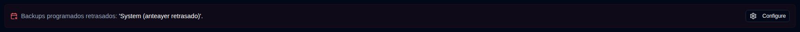
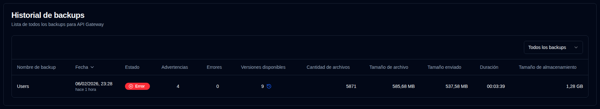

# Detalles del Servidor {#server-details}

Al hacer clic en un servidor desde el Panel de control, se abre una página con una lista de Backups para ese servidor. Puede ver todas las copias de seguridad o seleccionar una específica si el servidor tiene múltiples Backups configurados.

## Estadísticas del Servidor/Backup {#serverbackup-statistics}

Esta sección muestra estadísticas para todas las copias de seguridad en el Servidor o un backup seleccionado individualmente.

- **TOTAL DE TRABAJOS DE BACKUP**: Número total de trabajos de backup configurados en este servidor.
- **TOTAL DE EJECUCIONES DE BACKUP**: Número total de ejecuciones de backup realizadas (según lo reportado por el servidor Duplicati).
- **VERSIONES DISPONIBLES**: Número de versiones disponibles (según lo reportado por el servidor Duplicati).
- **DURACIÓN PROMEDIO**: Duración promedio (media) de los backups registrados en la base de datos de **duplistatus**.
- **TAMAÑO DEL ÚLTIMO BACKUP**: Tamaño de los archivos de origen del último registro de backup recibido.
- **ALMACENAMIENTO TOTAL USADO**: Almacenamiento utilizado en el destino de backup, según lo reportado en el último registro de backup.
- **TOTAL ENVIADO**: Suma de todos los datos enviados registrados en la base de datos de **duplistatus**.

Si este backup o cualquiera de los backups en el servidor (cuando `All Backups` está seleccionado) está retrasado, aparece un mensaje debajo del resumen.

Haga clic en <IconButton icon="lucide:settings" href="settings/overdue-settings" label="Configurar"/> para ir a [`Configuración → Monitoreo retrasado`](settings/overdue-settings.md). O haga clic en <SvgButton SvgButton svgFilename="duplicati_logo.svg" href="duplicati-configuration" /> en la barra de herramientas para abrir la interfaz web del Servidor duplistatus y verificar los Logs.

 

## Historial de backups {#backup-history}

Esta tabla enumera los logs de backup para el servidor seleccionado.

- **Nombre de backup**: El nombre del backup en el servidor Duplicati.
- **Fecha**: La marca de tiempo del backup y el tiempo transcurrido desde la última actualización de pantalla.
- **Estado**: El estado del backup (Éxito, Advertencia, Error, Fatal).
- **Advertencias/Errores**: El número de advertencias/errores reportados en el registro del backup.
- **Versiones disponibles**: El número de versiones de backup disponibles en el destino del backup. Si el icono está deshabilitado, no se recibió información detallada.
- **Cantidad de archivos, Tamaño de archivos, Tamaño cargado, Duración, Tamaño de almacenamiento**: Valores según lo reportado por el servidor Duplicati.

:::tip Consejos
• Utilice el menú desplegable en la sección **Historial de backups** para seleccionar `Todas las copias de seguridad` o un backup específico para este servidor.

• Puede ordenar cualquier columna haciendo clic en su encabezado; haga clic nuevamente para invertir el orden de clasificación.
 
• Haga clic en cualquier lugar de una fila para ver los [Detalles del backup](#backup-details).

::: 

:::note
Cuando se selecciona `Todas las copias de seguridad`, la lista muestra todos los backups ordenados de más reciente a más antiguo por defecto.
:::

 

## Detalles del backup {#backup-details}

Al hacer clic en una insignia de estado en el Panel de control (vista de tabla) o en cualquier fila de la tabla del Historial de backups, se muestra la Información del backup detallada.

- **Detalles del servidor**: nombre del servidor, alias y nota.
- **Información del backup**: La marca de tiempo del backup y su ID.
- **Estadísticas del backup**: Un resumen de contadores reportados, tamaños y duración.
- **Resumen del registro**: El número de mensajes reportados.
- **Versiones disponibles**: Una lista de versiones disponibles (solo se muestra si la información fue recibida en los logs).
- **Mensajes/Advertencias/Errores**: Los logs de ejecución completos. El subtítulo indica si el log fue truncado por el servidor de Duplicati.

 

:::note
Consulte las [instrucciones de Configuración de Duplicati](../installation/duplicati-server-configuration.md) para aprender cómo configurar el Servidor Duplicati para enviar logs de ejecución completos y evitar truncamiento.
:::
