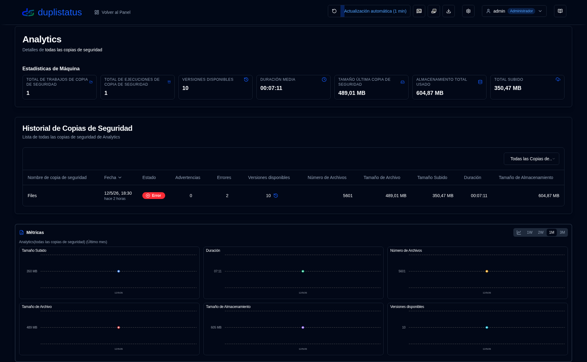
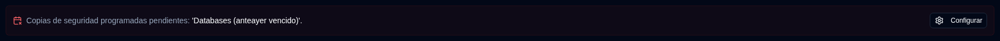
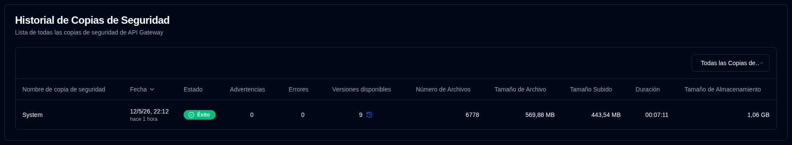
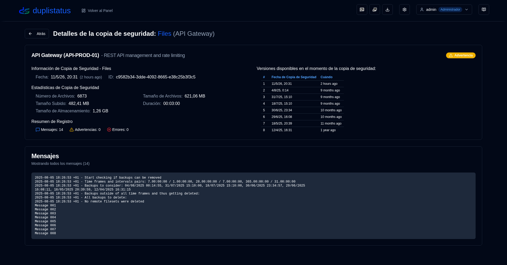

# Detalles del Servidor {#server-details}

Al hacer clic en un servidor desde el panel de control se abre una página con una lista de backups para ese servidor. Puede ver todas las copias de seguridad o seleccionar una específica si el servidor tiene múltiples backups configurados.

## Estadísticas del servidor/backup {#serverbackup-statistics}

Esta sección muestra estadísticas para todas las copias de seguridad en el servidor o un backup individual seleccionado.

- **TOTAL BACKUP JOBS**: Número total de trabajos de respaldo configurados en este servidor.
- **TOTAL BACKUP RUNS**: Número total de ejecuciones de respaldo realizadas (según informado por el servidor Duplicati).
- **AVAILABLE VERSIONS**: Número de versiones disponibles (según informado por el servidor Duplicati).
- **AVG DURATION**: Duración promedio (media) de los respaldos registrados en la base de datos **duplistatus**.
- **LAST BACKUP SIZE**: Tamaño de los archivos fuente del último registro de respaldo recibido.
- **TOTAL STORAGE USED**: Almacenamiento utilizado en el destino del respaldo, según informado en el último registro de respaldo.
- **TOTAL UPLOADED**: Suma de todos los datos subidos registrados en la base de datos **duplistatus**.

Si este backup o cualquiera de los backups en el servidor (cuando **Todas las copias de seguridad** está seleccionado) está retrasado, aparece un mensaje debajo del resumen.

Haga clic en el <IconButton icon="lucide:settings" href="settings/backup-monitoring-settings" label="Configurar"/> para ir a [Configuración → Supervisión de backups](settings/backup-monitoring-settings.md). O haga clic en el <SvgButton SvgButton svgFilename="duplicati_logo.svg" href="duplicati-configuration" /> en la barra de herramientas para abrir la interfaz web del servidor Duplicati y verificar los logs.

 

## Historial de backups {#backup-history}

Esta tabla enumera los logs de backup para el servidor seleccionado.

- **Backup Name**: Nombre del respaldo en el servidor Duplicati.
- **Date**: Marca de tiempo del respaldo y el tiempo transcurrido desde la última actualización de pantalla.
- **Status**: Estado del respaldo (Éxito, Advertencia, Error, Fatal).
- **Warnings/Errors**: Número de advertencias/errores reportados en el registro del respaldo.
- **Available Versions**: Número de versiones disponibles del respaldo en el destino. Si el icono está en gris, no se recibió información detallada.
- **File Count, File Size, Uploaded Size, Duration, Storage Size**: Valores según informados por el servidor Duplicati.

:::tip Tips
• Utilice el menú desplegable en la sección **Historial de backups** para seleccionar **Todas las copias de seguridad** o un backup específico para este servidor.

• Puede ordenar cualquier columna haciendo clic en su encabezado; haga clic de nuevo para invertir el orden de clasificación.
 
• Haga clic en cualquier lugar de una fila para ver los [Detalles del backup](#backup-details).

:::

:::note
Cuando **Todas las copias de seguridad** está seleccionado, la lista muestra todos los backups ordenados de más reciente a más antiguo por defecto.
:::

 

## Detalles del backup {#backup-details}

Al hacer clic en una insignia de estado en el panel de control (vista de tabla) o en cualquier fila de la tabla del historial de backups se muestra la información detallada del backup.

- **Server details**: nombre del servidor, alias y nota.
- **Backup Information**: Marca de tiempo del respaldo y su ID.
- **Backup Statistics**: Resumen de contadores, tamaños y duración informados.
- **Log Summary**: Número de mensajes reportados.
- **Available Versions**: Lista de versiones disponibles (solo se muestra si la información fue recibida en los registros).
- **Messages/Warnings/Errors**: Registros completos de ejecución. El subtítulo indica si el registro fue truncado por el servidor Duplicati.

 

:::note
Consulte las [instrucciones de Configuración de Duplicati](../installation/duplicati-server-configuration.md) para aprender cómo configurar el servidor de Duplicati para enviar logs de ejecución completos y evitar truncamiento.
:::
