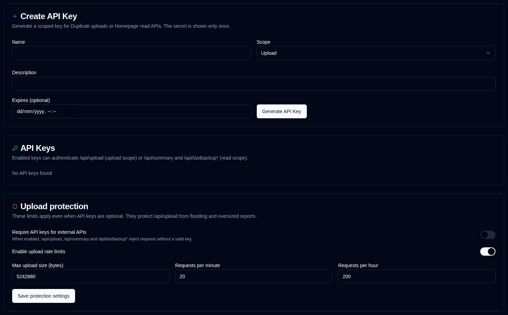

# Claves de API {#api-keys}

Los administradores pueden crear claves de API con ámbito para las APIs HTTP externas que Duplicati y Homepage usan. Las claves son opcionales de forma predeterminada, por lo que los trabajos existentes de Duplicati siguen funcionando.



## Ámbitos {#scopes}

| Ámbito | Endpoints |
|-------|-----------|
| Subir | `POST /api/upload` |
| Leer | `GET /api/summary`, `GET /api/lastbackup/:id`, `GET /api/lastbackups/:id` |

Una clave de subida no puede llamar a las APIs de lectura, y una clave de lectura no puede subir informes.

## Crear una clave {#creating-a-key}

1. Abra **Configuración → Claves de API**.
2. Haga clic en **Crear clave de API** en la parte inferior de la tarjeta de Claves de API.
3. Ingrese un nombre, elija un ámbito y, opcionalmente, establezca una fecha de vencimiento (`YYYY-MM-DD`).
4. Genere la clave y copie el secreto inmediatamente. Solo se muestra una vez en el diálogo.
5. La lista muestra después una huella digital como `Qk7v…3xTa` (primeros y últimos cuatro caracteres), la fecha de vencimiento y el estado. La misma huella digital aparece en el registro de auditoría.

### Desactivar o eliminar {#disable-or-delete}

Use la casilla de verificación en la columna **Acciones** para desactivar una clave sin eliminarla. Las claves desactivadas no pueden autenticarse. Marque la casilla de verificación de nuevo para reactivar la clave. Las claves caducadas no se pueden activar; cree una nueva clave en su lugar. Eliminar elimina la clave permanentemente.

### Caducidad {#expiry}

Una fecha de caducidad opcional es el último día del calendario en el que la clave sigue siendo válida. Caduca a las **23:59:59 de ese día en la zona horaria local del navegador**, no a medianoche al inicio del día.

Elegir `2026-12-01` construye `2026-12-01T23:59:59` localmente, luego almacena ese instante como UTC. Para un navegador en UTC+1, eso es `2026-12-01T22:59:59.000Z`. La clave sigue siendo válida hasta el 1 de diciembre y se trata como vencida a partir de las 23:59:59 hora local (`expires_at <= now`). La tabla de Claves de API muestra la fecha de vencimiento (o **Nunca** si no se estableció ninguna). Después de ese instante, la insignia de Estado cambia a **Expirado** (gris); las claves vencidas no pueden autenticarse, incluso si se dejaron habilitadas.

## Usar una clave {#using-a-key}

Duplicati no puede establecer encabezados personalizados. Ponga la clave en la URL del informe:

```bash
--send-http-json-urls=https://your-host/api/upload?api_key=YOUR_KEY
```

Los widgets de Homepage pueden usar el mismo parámetro de consulta:

```yaml
url: http://your-host/api/summary?api_key=YOUR_READ_KEY
```

Los clientes que pueden enviar encabezados pueden usar `X-Api-Key` o `Authorization: Bearer` en su lugar. Las claves de cadena de consulta aparecen en los registros de acceso de los proxies inversos.

## Exigir claves {#require-keys}

El interruptor **Exigir claves de API para APIs externas** está desactivado de forma predeterminada. Cuando lo activa, las cuatro APIs de datos externas devuelven `401` sin una clave válida. Active al menos una clave de subida y una clave de lectura primero, o Duplicati dejará de subir y los widgets de Homepage dejarán de funcionar.

## Protección de API externa {#external-api-protection}

La misma página puede exigir claves de API para las APIs públicas de subida y lectura, y configura un tamaño máximo del cuerpo (predeterminado 5 MB) y límites de velocidad por IP para `/api/upload`. El tamaño y los límites de velocidad se aplican incluso cuando las claves son opcionales y son la principal defensa contra inundaciones.

Consulte también [Lista de IPs permitidas](ip-allowlist-settings.md) si desea restringir quién puede acceder a las APIs externas sin usar claves.
