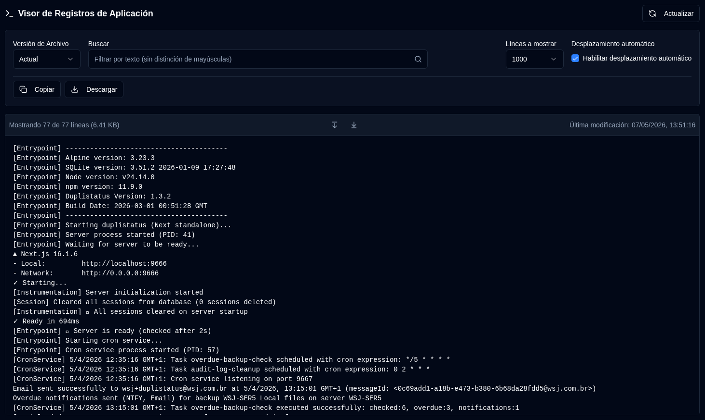

# Logs de aplicación {#application-logs}

El Visor de Logs de aplicación permite a los administradores monitorear todos los Logs de aplicación en un solo lugar, con filtrado, Exportar y actualizaciones en tiempo real directamente desde la interfaz web.

 

## Acciones disponibles {#available-actions}

| Botón                                                               | Descripción                                                                                         |
|:--------------------------------------------------------------------|:----------------------------------------------------------------------------------------------------|
| <IconButton icon="lucide:refresh-cw" label="Actualizar" />            | Recarga manualmente los registros desde el archivo seleccionado. Muestra un indicador de carga durante la actualización y restablece el seguimiento para la detección de nuevas líneas. |
| <IconButton icon="lucide:copy" label="Copiar al portapapeles" />         | Copia todas las líneas de registro filtradas al portapapeles. Respeta el filtro de búsqueda actual. Útil para compartir rápidamente o pegar en otras herramientas. |
| <IconButton icon="lucide:download" label="Exportar" />               | Descarga los registros como un archivo de texto. Exporta desde la versión de archivo actualmente seleccionada y aplica el filtro de búsqueda actual (si existe). Formato del nombre de archivo: `duplistatus-logs-YYYY-MM-DD.txt` (fecha en formato ISO). |
| <IconButton icon="lucide:arrow-down-from-line" />                   | Salta rápidamente al principio de los registros mostrados. Útil cuando el desplazamiento automático está deshabilitado o al navegar por archivos de registro largos. |
| <IconButton icon="lucide:arrow-down-to-line" />                    | Salta rápidamente al final de los registros mostrados. Útil cuando el desplazamiento automático está deshabilitado o al navegar por archivos de registro largos. |

 

## Controles y Filtros {#controls-and-filters}

| Control | Descripción |
|:--------|:-----------|
| **Versión del archivo** | Selecciona qué archivo de registro ver: **Actual** (archivo activo) o archivos rotados (`.1`, `.2`, etc., donde los números más altos son más antiguos). |
| **Líneas a mostrar** | Muestra las **100**, **500**, **1000** (por defecto), **5000** o **10000** líneas más recientes del archivo seleccionado. |
| **Desplazamiento automático** | Cuando está habilitado (por defecto para el archivo actual), se desplaza automáticamente a las nuevas entradas de registro y se actualiza cada 2 segundos. Solo funciona para la versión de archivo **Actual**. |
| **Buscar** | Filtra las líneas de registro por texto (no distingue mayúsculas y minúsculas). Los filtros se aplican a las líneas mostradas actualmente. |

 

El encabezado de visualización del registro muestra el recuento de líneas filtradas, líneas totales, tamaño de archivos y marca de tiempo de última modificación.

 
