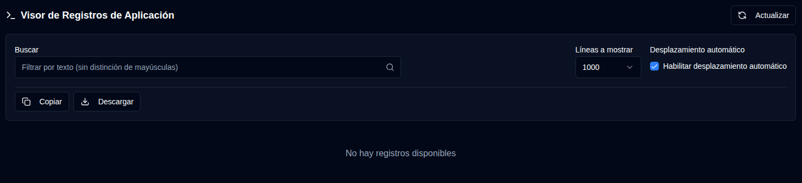

# Registros de la Aplicación {/* #application-logs */}

El Visor de Registros de Aplicación permite a los administradores supervisar todos los registros de la aplicación en un solo lugar, con filtrado, exportación y actualizaciones en tiempo real directamente desde la interfaz web.

 

## Acciones Disponibles {/* #available-actions */}

| Botón                                                              | Descripción                                                                                         |
|:--------------------------------------------------------------------|:----------------------------------------------------------------------------------------------------|
| <IconButton icon="lucide:refresh-cw" label="Actualizar" />            | Recargar manualmente los registros del archivo seleccionado. Muestra un indicador de carga mientras se actualiza y restablece el seguimiento para la detección de nuevas líneas. |
| <IconButton icon="lucide:copy" label="Copiar al portapapeles" />         | Copiar todas las líneas de registro filtradas al portapapeles. Respeta el filtro de búsqueda actual. Útil para compartir rápidamente o pegar en otras herramientas. |
| <IconButton icon="lucide:download" label="Exportar" />               | Descargar los registros como un archivo de texto. Exporta desde la versión de archivo seleccionada actualmente y aplica el filtro de búsqueda actual (si lo hay). Formato del nombre de archivo: `duplistatus-logs-YYYY-MM-DD.txt` (fecha en formato ISO). |
| <IconButton icon="lucide:arrow-down-from-line" />                   | Saltar rápidamente al inicio de los registros mostrados. Útil cuando el desplazamiento automático está desactivado o al navegar por archivos de registro largos. |
| <IconButton icon="lucide:arrow-down-to-line" />                    | Saltar rápidamente al final de los registros mostrados. Útil cuando el desplazamiento automático está desactivado o al navegar por archivos de registro largos. |

 

## Controles y Filtros {/* #controls-and-filters */}

| Control | Descripción |
|:--------|:-----------|
| **Versión de Archivo** | Seleccionar qué archivo de registro ver: **Actual** (archivo activo) o archivos rotados (`.1`, `.2`, etc., donde los números más altos son más antiguos). |
| **Líneas a mostrar** | Mostrar las **100**, **500**, **1000** (predeterminado), **5000**, o **10000** líneas más recientes del archivo seleccionado. |
| **Desplazamiento automático** | Cuando está habilitado (predeterminado para el archivo actual), se desplaza automáticamente a las nuevas entradas de registro y se actualiza cada 2 segundos. Solo funciona para la versión de archivo **Actual**. |
| **Buscar** | Filtrar líneas de registro por texto (sin distinguir mayúsculas y minúsculas). Los filtros se aplican a las líneas mostradas actualmente. |

 

La cabecera de visualización de registros muestra la cantidad de líneas filtradas, líneas totales, tamaño del archivo y la última marca de tiempo de modificación.

 
