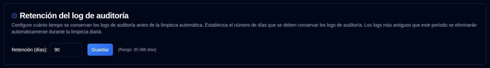

# Retención del log de auditoría {#audit-log-retention}

Configurar cuánto tiempo se retienen los logs de auditoría antes de la limpieza automática.

| Setting | Descripción | Valor por defecto |
|:-------|:-----------|:-------------|
| **Retención (días)** | Número de días para retener logs de auditoría antes de la eliminación automática | `90 días` |

## Configuración de Retención {#retention-settings}

- **Rango**: 30 a 365 días
- **Limpieza automática**: Se ejecuta diariamente a las 02:00 UTC (no configurable)
- **Limpieza manual**: Disponible a través de API para administradores (consulte [Cleanup Audit Logs](../../api-reference/administration-apis.md#cleanup-audit-logs-apiaudit-logcleanup))
