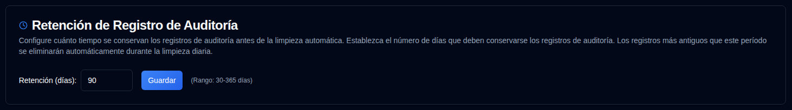

# Retención de Registro de Auditoría {/* #audit-log-retention */}

Configurar cuánto tiempo se conservan los registros de auditoría antes de la limpieza automática.

| Configuración | Descripción | Valor Predeterminado |
|:-------|:-----------|:-------------|
| **Retención (días)** | Número de días para conservar los registros de auditoría antes de la eliminación automática | **90 días** |

## Configuración de Retención {/* #retention-settings */}

- **Rango**: 30 a 365 días
- **Limpieza Automática**: Se ejecuta diariamente a las 02:00 UTC (no configurable)
- **Limpieza Manual**: Disponible a través de la API para administradores (ver [Limpiar Registros de Auditoría](../../api-reference/administration-apis.md#cleanup-audit-logs---apiaudit-logcleanup))
