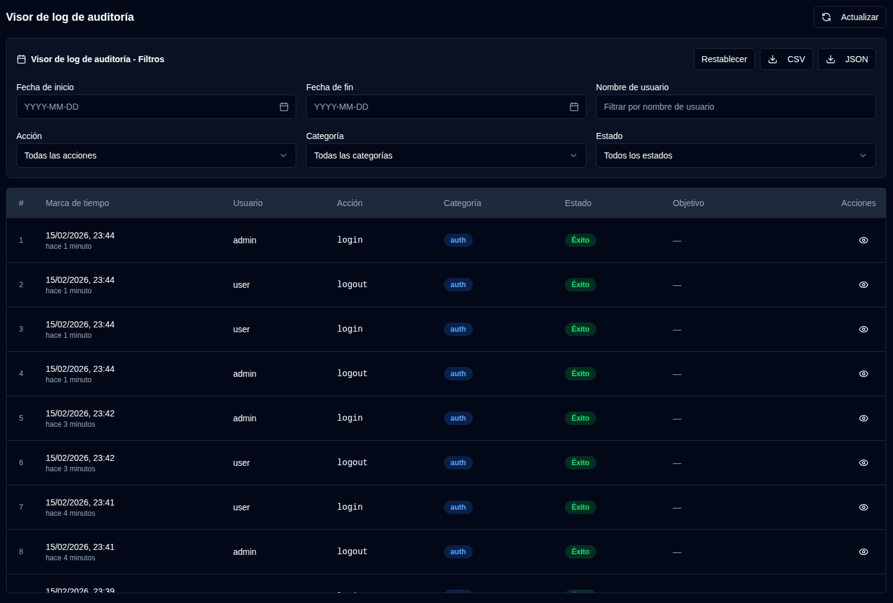

# Logs de Auditoría {#audit-logs}

El log de auditoría proporciona un registro completo de todos los cambios del sistema y las acciones del usuario en **duplistatus**. Esto ayuda a rastrear cambios de configuración, actividades del usuario y operaciones del sistema para propósitos de seguridad y solución de problemas.

## Visor de log de auditoría {#audit-log-viewer}

El visor de log de auditoría muestra una lista cronológica de todos los eventos registrados con la siguiente información:

- **Marca de tiempo**: Cuándo ocurrió el evento
- **Usuario**: El nombre de usuario que realizó la acción (o "Sistema" para acciones automatizadas)
- **Acción**: La acción específica que se realizó
- **Categoría**: La categoría de la acción (Autenticación, Gestión de usuarios, Configuración, Operaciones de backup, Gestión de servidores, Operaciones del sistema)
- **Estado**: Si la acción se realizó correctamente o falló
- **Objetivo**: El objeto que fue afectado (si aplica)
- **Detalles**: Información adicional sobre la acción

### Ver Detalles del Registro {#viewing-log-details}

Haga clic en el icono <IconButton icon="lucide:eye" /> de ojo junto a cualquier entrada de registro para ver información detallada, incluyendo:
- Marca de tiempo completa
- Información del usuario
- Detalles completos de la acción (por ejemplo: campos modificados, estadísticas, etc.)
- Dirección IP y agente de usuario
- Mensajes de error (si la acción falló)

### Exportación de Logs de Auditoría {#exporting-audit-logs}

Puede exportar logs de auditoría filtrados en dos formatos:

| Botón | Descripción |
|:------|:-----------|
| <IconButton icon="lucide:download" label="CSV"/> | Exportar logs como archivo CSV para análisis en hojas de cálculo |
| <IconButton icon="lucide:download" label="JSON"/> | Exportar logs como archivo JSON para análisis programático |

:::note
Las exportaciones incluyen solo los logs actualmente visibles según sus filtros activos. Para exportar todos los logs, primero limpie todos los filtros.
:::
