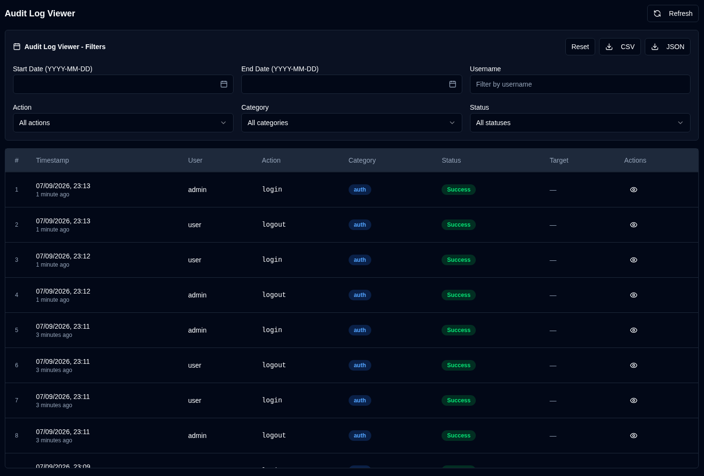

# Registro de auditoría {/* #audit-logs */}

El registro de auditoría proporciona un registro completo de todos los cambios en el sistema y las acciones de los usuarios en **duplistatus**. Esto ayuda a rastrear los cambios de configuración, las actividades de los usuarios y las operaciones del sistema con fines de seguridad y solución de problemas.

## Visor de Registro de Auditoría {/* #audit-log-viewer */}

El visor de registro de auditoría muestra una lista cronológica de todos los eventos registrados con la siguiente información:

- **Marca de tiempo**: Cuándo ocurrió el evento
- **Usuario**: El nombre de usuario que realizó la acción (o "Sistema" para acciones automatizadas)
- **Acción**: La acción específica que se realizó
- **Categoría**: La categoría de la acción (Autenticación, Gestión de usuarios, Configuración, Operaciones de copia de seguridad, Gestión del servidor, Operaciones del sistema)
- **Estado**: Si la acción tuvo éxito o falló
- **Destino**: El objeto que fue afectado (si aplica)
- **Detalles**: Información adicional sobre la acción

### Visualización de detalles del registro {/* #viewing-log-details */}

Haga clic en el <IconButton icon="lucide:eye" /> icono de ojo junto a cualquier entrada de registro para ver información detallada, incluyendo:
- Marca de tiempo completa
- Información del usuario
- Detalles completos de la acción (por ejemplo: campos cambiados, estadísticas, etc.)
- Dirección IP y agente de usuario
- Mensajes de error (si la acción falló)

### Exportación de registros de auditoría {/* #exporting-audit-logs */}

Puede exportar registros de auditoría filtrados en dos formatos:

| Botón | Descripción |
|:------|:-----------|
| <IconButton icon="lucide:download" label="CSV"/> | Exportar registros como un archivo CSV para análisis de hojas de cálculo |
| <IconButton icon="lucide:download" label="JSON"/> | Exportar registros como un archivo JSON para análisis programático |

:::note
Las exportaciones incluyen solo los registros actualmente visibles según los filtros activos. Para exportar todos los registros, primero borre todos los filtros.
:::
