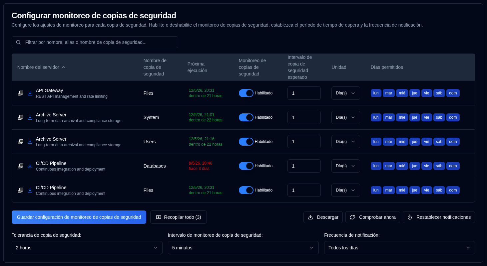

# Monitoreo de Backups {#backup-monitoring}

## Configurar la configuración de monitoreo por backup {#configure-per-backup-monitoring-settings}

-  **Nombre del servidor**: El nombre del servidor que se monitoreará en busca de copias de seguridad atrasadas. 
   - Haga clic en <SvgIcon svgFilename="duplicati_logo.svg" height="18"/> para abrir la interfaz web del servidor Duplicati
   - Haga clic en <IIcon2 icon="lucide:download" height="18"/> para recopilar registros de copia de seguridad de este servidor.
- **Nombre del respaldo**: El nombre de la copia de seguridad que se monitoreará en busca de copias atrasadas.
- **Próxima Ejecución**: La próxima hora programada para la copia de seguridad, mostrada en verde si está programada en el futuro, o en rojo si está retrasada. Al pasar el cursor sobre el valor de "Próxima Ejecución", aparece una sugerencia que muestra la marca de tiempo de la última copia de seguridad desde la base de datos, con formato de fecha/hora completa y tiempo relativo.
- **Monitoreo de Copias de Seguridad**: Habilita o deshabilita el monitoreo de copias de seguridad para esta copia.
- **Intervalo Esperado de Copia de Seguridad**: El intervalo esperado entre copias de seguridad.
- **Unidad**: La unidad del intervalo esperado.
- **Días Permitidos**: Los días de la semana permitidos para la copia de seguridad.

Si los iconos al lado del nombre del servidor están atenuados, el servidor no está configurado en [Configuración → Configuración del servidor](/user-guide/settings/server-settings).

:::note
Cuando recopila logs de backup de un servidor Duplicati, **duplistatus** actualiza automáticamente los intervalos de monitoreo de backup y las configuraciones.
:::

:::tip
Para obtener los mejores resultados, recopile logs de backup después de cambiar la configuración de intervalos de trabajos de backup en su servidor Duplicati. Esto garantiza que **duplistatus** se mantenga sincronizado con su configuración actual.
:::

## Configuraciones Globales {#global-configurations}

Estas configuraciones se aplican a todas las copias de seguridad:

| Configuración                         | Descripción                                                                                                                                                                                                                                                                                                                             |
|:--------------------------------|:----------------------------------------------------------------------------------------------------------------------------------------------------------------------------------------------------------------------------------------------------------------------------------------------------------------------------------------|
| **Tolerancia de Copia de Seguridad**            | El período de gracia (tiempo adicional permitido) que se agrega al tiempo esperado de copia de seguridad antes de marcarla como atrasada. El valor predeterminado es **1 hora**.                                                                                                                                                                                                             |
| **Intervalo de Monitoreo de Copias de Seguridad** | Con qué frecuencia el sistema verifica la existencia de copias de seguridad atrasadas. El valor predeterminado es **5 minutos**.                                                                                                                                                                                                                                                            |
| **Frecuencia de Notificaciones**      | Con qué frecuencia enviar notificaciones de retraso:   **Una vez`: Send **just one** notification when the backup becomes overdue.   `Cada día`: Send **daily** notifications while overdue (default).   `Cada semana`: Send **weekly** notifications while overdue.   `Cada mes**: Envía notificaciones **mensuales** mientras esté atrasado. |

## Acciones disponibles {#available-actions}

| Botón                                                              | Descripción                                                                                                                           |
|:--------------------------------------------------------------------|:--------------------------------------------------------------------------------------------------------------------------------------|
| <IconButton label="Guardar la configuración de monitoreo de copias de seguridad" />              | Guarda la configuración, borra los temporizadores de cualquier copia de seguridad deshabilitada y realiza una verificación de retrasos.                                                |
| <IconButton icon="lucide:import" label="Recopilar todo (#)"/>          | Recopila registros de copia de seguridad de todos los servidores configurados; entre paréntesis, el número de servidores de los que se recopilará.                                   |
| <IconButton icon="lucide:download" label="Descargar CSV"/>           | Descarga un archivo CSV que contiene toda la configuración de monitoreo de copias de seguridad y la "Marca de tiempo de la última copia de seguridad (BD)" desde la base de datos.               |
| <IconButton icon="lucide:refresh-cw" label="Verificar ahora"/>            | Ejecuta inmediatamente la verificación de copias de seguridad atrasadas. Esto es útil después de cambiar la configuración. También desencadena un recálculo de "Próxima Ejecución". |
| <IconButton icon="lucide:timer-reset" label="Restablecer notificaciones"/> | Restablece la última notificación de retraso enviada para todas las copias de seguridad.                                                                            |
