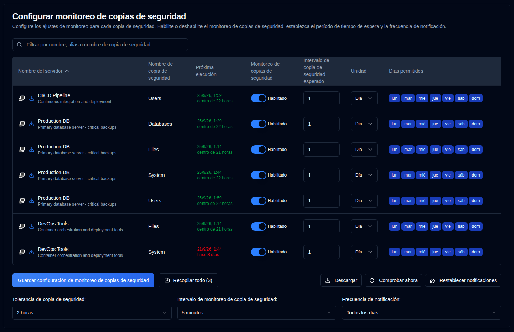

# Monitoreo de copias de seguridad {/* #backup-monitoring */}

## Filtrado de servidores {/* #server-filtering */}

La lista de servidores en esta página se puede filtrar mediante el campo de filtro.

Cuando **Resumen Diario** está habilitado, la detección de vencimientos continúa pero se suprime el correo electrónico de vencimiento al destinatario de correo electrónico predeterminado. Los destinos de correo electrónico adicionales continúan para eventos coincidentes (el vencimiento se considera una advertencia). Consulte [Resumen Diario](daily-summary-settings.md).

**Coincidencias de filtro:**
- ID del servidor
- URL del servidor
- Nombres de trabajos de copia de seguridad

Esto facilita localizar rápidamente servidores o copias de seguridad específicas en la configuración de monitoreo cuando se gestionan muchos sistemas.

## Configurar ajustes de monitoreo por copia de seguridad {/* #configure-per-backup-monitoring-settings */}

-  **Nombre del servidor**: El nombre del servidor que se monitoreará para detectar copias de seguridad vencidas.
   - Haga clic en <SvgIcon svgFilename="duplicati_logo.svg" height="18"/> para abrir la interfaz web del servidor Duplicati
   - Haga clic en <IIcon2 icon="lucide:download" height="18"/> para recopilar registros de copias de seguridad de este servidor.
- **Nombre de copia de seguridad**: El nombre de la copia de seguridad que se monitoreará para detectar copias de seguridad vencidas.
- **Próxima ejecución**: La próxima hora programada de la copia de seguridad mostrada en verde si está programada en el futuro, o en rojo si está vencida. Al pasar el cursor sobre el valor "Próxima ejecución" se muestra un mensaje emergente que muestra la marca de tiempo de la última copia de seguridad desde la base de datos, con formato de fecha/hora completa y tiempo relativo.
- **Monitoreo de copias de seguridad**: Activar o desactivar el monitoreo de copias de seguridad para esta copia de seguridad.
- **Intervalo de copia de seguridad esperado**: El intervalo de copia de seguridad esperado.
- **Unidad**: La unidad del intervalo esperado.
- **Días permitidos**: Los días laborables permitidos para la copia de seguridad.

Si los iconos del lado del nombre del servidor están en gris, el servidor no está configurado en [Configuración → Ajustes del servidor](/user-guide/settings/server-settings).

:::note
Cuando recopila registros de copias de seguridad de un servidor Duplicati, **duplistatus** actualiza automáticamente los intervalos y configuraciones de monitoreo de copias de seguridad.
:::

:::tip
Para obtener mejores resultados, recopile registros de copias de seguridad después de cambiar la configuración de intervalos de trabajos de copia de seguridad en su servidor Duplicati. Esto asegura que **duplistatus** permanezca sincronizado con su configuración actual.
:::

## Configuraciones globales {/* #global-configurations */}

Estos ajustes se aplican a todas las copias de seguridad:

| Configuración                   | Descripción                                                                                                                                                                                                                                                                                                                             |
|:--------------------------------|:----------------------------------------------------------------------------------------------------------------------------------------------------------------------------------------------------------------------------------------------------------------------------------------------------------------------------------------|
| **Tolerancia de copia de seguridad** | El período de gracia (tiempo adicional permitido) añadido al tiempo de copia de seguridad esperado antes de marcarlo como vencido. El valor predeterminado es **1 hora**.                                                                                                                                                                     |
| **Intervalo de monitoreo de copias de seguridad** | Con qué frecuencia el sistema verifica las copias de seguridad vencidas. El valor predeterminado es **5 minutos**.                                                                                                                                                                                                                           |
| **Frecuencia de notificación**    | Con qué frecuencia enviar notificaciones de vencimiento:   **Una vez`: Send **just one** notification when the backup becomes overdue.   `Cada día`: Send **daily** notifications while overdue (default).   `Cada semana`: Send **weekly** notifications while overdue.   `Cada mes**: Enviar notificaciones **mensuales** mientras esté vencido. |

## Acciones Disponibles {/* #available-actions */}

| Botón                                                             | Descripción                                                                                                                           |
|:--------------------------------------------------------------------|:--------------------------------------------------------------------------------------------------------------------------------------|
| <IconButton label="Guardar Configuración de Monitoreo de Copias de Seguridad" />              | Guarda la configuración, borra los temporizadores para cualquier copia de seguridad desactivada y ejecuta una comprobación de vencimiento.                                                |
| <IconButton icon="lucide:import" label="Recopilar todo (#)"/>          | Recopila registros de copias de seguridad de todos los servidores configurados, entre paréntesis el número de servidores de los que recopilar.                                   |
| <IconButton icon="lucide:download" label="Descargar CSV"/>           | Descarga un archivo CSV que contiene toda la configuración de monitoreo de copias de seguridad y la "Marca de tiempo de la Última Copia de Seguridad (BD)" de la base de datos.               |
| <IconButton icon="lucide:refresh-cw" label="Comprobar ahora"/>            | Ejecuta inmediatamente la comprobación de copias de seguridad vencidas. Esto es útil después de cambiar configuraciones. También activa un recálculo de "Próxima ejecución". |
| <IconButton icon="lucide:timer-reset" label="Restablecer notificaciones"/> | Restablece la última notificación de vencimiento enviada para todas las copias de seguridad.                                                                            |
