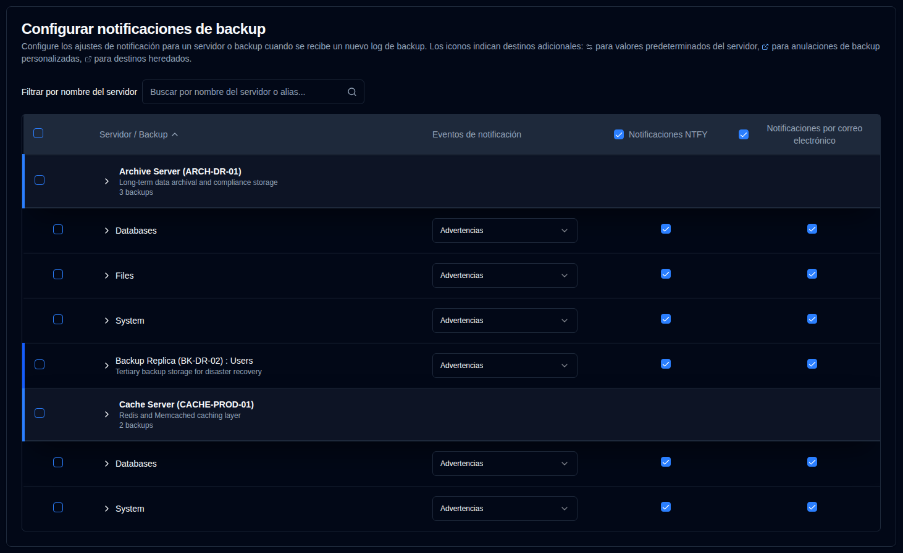
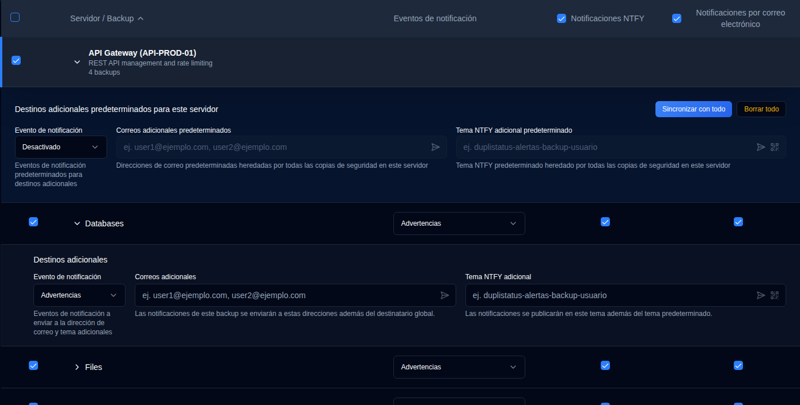
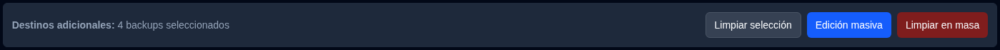

# Notificaciones de backup {#backup-notifications}

Utilice esta configuración para enviar notificaciones cuando se [reciba un nuevo registro de backup](../../installation/duplicati-server-configuration.md).

La tabla de notificaciones de backup está organizada por servidor. El formato de visualización depende de cuántos backups tenga un servidor:
- **Múltiples backups**: Muestra una fila de encabezado del servidor con filas de backup individuales debajo. Haga clic en el encabezado del servidor para expandir o contraer la lista de backups.
- **Un único backup**: Muestra una **fila combinada** con un borde izquierdo azul, mostrando:
  - **Nombre del servidor : Nombre de backup** si no hay alias del servidor configurado, o
  - **Alias del servidor (Nombre del servidor) : Nombre de backup** si está configurado.

Esta página tiene una función de guardado automático. Cualquier cambio que realice se guardará automáticamente.

 

## Filtrar y Buscar {#filter-and-search}

Utilice el campo **Filtrar por nombre del servidor** en la parte superior de la página para encontrar rápidamente backups específicos por nombre del servidor o alias. La tabla se filtrará automáticamente para mostrar solo las entradas coincidentes.

 

## Configurar la configuración de notificaciones por backup {#configure-per-backup-notification-settings}

| Configuración                 | Descripción                                                    | Valor por defecto |
| :---------------------------- | :-------------------------------------------------------- | :------------ |
| **Eventos de notificación**       | Configurar cuándo enviar notificaciones para nuevos logs de backup. | `Advertencias`    |
| **NTFY**                      | Activar o desactivar notificaciones NTFY para este backup.     | `Activado`     |
| **Correo electrónico**                     | Activar o desactivar notificaciones por correo electrónico para este backup.    | `Activado`    |

**Opciones de Eventos de notificación:**

- `all`: Enviar notificaciones para todos los eventos de backup.
- `warnings`: Enviar notificaciones solo para advertencias y errores (por defecto).
- `errors`: Enviar notificaciones solo para errores.
- `off`: Desactivar notificaciones para nuevos logs de backup para este backup.

 

## Destinos adicionales {#additional-destinations}

Los destinos de notificación adicionales le permiten enviar notificaciones a direcciones de correo electrónico específicas o temas de NTFY más allá de la configuración global. El sistema utiliza un modelo de herencia jerárquica donde los backups pueden heredar la configuración por defecto de su servidor, o anularla con valores específicos del backup.

La configuración de destino adicional se indica mediante iconos contextuales junto a los nombres del servidor y del backup:

- **Icono de servidor** <IconButton icon="lucide:settings-2" style={{border: 'none', padding: 0, color: 'inherit', background: 'transparent'}} />: Aparece junto a los nombres de servidor cuando se configuran destinos adicionales por defecto a nivel de servidor.

- **Icono de backup** <IconButton icon="lucide:external-link" style={{border: 'none', padding: 0, color: '#60a5fa', background: 'transparent'}} /> (azul): Aparece junto a los nombres de backup cuando se configuran destinos adicionales personalizados (anulando los valores predeterminados del servidor).

- **Icono de backup** <IconButton icon="lucide:external-link" style={{border: 'none', padding: 0, color: '#64748b', background: 'transparent'}} /> (gris): Aparece junto a los nombres de backup cuando el backup hereda Destinos adicionales de los valores predeterminados del Servidor.

Si no se muestra ningún icono, el servidor o backup no tiene destinos adicionales configurados.

### Valores Predeterminados a Nivel de Servidor {#server-level-defaults}

Puede configurar destinos adicionales por defecto a nivel de servidor que todas las copias de seguridad en ese servidor heredarán automáticamente.

1. Vaya a `Configuración → Notificaciones de Backup`.
2. La tabla se agrupa por servidor, con filas de encabezado de servidor distintas que muestran el nombre del servidor, alias y cantidad de backups.
   - **Nota**: Para servidores con solo un backup, se muestra una fila combinada en lugar de un encabezado de servidor separado. Los valores por defecto a nivel de servidor no se pueden configurar directamente desde filas combinadas. Si necesita configurar valores por defecto del servidor para un servidor con un solo backup, puede hacerlo agregando temporalmente otro backup a ese servidor, o los Destinos adicionales del backup heredarán automáticamente de cualquier valor por defecto del servidor existente.
3. Haga clic en cualquier lugar de una fila de servidor para expandir la sección **Destinos adicionales por defecto para este servidor**.
4. Configure los siguientes valores por defecto:
   - **Evento de notificación**: Elija qué eventos desencadenan notificaciones a los destinos adicionales (`todos`, `advertencias`, `errores` u `off`).
   - **Correos electrónicos adicionales**: Ingrese una o más direcciones de correo electrónico (separadas por comas) que recibirán notificaciones para todas las copias de seguridad en este servidor. Haga clic en el botón de icono <IconButton icon="lucide:send-horizontal" style={{border: 'none', padding: 0, color: 'inherit', background: 'transparent'}} /> para enviar un correo electrónico de prueba a las direcciones en el campo.
   - **Tema NTFY adicional**: Ingrese un nombre de tema NTFY personalizado donde se publicarán las notificaciones para todas las copias de seguridad en este servidor. Haga clic en el botón de icono <IconButton icon="lucide:send-horizontal" style={{border: 'none', padding: 0, color: 'inherit', background: 'transparent'}} /> para enviar una notificación de prueba al tema, o haga clic en el botón de icono <IconButton icon="lucide:qr-code" style={{border: 'none', padding: 0, color: 'inherit', background: 'transparent'}} /> para mostrar un código QR del tema para configurar su dispositivo a fin de recibir notificaciones.

**Gestión de Servidor Por Defecto:**

- **Sincronizar con todos**: Limpia todas las anulaciones de backup, haciendo que todos los backups hereden de los valores predeterminados del servidor.
- **Limpiar todos**: Limpia todos los destinos adicionales tanto de los valores predeterminados del servidor como de todos los backups mientras se mantiene la estructura de herencia.

### Configuración por Backup {#per-backup-configuration}

Las copias de seguridad individuales heredan automáticamente los valores predeterminados del servidor, pero puede anularlos para trabajos de backup específicos.

1. Haga clic en cualquier lugar de una fila de backup para expandir su sección **Destinos adicionales**.
2. Configure la siguiente configuración:
   - **Evento de notificación**: Elija qué eventos desencadenan notificaciones a los destinos adicionales (`all`, `warnings`, `errors`, u `off`).
   - **Correos electrónicos adicionales**: Ingrese una o más direcciones de correo electrónico (separadas por comas) que recibirán notificaciones además del destinatario global. Haga clic en el botón de icono <IconButton icon="lucide:send-horizontal" style={{border: 'none', padding: 0, color: 'inherit', background: 'transparent'}} /> para enviar un correo electrónico de prueba a las direcciones en el campo.
   - **Tema NTFY adicional**: Ingrese un nombre de tema NTFY personalizado donde se publicarán notificaciones además del tema por defecto. Haga clic en el botón de icono <IconButton icon="lucide:send-horizontal" style={{border: 'none', padding: 0, color: 'inherit', background: 'transparent'}} /> para enviar una notificación de prueba al tema, o haga clic en el botón de icono <IconButton icon="lucide:qr-code" style={{border: 'none', padding: 0, color: 'inherit', background: 'transparent'}} /> para mostrar un código QR del tema para configurar su dispositivo a fin de recibir notificaciones.

**Indicadores de Herencia:**

- **Icono de enlace** <IconButton icon="lucide:link" style={{border: 'none', padding: 0, color: '#3b82f6', background: 'transparent'}} /> en azul: Indica que el valor se hereda de los valores predeterminados del servidor. Al hacer clic en el campo, se creará una anulación para editar.
- **Icono de enlace roto** <IconButton icon="lucide:link-2-off" style={{border: 'none', padding: 0, color: '#3b82f6', background: 'transparent'}} /> en azul: Indica que el valor ha sido anulado. Haga clic en el icono para revertir a la herencia.

**Comportamiento de Destinos adicionales:**

- Las notificaciones se envían tanto a la configuración global como a los destinos adicionales cuando están configurados.
- La configuración del evento de notificación para destinos adicionales es independiente de la configuración del evento de notificación principal.
- Si los destinos adicionales están configurados en `off`, no se enviarán notificaciones a esos destinos, pero las notificaciones principales seguirán funcionando de acuerdo con la configuración principal.
- Cuándo un backup hereda de los valores predeterminados del servidor, cualquier cambio en los valores predeterminados del servidor se aplicará automáticamente a ese backup (a menos que haya sido anulado).

 

## Edición masiva {#bulk-edit}

Puede editar la configuración de destinos adicionales para múltiples backups a la vez utilizando la función de edición masiva. Esto es particularmente útil cuando necesita aplicar los mismos destinos adicionales a muchos trabajos de backup.

1. Navegue a `Configuración → Notificaciones de Backup`.
2. Utilice las casillas de verificación en la primera columna para seleccionar los backups o servidores que desea editar.
   - Utilice la casilla de verificación en la fila de encabezado para seleccionar o deseleccionar todos los backups visibles.
   - Puede utilizar el filtro para reducir la lista antes de seleccionar.
3. Una vez que se seleccionen los backups, aparecerá una barra de acción masiva que muestra el número de backups seleccionados.
4. Haga clic en `Edición masiva` para abrir el diálogo de edición.
5. Configure los ajustes de destino adicionales:
   - **Evento de notificación**: Establezca el evento de notificación para todos los backups seleccionados.
   - **Correos electrónicos adicionales**: Ingrese direcciones de correo electrónico (separadas por comas) para aplicar a todos los backups seleccionados.
   - **Tema NTFY adicional**: Ingrese un nombre de tema NTFY para aplicar a todos los backups seleccionados.
   - Los botones de prueba están disponibles en el diálogo de edición masiva para verificar direcciones de correo electrónico y temas NTFY antes de aplicar a múltiples backups.
6. Haga clic en `Guardar` para aplicar los ajustes a todos los backups seleccionados.

**Limpiar en masa:**

Para eliminar toda la configuración de destino adicional de los backups seleccionados:

1. Seleccionar los backups que desea limpiar.
2. Haga clic en `Bulk Clear` en la barra de acciones en lote.
3. Confirmar la acción en el cuadro de diálogo.

Esto eliminará todos los correos electrónicos adicionales, temas de NTFY y eventos de notificación para los Backups seleccionados. Después de limpiar, los Backups revertirán a heredar de los valores predeterminados del Servidor (si hay alguno configurado).

 
