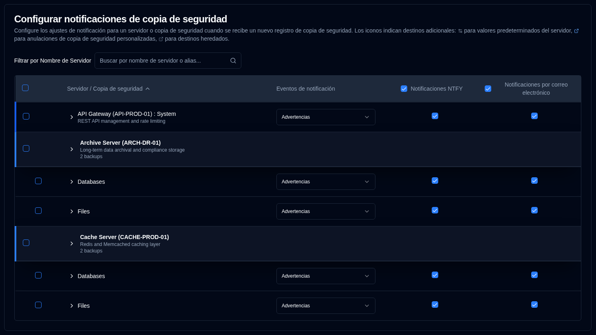
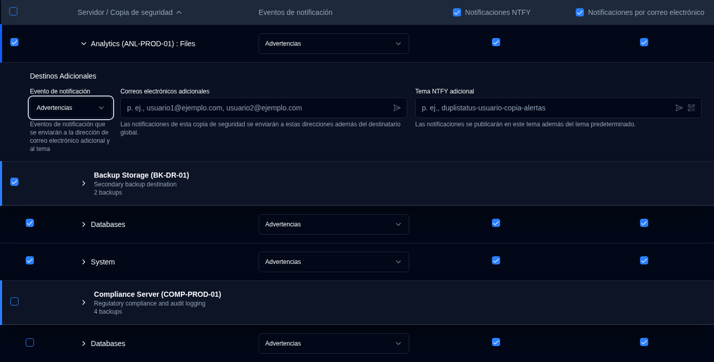

# Notificaciones de backup {#backup-notifications}

Utilice esta configuración para enviar notificaciones cuando se [reciba un nuevo registro de backup](../../installation/duplicati-server-configuration.md).

La tabla de notificaciones de copia de seguridad está organizada por servidor. El formato de visualización depende de cuántas copias de seguridad tenga un servidor:
- **Múltiples copias de seguridad**: Muestra una fila de encabezado del servidor con filas individuales de copias de seguridad debajo. Haga clic en el encabezado del servidor para expandir o contraer la lista de copias de seguridad.
- **Copia de seguridad única**: Muestra una **fila combinada** con un borde izquierdo azul, que muestra:
  -  **Nombre del servidor : Nombre del respaldo** si no se ha configurado un alias del servidor, o
  - **Alias del servidor (Nombre del servidor) : Nombre del respaldo** si está configurado.

Esta página tiene una función de guardado automático. Cualquier cambio que realice se guardará automáticamente.

 

## Filtrar y Buscar {#filter-and-search}

Utilice el campo **Filtrar por nombre del servidor** en la parte superior de la página para encontrar rápidamente backups específicos por nombre del servidor o alias. La tabla se filtrará automáticamente para mostrar solo las entradas coincidentes.

 

## Configurar la configuración de notificaciones por backup {#configure-per-backup-notification-settings}

| Configuración                   | Descripción                                               | Valor predeterminado |
| :------------------------------ | :-------------------------------------------------------- | :------------------- |
| **Eventos de notificación**     | Configure cuándo enviar notificaciones para nuevos registros de copia de seguridad. | **Advertencias**       |
| **NTFY**                        | Habilitar o deshabilitar las notificaciones NTFY para esta copia de seguridad.     | **Habilitado**         |
| **Correo electrónico**          | Habilitar o deshabilitar las notificaciones por correo electrónico para esta copia de seguridad.    | **Habilitado**        |

**Opciones de Eventos de notificación:**

- **todos**: Enviar notificaciones para todos los eventos de backup.
- **advertencias**: Enviar notificaciones solo para advertencias y errores (por defecto).
- **errores**: Enviar notificaciones solo para errores.
- **desactivado**: Desactivar notificaciones para nuevos logs de backup para este backup.

 

## Destinos adicionales {#additional-destinations}

Los destinos de notificación adicionales le permiten enviar notificaciones a direcciones de correo electrónico específicas o temas de NTFY más allá de la configuración global. El sistema utiliza un modelo de herencia jerárquica donde los backups pueden heredar la configuración por defecto de su servidor, o anularla con valores específicos del backup.

La configuración de destino adicional se indica mediante iconos contextuales junto a los nombres del servidor y del backup:

- **Icono de servidor** <IconButton icon="lucide:settings-2" style={{border: 'none', padding: 0, color: 'inherit', background: 'transparent'}} />: Aparece junto a los nombres de servidor cuando se configuran destinos adicionales por defecto a nivel de servidor.

- **Icono de backup** <IconButton icon="lucide:external-link" style={{border: 'none', padding: 0, color: '#60a5fa', background: 'transparent'}} /> (azul): Aparece junto a los nombres de backup cuando se configuran destinos adicionales personalizados (anulando los valores predeterminados del servidor).

- **Icono de backup** <IconButton icon="lucide:external-link" style={{border: 'none', padding: 0, color: '#64748b', background: 'transparent'}} /> (gris): Aparece junto a los nombres de backup cuando el backup hereda Destinos adicionales de los valores predeterminados del Servidor.

Si no se muestra ningún icono, el servidor o backup no tiene destinos adicionales configurados.

### Valores Predeterminados a Nivel de Servidor {#server-level-defaults}

Puede configurar destinos adicionales por defecto a nivel de servidor que todas las copias de seguridad en ese servidor heredarán automáticamente.

1. Navegue a [Configuración → Notificaciones de copia de seguridad](backup-notifications-settings.md).
2. La tabla está agrupada por servidor, con filas de encabezado distintas que muestran el nombre del servidor, el alias y la cantidad de respaldos.
   - **Nota**: Para servidores con solo una copia de seguridad, se muestra una fila combinada en lugar de un encabezado de servidor separado. Los valores predeterminados a nivel de servidor no se pueden configurar directamente desde filas combinadas. Si necesita configurar valores predeterminados del servidor para un servidor con una sola copia de seguridad, puede hacerlo agregando temporalmente otra copia de seguridad a ese servidor, o los Destinos adicionales de la copia de seguridad heredarán automáticamente cualquier valor predeterminado del servidor existente.
3. Haga clic en cualquier parte de una fila del servidor para expandir la sección **Destinos adicionales predeterminados para este servidor**.
4. Configure los siguientes valores predeterminados:
   - **Evento de notificación**: Elija qué eventos desencadenan notificaciones a los destinos adicionales (**todas**, **advertencias**, **errores** o **apagado**).
   - **Correos electrónicos adicionales**: Ingrese una o más direcciones de correo electrónico (separadas por comas) que recibirán notificaciones para todas las copias de seguridad en este servidor. Haga clic en el botón del icono <IconButton icon="lucide:send-horizontal" style={{border: 'none', padding: 0, color: 'inherit', background: 'transparent'}} /> para enviar un correo de prueba a las direcciones del campo.
   - **Tema NTFY adicional**: Ingrese un nombre personalizado del tema NTFY donde se publicarán las notificaciones para todas las copias de seguridad en este servidor. Haga clic en el botón del icono <IconButton icon="lucide:send-horizontal" style={{border: 'none', padding: 0, color: 'inherit', background: 'transparent'}} /> para enviar una notificación de prueba al tema, o haga clic en el botón del icono <IconButton icon="lucide:qr-code" style={{border: 'none', padding: 0, color: 'inherit', background: 'transparent'}} /> para mostrar un código QR del tema y configurar su dispositivo para recibir notificaciones.

**Gestión de Servidor Por Defecto:**

- **Sincronizar con todos**: Limpia todas las anulaciones de backup, haciendo que todos los backups hereden de los valores predeterminados del servidor.
- **Limpiar todos**: Limpia todos los destinos adicionales tanto de los valores predeterminados del servidor como de todos los backups mientras se mantiene la estructura de herencia.

### Configuración por Backup {#per-backup-configuration}

Las copias de seguridad individuales heredan automáticamente los valores predeterminados del servidor, pero puede anularlos para trabajos de backup específicos.

1. Haga clic en cualquier parte de una fila de copia de seguridad para expandir su sección **Destinos adicionales**.
2. Configure los siguientes ajustes:
   - **Evento de notificación**: Elija qué eventos desencadenan notificaciones a los destinos adicionales (**todas**, **advertencias**, **errores** o **apagado**).
   - **Correos electrónicos adicionales**: Ingrese una o más direcciones de correo electrónico (separadas por comas) que recibirán notificaciones además del destinatario global. Haga clic en el botón del icono <IconButton icon="lucide:send-horizontal" style={{border: 'none', padding: 0, color: 'inherit', background: 'transparent'}} /> para enviar un correo de prueba a las direcciones del campo.
   - **Tema NTFY adicional**: Ingrese un nombre personalizado del tema NTFY donde se publicarán notificaciones además del tema predeterminado. Haga clic en el botón del icono <IconButton icon="lucide:send-horizontal" style={{border: 'none', padding: 0, color: 'inherit', background: 'transparent'}} /> para enviar una notificación de prueba al tema, o haga clic en el botón del icono <IconButton icon="lucide:qr-code" style={{border: 'none', padding: 0, color: 'inherit', background: 'transparent'}} /> para mostrar un código QR del tema y configurar su dispositivo para recibir notificaciones.

**Indicadores de Herencia:**

- **Icono de enlace** <IconButton icon="lucide:link" style={{border: 'none', padding: 0, color: '#3b82f6', background: 'transparent'}} /> en azul: Indica que el valor se hereda de los valores predeterminados del servidor. Al hacer clic en el campo, se creará una anulación para editar.
- **Icono de enlace roto** <IconButton icon="lucide:link-2-off" style={{border: 'none', padding: 0, color: '#3b82f6', background: 'transparent'}} /> en azul: Indica que el valor ha sido anulado. Haga clic en el icono para revertir a la herencia.

**Comportamiento de Destinos adicionales:**

- Las notificaciones se envían tanto a la configuración global como a los destinos adicionales cuando están configurados.
- La configuración del evento de notificación para destinos adicionales es independiente de la configuración del evento de notificación principal.
- Si los destinos adicionales están configurados en **desactivado**, no se enviarán notificaciones a esos destinos, pero las notificaciones principales seguirán funcionando de acuerdo con la configuración principal.
- Cuando un backup hereda de los valores por defecto del servidor, cualquier cambio en los valores por defecto del servidor se aplicará automáticamente a ese backup (a menos que haya sido anulado).

 

## Edición masiva {#bulk-edit}

Puede editar la configuración de destinos adicionales para múltiples backups a la vez utilizando la función de edición masiva. Esto es particularmente útil cuando necesita aplicar los mismos destinos adicionales a muchos trabajos de backup.

1. Navegue a [Configuración → Notificaciones de copia de seguridad](backup-notifications-settings.md).
2. Use las casillas de verificación en la primera columna para seleccionar las copias de seguridad o servidores que desea editar.
   - Use la casilla de verificación en la fila del encabezado para seleccionar o deseleccionar todas las copias de seguridad visibles.
   - Puede usar el filtro para reducir la lista antes de seleccionar.
3. Una vez seleccionadas las copias de seguridad, aparecerá una barra de acciones masivas que muestra el número de copias seleccionadas.
4. Haga clic en **Edición masiva** para abrir el cuadro de diálogo de edición.
5. Configure la configuración del destino adicional:
   - **Evento de notificación**: Establezca el evento de notificación para todas las copias de seguridad seleccionadas.
   - **Correos electrónicos adicionales**: Ingrese direcciones de correo electrónico (separadas por comas) para aplicar a todas las copias de seguridad seleccionadas.
   - **Tema NTFY adicional**: Ingrese un nombre de tema NTFY para aplicar a todas las copias de seguridad seleccionadas.
   - Los botones de prueba están disponibles en el cuadro de diálogo de edición masiva para verificar las direcciones de correo electrónico y los temas NTFY antes de aplicarlos a múltiples copias de seguridad.
6. Haga clic en **Guardar** para aplicar la configuración a todas las copias de seguridad seleccionadas.

**Limpiar en masa:**

Para eliminar toda la configuración de destino adicional de los backups seleccionados:

1. Seleccione los backups que desea limpiar.
2. Haga clic en **Limpiar en masa** en la barra de acciones en masa.
3. Confirme la acción en el cuadro de diálogo.

Esto eliminará todos los correos electrónicos adicionales, temas de NTFY y eventos de notificación para los Backups seleccionados. Después de limpiar, los Backups revertirán a heredar de los valores predeterminados del Servidor (si hay alguno configurado).

 
