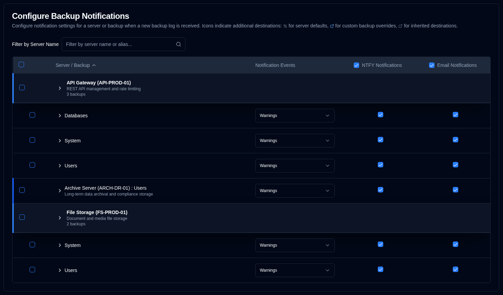

# Notificaciones de Copia de Seguridad {/* #backup-notifications */}

Utilice esta configuración para enviar notificaciones cuando se recibe un [nuevo registro de copia de seguridad](../../installation/duplicati-server-configuration.md).

La tabla de notificaciones de copia de seguridad está organizada por servidor. El formato de visualización depende de cuántas copias de seguridad tenga un servidor:
- **Múltiples copias de seguridad**: Muestra una fila de encabezado del servidor con filas individuales de copia de seguridad debajo. Haga clic en el encabezado del servidor para expandir o colapsar la lista de copias de seguridad.
- **Copia de seguridad única**: Muestra una **fila combinada** con borde izquierdo azul, mostrando:
  -  **Nombre del servidor : Nombre de copia de seguridad** si no hay alias de servidor configurado, o
  - **Alias del servidor (Nombre del servidor) : Nombre de copia de seguridad** si está configurado.

Esta página tiene una función de guardado automático. Cualquier cambio que realice se guardará automáticamente.

Cuando **Resumen Diario** está activado, los correos electrónicos al destinatario predeterminado se suprimen. Los destinos de correo electrónico adicionales en esta página continuarán recibiendo eventos coincidentes. La configuración en esta página se mantiene y vuelve a estar activa cuando Resumen Diario se desactiva. Vea [Resumen Diario](daily-summary-settings.md).

 

## Filtro {/* #filter */}

Utilice el campo **Filtrar por Nombre de Servidor** en la parte superior de la página para encontrar rápidamente copias de seguridad específicas por nombre de servidor o alias. La tabla se filtrará automáticamente para mostrar solo las entradas coincidentes.

 

## Configurar Configuración de Notificación Por Copia de Seguridad {/* #configure-per-backup-notification-settings */}

| Configuración                 | Descripción                                               | Valor Predeterminado |
| :---------------------------- | :-------------------------------------------------------- | :------------------- |
| **Eventos de notificación**   | Configure cuándo enviar notificaciones para nuevos registros de copia de seguridad. | **Advertencias**     |
| **NTFY**                      | Activar o desactivar notificaciones NTFY para esta copia de seguridad.     | **Habilitado**      |
| **Correo electrónico**        | Activar o desactivar notificaciones por correo electrónico para esta copia de seguridad.    | **Habilitado**      |

**Opciones de Eventos de Notificación:**

- **todos**: Enviar notificaciones para todos los eventos de copia de seguridad.
- **advertencias**: Enviar notificaciones solo para advertencias y errores (predeterminado).
- **errores**: Enviar notificaciones solo para errores.
- **desactivado**: Deshabilitar notificaciones para nuevos registros de copia de seguridad para esta copia de seguridad.

 

## Destinos Adicionales {/* #additional-destinations */}

Los destinos de notificación adicionales le permiten enviar notificaciones a direcciones de correo electrónico específicas o temas NTFY más allá de la configuración global. El sistema utiliza un modelo de herencia jerárquica donde las copias de seguridad pueden heredar configuraciones predeterminadas de su servidor, o anularlas con valores específicos de la copia de seguridad.

La configuración de destino adicional se indica mediante iconos contextuales junto a los nombres de servidor y copia de seguridad:

- **Icono de servidor** <IconButton icon="lucide:settings-2" style={{border: 'none', padding: 0, color: 'inherit', background: 'transparent'}} />: Aparece junto a los nombres de servidor cuando se configuran destinos adicionales predeterminados a nivel de servidor.

- **Icono de copia de seguridad** <IconButton icon="lucide:external-link" style={{border: 'none', padding: 0, color: '#60a5fa', background: 'transparent'}} /> (azul): Aparece junto a los nombres de copia de seguridad cuando se configuran destinos adicionales personalizados (anulando los valores predeterminados del servidor).

- **Icono de copia de seguridad** <IconButton icon="lucide:external-link" style={{border: 'none', padding: 0, color: '#64748b', background: 'transparent'}} /> (gris): Aparece junto a los nombres de copia de seguridad cuando la copia de seguridad está heredando destinos adicionales de los valores predeterminados del servidor.

Si no se muestra ningún icono, el servidor o la copia de seguridad no tienen destinos adicionales configurados.

### Predeterminados a nivel de servidor {/* #server-level-defaults */}

Puede configurar destinos adicionales predeterminados a nivel de servidor que todas las copias de seguridad en ese servidor heredarán automáticamente.

1. Navegue a [Configuración → Notificaciones de Copia de Seguridad](backup-notifications-settings.md).
2. La tabla está agrupada por servidor, con filas de encabezado distintas que muestran el nombre del servidor, alias y número de copias de seguridad.
   - **Nota**: Para servidores con solo una copia de seguridad, se muestra una fila combinada en lugar de un encabezado de servidor separado. Los valores predeterminados a nivel de servidor no se pueden configurar directamente desde filas combinadas. Si necesita configurar valores predeterminados del servidor para un servidor con una sola copia de seguridad, puede hacerlo temporalmente agregando otra copia de seguridad a ese servidor, o las Destinos Adicionales de la copia de seguridad heredarán automáticamente cualquier valor predeterminado existente del servidor.
3. Haga clic en cualquier parte de una fila de servidor para expandir la sección **Destinos adicionales predeterminados para este servidor**.
4. Configure las siguientes opciones predeterminadas:
   - **Evento de notificación**: Elija qué eventos activan notificaciones a los destinos adicionales (**todos**, **advertencias**, **errores** o **desactivado**).
   - **Correos electrónicos adicionales**: Introduzca una o más direcciones de correo electrónico (separadas por comas) que recibirán notificaciones para todas las copias de seguridad en este servidor. Haga clic en el botón de icono <IconButton icon="lucide:send-horizontal" style={{border: 'none', padding: 0, color: 'inherit', background: 'transparent'}} /> para enviar un correo electrónico de prueba a las direcciones en el campo.
   - **Tema NTFY adicional**: Introduzca un nombre personalizado de tema NTFY donde se publicarán notificaciones para todas las copias de seguridad en este servidor. Haga clic en el botón de icono <IconButton icon="lucide:send-horizontal" style={{border: 'none', padding: 0, color: 'inherit', background: 'transparent'}} /> para enviar una notificación de prueba al tema, o haga clic en el botón de icono <IconButton icon="lucide:qr-code" style={{border: 'none', padding: 0, color: 'inherit', background: 'transparent'}} /> para mostrar un código QR para el tema y configurar su dispositivo para recibir notificaciones.

**Gestión de predeterminados del servidor:**

- **Sincronizar a todos**: Borra todas las anulaciones de copias de seguridad, haciendo que todas las copias de seguridad hereden de los valores predeterminados del servidor.
- **Limpiar todo**: Borra todos los destinos adicionales tanto de los valores predeterminados del servidor como de todas las copias de seguridad manteniendo la estructura de herencia.

### Configuración por copia de seguridad {/* #per-backup-configuration */}

Las copias de seguridad individuales heredan automáticamente los valores predeterminados del servidor, pero puede anularlos para trabajos específicos de copia de seguridad.

1. Haga clic en cualquier parte de una fila de copia de seguridad para expandir su sección **Destinos Adicionales**.
2. Configure las siguientes opciones:
   - **Evento de notificación**: Elija qué eventos activan notificaciones a los destinos adicionales (**todos**, **advertencias**, **errores** o **desactivado**).
   - **Correos electrónicos adicionales**: Introduzca una o más direcciones de correo electrónico (separadas por comas) que recibirán notificaciones además del destinatario global. Haga clic en el botón de icono <IconButton icon="lucide:send-horizontal" style={{border: 'none', padding: 0, color: 'inherit', background: 'transparent'}} /> para enviar un correo electrónico de prueba a las direcciones en el campo.
   - **Tema NTFY adicional**: Introduzca un nombre personalizado de tema NTFY donde se publicarán notificaciones además del tema predeterminado. Haga clic en el botón de icono <IconButton icon="lucide:send-horizontal" style={{border: 'none', padding: 0, color: 'inherit', background: 'transparent'}} /> para enviar una notificación de prueba al tema, o haga clic en el botón de icono <IconButton icon="lucide:qr-code" style={{border: 'none', padding: 0, color: 'inherit', background: 'transparent'}} /> para mostrar un código QR para el tema y configurar su dispositivo para recibir notificaciones.

**Indicadores de herencia:**

- **Icono de enlace** <IconButton icon="lucide:link" style={{border: 'none', padding: 0, color: '#3b82f6', background: 'transparent'}} /> en azul: Indica que el valor se hereda de los valores predeterminados del servidor. Al hacer clic en el campo se creará una anulación para editar.
- **Icono de enlace roto** <IconButton icon="lucide:link-2-off" style={{border: 'none', padding: 0, color: '#3b82f6', background: 'transparent'}} /> en azul: Indica que el valor ha sido anulado. Haga clic en el icono para revertir a la herencia.

**Comportamiento de Destinos Adicionales:**

- Las notificaciones se envían tanto a la configuración global como a los destinos adicionales cuando están configurados.
- La configuración de evento de notificación para destinos adicionales es independiente de la configuración principal de evento de notificación.
- Si los destinos adicionales están configurados como **desactivado**, no se enviarán notificaciones a esos destinos, pero las notificaciones principales seguirán funcionando según la configuración primaria.
- Las alertas **vencidas** cuentan como una **Advertencia** para el filtro de evento de notificación adicional: se envían cuando el evento es **todos** o **advertencias**, y no cuando es **errores** o **desactivado**. El mismo filtro se aplica a temas NTFY adicionales.
- Cuando una copia de seguridad hereda de los valores predeterminados del servidor, cualquier cambio en los valores predeterminados del servidor se aplicará automáticamente a esa copia de seguridad (a menos que se haya anulado).
- Mientras el [Resumen Diario](daily-summary-settings.md) esté habilitado, los destinos de correo electrónico adicionales aún recibirán eventos coincidentes; solo se suprime el destinatario de correo electrónico predeterminado.

 

## Edición Masiva {/* #bulk-edit */}

Puede editar la configuración de destinos adicionales para múltiples copias de seguridad a la vez utilizando la función de edición masiva. Esto es particularmente útil cuando necesita aplicar los mismos destinos adicionales a muchos trabajos de copia de seguridad.

1. Navegue a [Configuración → Notificaciones de Copia de Seguridad](backup-notifications-settings.md).
2. Utilice las casillas de verificación en la primera columna para seleccionar las copias de seguridad o servidores que desea editar.
   - Utilice la casilla de verificación en la fila de encabezado para seleccionar o deseleccionar todas las copias de seguridad visibles.
   - Puede utilizar el filtro para reducir la lista antes de seleccionar.
3. Una vez que se hayan seleccionado las copias de seguridad, aparecerá una barra de acciones masivas mostrando el número de copias de seguridad seleccionadas.
4. Haga clic en **Edición Masiva** para abrir el diálogo de edición.
5. Configure la configuración de destino adicional:
   - **Evento de notificación**: Establezca el evento de notificación para todas las copias de seguridad seleccionadas.
   - **Correos electrónicos adicionales**: Introduzca direcciones de correo electrónico (separadas por comas) para aplicarlas a todas las copias de seguridad seleccionadas.
   - **Tema NTFY adicional**: Introduzca un nombre de tema NTFY para aplicarlo a todas las copias de seguridad seleccionadas.
   - Hay botones de prueba disponibles en el cuadro de diálogo de edición masiva para verificar direcciones de correo electrónico y temas NTFY antes de aplicarlos a múltiples copias de seguridad.
6. Haga clic en **Guardar** para aplicar la configuración a todas las copias de seguridad seleccionadas.

**Borrado Masivo:**

Para eliminar toda la configuración de destinos adicionales de las copias de seguridad seleccionadas:

1. Seleccione las copias de seguridad que desea borrar.
2. Haga clic en **Borrado Masivo** en la barra de acción masiva.
3. Confirme la acción en el cuadro de diálogo.

Esto eliminará todas las direcciones de correo electrónico adicionales, temas NTFY y eventos de notificación para las copias de seguridad seleccionadas. Después de borrar, las copias de seguridad volverán a heredar de los valores predeterminados del servidor (si se han configurado algunos).

 
