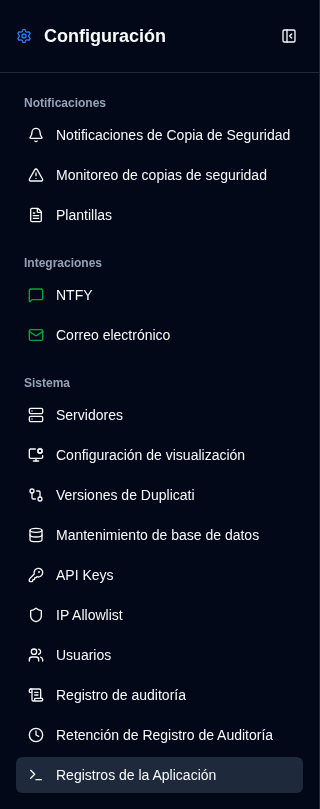

# Resumen Diario {#daily-summary}

Resumen Diario es un modo de notificación opcional que envía **una** instantánea localizada de cada trabajo de copia de seguridad conocido a una hora exacta. Mientras está habilitado, los mensajes de correo electrónico y NTFY individuales de copia de seguridad y vencidos se pausan, incluyendo destinos adicionales por trabajo. Esas configuraciones se mantienen almacenadas y se activan nuevamente tan pronto como se desactiva el Resumen Diario.

La instantánea es el **estado actual** en el momento del envío (el último resultado para cada trabajo). No es un historial de las ejecuciones del día anterior.

## Requisitos {#requirements}

- Debe estar configurado SMTP. El correo electrónico siempre se envía una vez al destinatario SMTP.
- El servicio cron debe estar en ejecución. El despachador verifica cada minuto en UTC.
- El envío opcional a NTFY también requiere configuraciones válidas de NTFY almacenadas.

## ¿Qué se incluye? {#what-is-included}

Los trabajos conocidos son la unión de:

- la última copia de seguridad observada para cada servidor y nombre de copia de seguridad
- configuraciones por trabajo explícitas cuyo servidor aún existe

Un trabajo configurado que nunca ha enviado un informe se etiqueta como **No se recibió informe**. Los grupos de estado (Éxito, Advertencia, Error, Fatal, Desconocido, No se recibió informe) son mutuamente exclusivos y suman el recuento de trabajos. **Vencida** se cuenta por separado: un trabajo exitoso vencido sigue siendo Éxito y también vencido.

## Programación {#schedule}

Elija una hora exacta `HH:mm` y guarde la zona horaria IANA del navegador. La zona horaria guardada sigue visible y no se reemplaza cuando otro navegador abre Configuración.

- Habilitar o cambiar la programación comienza en la **próxima ocurrencia futura**, nunca un envío sorpresivo inmediato.
- Reiniciar más tarde el mismo día local aún captura después de la hora configurada.
- Los días completamente perdidos no se reproducen.
- Los tiempos perdidos en la transición de primavera se ejecutan en el primer minuto válido después del intervalo. Las horas repetidas en el otoño se envían una vez.

## Comportamiento de reemplazo {#replacement-behaviour}

Cuando el Resumen Diario está activado:

- las subidas y los correos electrónicos/NTFY vencidos no se envían
- las marcas de tiempo vencidas no se avanzan, por lo que las alertas vencidas pueden reanudarse inmediatamente cuando se desactiva el modo
- la vista previa de plantillas, pruebas de transporte y **Enviar resumen ahora** siguen funcionando

**Enviar resumen ahora** es un envío adicional. No consume la próxima ocurrencia programada.

## Plantillas {#templates}

Edite las plantillas de correo electrónico del Resumen Diario (Markdown) y las plantillas compactas de NTFY en [Configuración → Plantillas](/user-guide/settings/notification-templates). Los cuerpos de correo electrónico para Éxito, Advertencia/Error, Vencida y Resumen Diario todos usan Markdown.

**Generar vista previa** en esta página abre un diálogo con la instantánea actual. El HTML del correo electrónico sigue el tema claro u oscuro actual.
