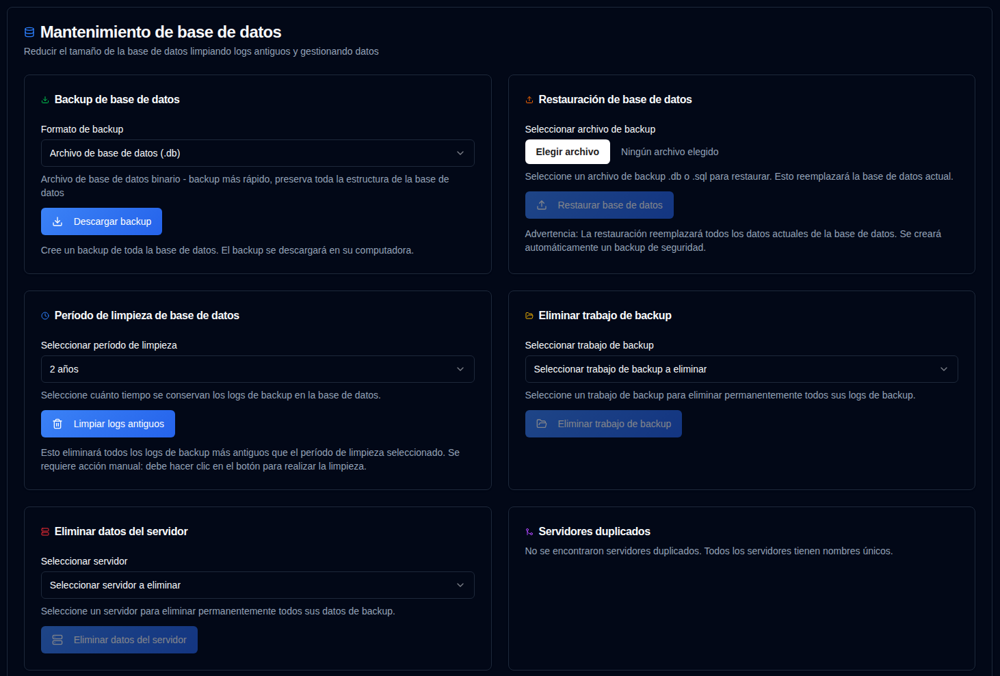

# Mantenimiento de base de datos {#database-maintenance}

Administre sus datos de backup y optimice el rendimiento a través de operaciones de mantenimiento de base de datos.

 

## Backup de base de datos {#database-backup}

Crea un backup de toda tu base de datos para su custodia o propósitos de migración.

1.  Navegue a [Configuración → Mantenimiento de base de datos](database-maintenance.md).
2.  En la sección **Backup de base de datos**, seleccione un formato de backup:
    - **Archivo de base de datos (.db)**: Formato binario - backup más rápido, preserva exactamente toda la estructura de la base de datos
    - **Volcado SQL (.sql)**: Formato de texto - sentencias SQL legibles, se pueden editar antes de restaurar
3.  Haga clic en <IconButton icon="lucide:download" label="Descargar backup" />.
4.  El archivo de backup se descargará en su computadora con un nombre de archivo con marca de tiempo.

**Formatos de Backup:**

- **.db format**: Recomendado para backups regulares. Crea una copia exacta del archivo de base de datos utilizando la API de backup de SQLite, garantizando consistencia incluso mientras la base de datos está en uso.
- **.sql format**: Útil para migración, inspección, o cuando necesita editar los datos antes de restaurar. Contiene todas las sentencias SQL necesarias para recrear la base de datos.

**Mejores Prácticas:**

- Crear backups regulares antes de operaciones importantes (limpieza, fusión, etc.)
- Almacenar backups en una ubicación segura separada de la aplicación
- Probar procedimientos de restauración periódicamente para asegurar que los backups sean válidos

 

## Restauración de base de datos {#database-restore}

Restaure su base de datos desde un archivo de backup creado anteriormente.

1.  Navegue a [Configuración → Mantenimiento de base de datos](database-maintenance.md).
2.  En la sección **Restauración de base de datos**, haga clic en la entrada de archivo y seleccione un archivo de backup:
    - Formatos admitidos: `.db`, `.sql`, `.sqlite`, `.sqlite3`
    - Tamaño máximo de archivo: 100MB
3.  Haga clic en <IconButton icon="lucide:upload" label="Restaurar base de datos" />.
4.  Confirme la acción en el cuadro de diálogo.

**Proceso de Restauración:**

- Se crea automáticamente un backup de seguridad de la base de datos actual antes de la restauración
- La base de datos actual se reemplaza con el archivo de backup
- Todas las sesiones se cierran por seguridad (los usuarios deben iniciar sesión nuevamente)
- Se verifica la integridad de la base de datos después de la restauración
- Todos los cachés se borran para garantizar datos frescos

**Formatos de Restauración:**

- **Archivos .db**: El archivo de base de datos se reemplaza directamente. Método de restauración más rápido.
- **Archivos .sql**: Se ejecutan sentencias SQL para recrear la base de datos. Permite restauración selectiva si es necesario.

:::warning
Restaurar una base de datos **reemplazará todos los datos actuales**. Esta acción no se puede deshacer.  
Se crea un backup de seguridad automáticamente, pero se recomienda crear su propio backup antes de restaurar.
 
**Importante:** Después de restaurar, todas las sesiones de usuario se cierran por seguridad. Necesitará iniciar sesión nuevamente.
:::

**Solución de problemas:**

- Si la restauración falla, la base de datos original se restaura automáticamente desde el backup de seguridad
- Asegúrese de que el archivo de backup no esté corrupto y coincida con el formato esperado
- Para bases de datos grandes, el proceso de restauración puede tardar varios minutos

 

---

 

:::note
Esto se aplica a todas las funciones de mantenimiento a continuación: todas las estadísticas en el panel de control, páginas de detalle y gráficos se calculan utilizando datos de la base de datos **duplistatus**. Eliminar información antigua afectará estos cálculos.

Si accidentalmente elimina datos, puede restaurarlos utilizando la función [Recopilar logs de backup](../collect-backup-logs.md).
:::

 

## Período de Limpieza de Datos {#data-cleanup-period}

Elimine registros de backup obsoletos para liberar espacio de almacenamiento y mejorar el rendimiento del sistema.

1.  Navegue a [Configuración → Mantenimiento de base de datos](database-maintenance.md).
2.  Elija un período de retención:
    - **6 meses**: Retener registros de los últimos 6 meses.
    - **1 año**: Retener registros del último año.
    - **2 años**: Retener registros de los últimos 2 años (por defecto).
    - **Eliminar todos los datos**: Eliminar todos los registros de backup y servidores. 
3.  Haga clic en <IconButton icon="lucide:trash-2" label="Limpiar logs antiguos" />.
4.  Confirme la acción en el cuadro de diálogo.

**Efectos de Limpieza:**

- Elimina registros de backup más antiguos que el período seleccionado
- Actualiza todas las estadísticas y métricas relacionadas

:::warning

Seleccionar la opción "Eliminar todos los datos" **eliminará permanentemente todos los registros de backup y la configuración** del sistema.

Se recomienda encarecidamente crear un backup de base de datos antes de proceder con esta acción.

:::

 

## Eliminar trabajo de backup {#delete-backup-job-data}

Eliminar datos de un Trabajo de Backup (tipo) específico.

1.  Navegue a [Configuración → Mantenimiento de base de datos](database-maintenance.md).
2.  Seleccione un trabajo de backup de la lista desplegable.
    - Los backups se ordenarán por alias del servidor o nombre, luego por nombre de backup.
3.  Haga clic en <IconButton icon="lucide:folder-open" label="Eliminar trabajo de backup" />.
4.  Confirme la acción en el cuadro de diálogo.

**Efectos de la Eliminación:**

- Elimina permanentemente todos los datos asociados con este Trabajo de Backup / Servidor.
- Limpia la configuración asociada.
- Actualiza las estadísticas del panel de control en consecuencia.

 

## Eliminar datos del servidor {#delete-server-data}

Eliminar un servidor específico y todos sus datos de backup asociados.

1.  Navegue a [Configuración → Mantenimiento de base de datos](database-maintenance.md).
2.  Seleccione un servidor de la lista desplegable.
3.  Haga clic en <IconButton icon="lucide:server" label="Eliminar datos del servidor" />.
4.  Confirme la acción en el cuadro de diálogo.

**Efectos de la Eliminación:**

- Elimina permanentemente el servidor seleccionado y todos sus registros de backup
- Limpia la configuración asociada
- Actualiza las estadísticas del panel de control en consecuencia

 

## Fusionar servidores duplicados {#merge-duplicate-servers}

Detectar y fusionar servidores duplicados que tienen el mismo nombre pero diferentes IDs. Utilice esta función para consolidarlos en una única entrada de servidor.

Esto puede ocurrir cuando el `machine-id` de Duplicati cambia después de una actualización o reinstalación. Los servidores duplicados solo se muestran cuando existen. Si no se detectan duplicados, la sección mostrará un mensaje indicando que todos los servidores tienen nombres únicos.

1.  Navegue a [Configuración → Mantenimiento de base de datos](database-maintenance.md).
2.  Si se detectan servidores duplicados, aparecerá una sección **Fusionar servidores duplicados**.
3.  Revise la lista de grupos de servidores duplicados:
    - Cada grupo muestra servidores con el mismo nombre pero diferentes IDs
    - El **Servidor objetivo** (más reciente por fecha de creación) está resaltado
    - Los **IDs de servidores antiguos** que se fusionarán se enumeran por separado
4.  Seleccione los grupos de servidores que desea fusionar marcando la casilla de verificación junto a cada grupo.
5.  Haga clic en <IconButton icon="lucide:git-merge" label="Fusionar servidores seleccionados" />.
6.  Confirme la acción en el cuadro de diálogo.

**Proceso de Fusión:**

- Todos los ID de servidor antiguos se fusionan en el servidor objetivo (el más reciente por fecha de creación)
- Todos los registros de backup y configuraciones se transfieren al servidor objetivo
- Las entradas del servidor antiguo se eliminan
- Las estadísticas del panel de control se actualizan automáticamente

:::info[IMPORTANTE]
Esta acción no se puede deshacer. Se recomienda realizar un backup de base de datos antes de confirmar.  
:::

 
