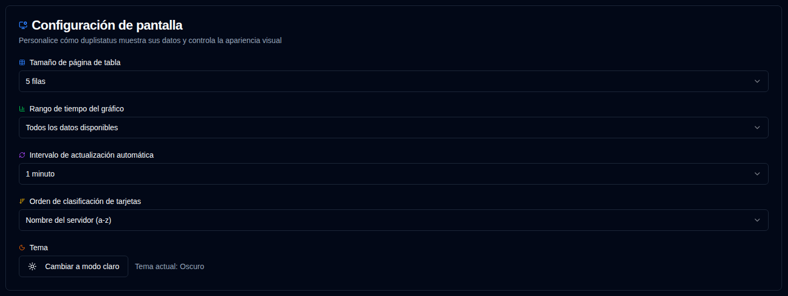

# Pantalla {#display}

Configurar preferencias de interfaz de usuario y pantalla.

 

| Configuración                    | Descripción                                              | Valor por defecto       |
| :------------------------------- | :------------------------------------------------------- | :---------------------- |
| **Tamaño de tabla**              | Número de filas por página en la página de detalles del servidor. | 5 filas                 |
| **Rango de tiempo del gráfico**  | Intervalo de tiempo mostrado en los gráficos.            | Todos los datos disponibles |
| **Intervalo de actualización automática** | Con qué frecuencia se actualizan automáticamente las páginas. | 1 minuto                |
| **Orden de clasificación de tarjetas** | Cómo se clasifican las tarjetas en el panel de control. | `Nombre del servidor (a-z)` |
| **Tema**                         | Seleccionar el tema claro u oscuro.                      | Oscuro                  |

 

:::tip
**Acceso Rápido**: Puede acceder rápidamente a esta página haciendo clic con el botón derecho en el botón de actualización automática en la barra de herramientas de la aplicación.
:::
