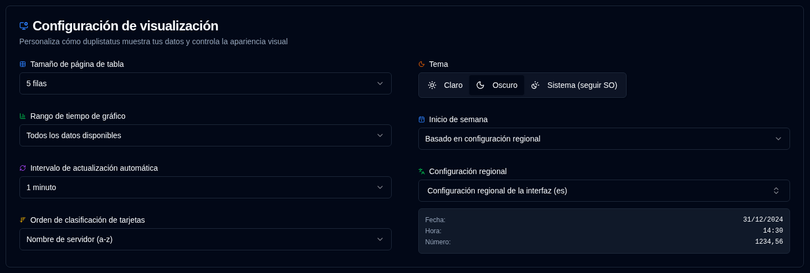

# Pantalla {#display}

Configurar preferencias de interfaz de usuario y pantalla.

 

| Configuración                   | Descripción                                         | Valor predeterminado      |
|:--------------------------------|:----------------------------------------------------|:--------------------------|
| **Tamaño de tabla**            | Número de filas por página en la página de detalles del servidor. | 5 filas             |
| **Rango de tiempo de la gráfica**      | Intervalo de tiempo mostrado en las gráficas.                  | Todos los datos disponibles |
| **Intervalo de actualización automática** | Frecuencia con la que las páginas se actualizan automáticamente.              | 1 minuto           |
| **Orden de clasificación de tarjetas**      | Forma en que se ordenan las tarjetas en el panel.              | Nombre del servidor (a-z)  |
| **Inicio de la semana**         | Configurar cuándo comienza la semana.                     | Basado en la configuración regional    |
| **Tema**                 | Elija claro, oscuro o coincidir con la apariencia de su sistema operativo (prefiere modo claro/oscuro). | Seguir SO cuando no esté establecido |

 

:::tip
**Acceso Rápido**: Puede acceder rápidamente a esta página haciendo clic con el botón derecho en el botón de actualización automática en la barra de herramientas de la aplicación.
:::
