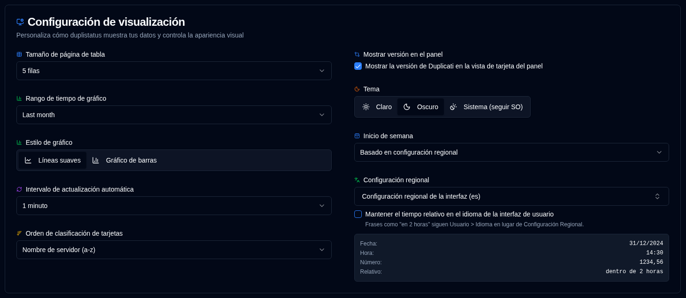

# Pantalla {#display}

Configurar preferencias de interfaz de usuario y pantalla.

 

| Configuración                   | Descripción                                         | Valor predeterminado      |
|:--------------------------------|:----------------------------------------------------|:--------------------------|
| **Tamaño de tabla**            | Número de filas por página en la página de detalles del servidor. | 5 filas             |
| **Mostrar versión en el panel** | Mostrar u ocultar la versión de Duplicati en las tarjetas del panel. La tabla del panel siempre muestra la columna Versión. También disponible en [Versiones de Duplicati](duplicati-versions.md). | Activado |
| **Tema**                 | Elija claro, oscuro o coincidir con la apariencia de su sistema operativo (prefiere modo claro/oscuro). | Seguir SO cuando no esté establecido |
| **Rango de tiempo de gráfico**      | Intervalo de tiempo mostrado en los gráficos. Opciones disponibles: **1W** (últimos 7 días), **2W** (últimos 14 días), **1M** (últimos 30 días), **3M** (últimos 90 días). También puede cambiar el rango de tiempo directamente desde los encabezados de los gráficos. | 1 mes            |
| **Estilo de gráfico**           | Elija entre gráficos de líneas suaves o visualización de gráfico de barras. Ambos modos utilizan agregación de cubos de tiempo para una visualización óptima. También puede cambiar directamente desde los encabezados de los gráficos. | Líneas suaves       |
| **Configuración regional**         | Seleccione una configuración regional de formato independiente del idioma de la interfaz de usuario (se admiten 416 configuraciones regionales). Esto afecta cómo se muestran las fechas, horas y números. Las frases de tiempo relativo (por ejemplo, "en 2 horas") siguen la configuración regional a menos que **Mantener el tiempo relativo en el idioma de la interfaz de usuario** esté habilitado. Una vista previa en vivo incluye una muestra de fecha, hora, número y tiempo relativo. Ejemplo: idioma de la interfaz de usuario = Alemán, configuración regional = Inglés (Reino Unido) → interfaz de usuario en alemán con formatos de fecha del Reino Unido. | Basado en el idioma de la interfaz de usuario |
| **Mantener el tiempo relativo en el idioma de la interfaz de usuario** | Cuando está habilitado, las frases como "en 2 horas" siguen **Usuario → Idioma** en lugar de la configuración regional. Las fechas, horas y números siguen usando la configuración regional. Desactivado por defecto. | Desactivado |
| **Intervalo de actualización automática** | Frecuencia con la que las páginas se actualizan automáticamente.              | 1 minuto           |
| **Orden de clasificación de tarjetas**      | Forma en que se ordenan las tarjetas en el panel.              | Nombre del servidor (a-z)  |
| **Inicio de la semana**         | Configurar cuándo comienza la semana.                     | Basado en la configuración regional    |

 

:::tip
**Acceso Rápido**: Puede acceder rápidamente a esta página haciendo clic con el botón derecho en el botón de actualización automática en la barra de herramientas de la aplicación.
:::
